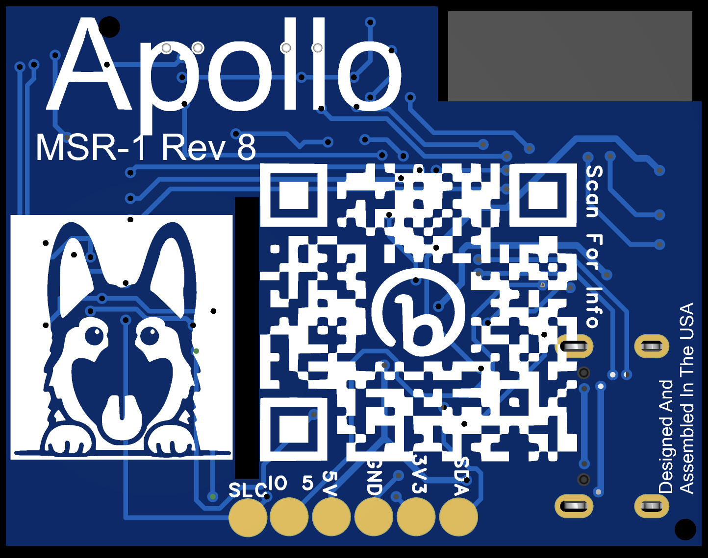

# Exposed GPIO

The back of the Apollo MSR-1 has exposed GPIO for a variety of uses.

From left to right:

- SLC (Typo, should be SCL) 
    - Used for I2C
- IO 5 
    - GPIO 5 of ESP32-C3-Mini
- 5V 
    - Used for powering the device, or powering a external sensor
- GND 
    - Ground
- 3V3 
    - Used to power external sensors. Can not power the MSR-1 from this
- SDA 
    - Used for I2C