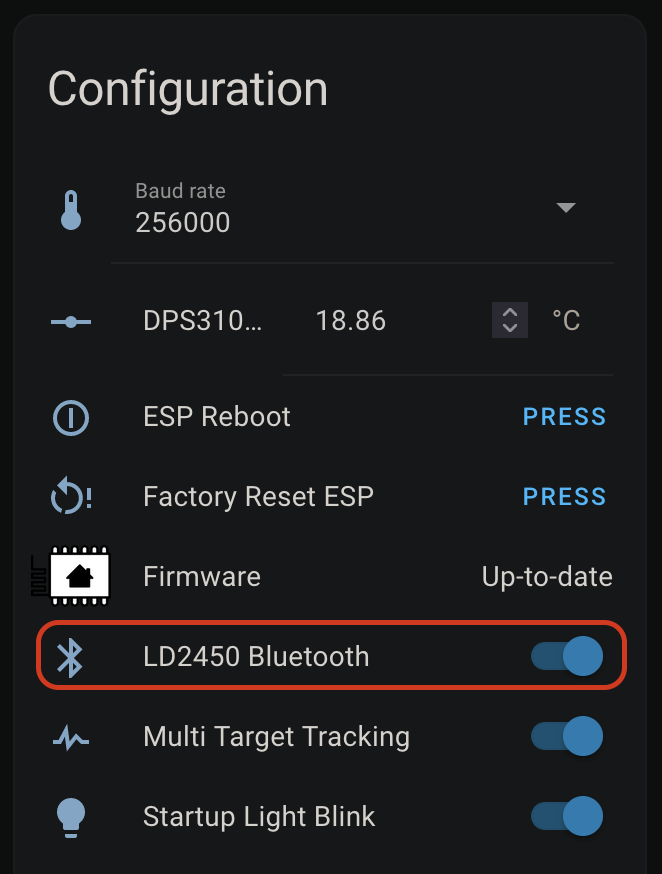
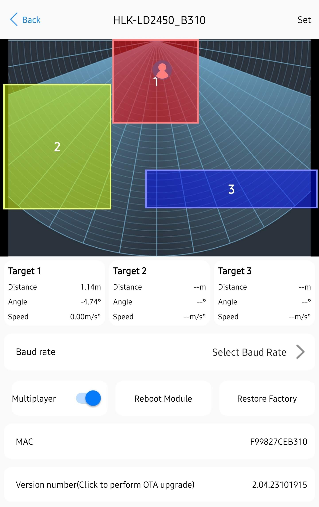

# Zone Configuration Using HLKRadarTool App


  
1\. Download the HLKRadarTool app for either [Android ](https://play.google.com/store/apps/details?id=com.hlk.hlkradartool&hl=en_US≷=US)or [Apple](https://apps.apple.com/us/app/hlkradartool/id1638651152)  
2\. Ensure the mmWave radar you want to configure has Radar Control Bluetooth turned on. Home Assistant > Settings > Devices & services > ESPHome Devices > Select Device > Scroll down and toggle on Radar Control Bluetooth  
  
3\. Open the HLKRadarTool App and select your device  
  
4\. Select Set in the top right  
  
5\. Select Close Detection, Area Detection, or Area Filtering. Then toggle Area 1, 2, or 3 and you will see a box with the corresponding number pop up. Then you can press and hold the box to move it and resize it. When your zones are set then select Submit and you should see Setup successfully!  
\- Close Detection: Disable zone area detection  
\- Area Detection: Only detects targets in the specified zone  
\- Area Filtering: Excludes a zone from detection  
  
6\. If set up correctly the zones should be saved as different colors. You can double-check that the settings are saved by looking at your HA entities (picture below). You should be all set! See below for a nice Home Assistant visualizer card.  
  
7\. Copy the code below and add a Home Assistant card to visualize your zones. You will need to change all of the sensor\_apollo\_mtr\_1 entity IDs to match your MTR-1 device. This can be done quickly by using a code editor or ChatGPT.  


```
type: custom:plotly-graph
title: Target Positions
refresh_interval: 1
hours_to_show: current_day
layout:
  height: 230
  margin:
    l: 50
    r: 20
    t: 20
    b: 40
  showlegend: true
  xaxis:
    dtick: 1000
    gridcolor: RGBA(200,200,200,0.15)
    zerolinecolor: RGBA(200,200,200,0.15)
    type: number
    fixedrange: true
    range:
      - 4000
      - -4000
  yaxis:
    dtick: 1000
    gridcolor: RGBA(200,200,200,0.15)
    zerolinecolor: RGBA(200,200,200,0.15)
    scaleanchor: x
    scaleratio: 1
    fixedrange: true
    range:
      - 7500
      - 0
entities:
  - entity: ''
    name: Target1
    marker:
      size: 12
    line:
      shape: spline
      width: 5
    x:
      - $ex hass.states["sensor.apollo_mtr_1_982da4_target_1_x"].state
    'y':
      - $ex hass.states["sensor.apollo_mtr_1_982da4_target_1_y"].state
  - entity: ''
    name: Target2
    marker:
      size: 12
    line:
      shape: spline
      width: 5
    x:
      - $ex hass.states["sensor.apollo_mtr_1_982da4_target_2_x"].state
    'y':
      - $ex hass.states["sensor.apollo_mtr_1_982da4_target_2_y"].state
  - entity: ''
    name: Target3
    marker:
      size: 12
    line:
      shape: spline
      width: 5
    x:
      - $ex hass.states["sensor.apollo_mtr_1_982da4_target_3_x"].state
    'y':
      - $ex hass.states["sensor.apollo_mtr_1_982da4_target_3_y"].state
  - entity: ''
    name: Zone1
    mode: lines
    fill: toself
    fillcolor: RGBA(20,200,0,0.06)
    line:
      color: RGBA(20,200,0,0.2)
      shape: line
      width: 2
    x:
      - $ex hass.states["number.apollo_mtr_1_982da4_zone_1_x1"].state
      - $ex hass.states["number.apollo_mtr_1_982da4_zone_1_x1"].state
      - $ex hass.states["number.apollo_mtr_1_982da4_zone_1_x2"].state
      - $ex hass.states["number.apollo_mtr_1_982da4_zone_1_x2"].state
      - $ex hass.states["number.apollo_mtr_1_982da4_zone_1_x1"].state
    'y':
      - $ex hass.states["number.apollo_mtr_1_982da4_zone_1_y1"].state
      - $ex hass.states["number.apollo_mtr_1_982da4_zone_1_y2"].state
      - $ex hass.states["number.apollo_mtr_1_982da4_zone_1_y2"].state
      - $ex hass.states["number.apollo_mtr_1_982da4_zone_1_y1"].state
      - $ex hass.states["number.apollo_mtr_1_982da4_zone_1_y1"].state
  - entity: ''
    name: Zone2
    mode: lines
    fill: toself
    fillcolor: RGBA(200,0,255,0.06)
    line:
      color: RGBA(200,0,255,0.2)
      shape: line
      width: 2
    x:
      - $ex hass.states["number.apollo_mtr_1_982da4_zone_2_x1"].state
      - $ex hass.states["number.apollo_mtr_1_982da4_zone_2_x1"].state
      - $ex hass.states["number.apollo_mtr_1_982da4_zone_2_x2"].state
      - $ex hass.states["number.apollo_mtr_1_982da4_zone_2_x2"].state
      - $ex hass.states["number.apollo_mtr_1_982da4_zone_2_x1"].state
    'y':
      - $ex hass.states["number.apollo_mtr_1_982da4_zone_2_y1"].state
      - $ex hass.states["number.apollo_mtr_1_982da4_zone_2_y2"].state
      - $ex hass.states["number.apollo_mtr_1_982da4_zone_2_y2"].state
      - $ex hass.states["number.apollo_mtr_1_982da4_zone_2_y1"].state
      - $ex hass.states["number.apollo_mtr_1_982da4_zone_2_y1"].state
  - entity: ''
    name: Zone3
    mode: lines
    fill: toself
    fillcolor: RGBA(200,120,55,0.06)
    line:
      color: RGBA(200,120,55,0.2)
      shape: line
      width: 2
    x:
      - $ex hass.states["number.apollo_mtr_1_982da4_zone_3_x1"].state
      - $ex hass.states["number.apollo_mtr_1_982da4_zone_3_x1"].state
      - $ex hass.states["number.apollo_mtr_1_982da4_zone_3_x2"].state
      - $ex hass.states["number.apollo_mtr_1_982da4_zone_3_x2"].state
      - $ex hass.states["number.apollo_mtr_1_982da4_zone_3_x1"].state
    'y':
      - $ex hass.states["number.apollo_mtr_1_982da4_zone_3_y1"].state
      - $ex hass.states["number.apollo_mtr_1_982da4_zone_3_y2"].state
      - $ex hass.states["number.apollo_mtr_1_982da4_zone_3_y2"].state
      - $ex hass.states["number.apollo_mtr_1_982da4_zone_3_y1"].state
      - $ex hass.states["number.apollo_mtr_1_982da4_zone_3_y1"].state
  - entity: ''
    name: Coverage
    mode: lines
    fill: tonexty
    fillcolor: rgba(168, 216, 234, 0.15)
    line:
      shape: line
      width: 1
      dash: dot
    x:
      - 0
      - $ex 7500 * Math.sin((2 * Math.PI)/360 * 60)
      - 4500
      - 4000
      - 3000
      - 2000
      - 1000
      - 0
      - -1000
      - -2000
      - -3000
      - -4000
      - -4500
      - $ex -7500 * Math.sin((2 * Math.PI)/360 * 60)
      - 0
    'y':
      - 0
      - $ex 7500 * Math.cos((2 * Math.PI)/360 * 60)
      - $ex Math.sqrt( 7500**2 - 4500**2 )
      - $ex Math.sqrt( 7500**2 - 4000**2 )
      - $ex Math.sqrt( 7500**2 - 3000**2 )
      - $ex Math.sqrt( 7500**2 - 2000**2 )
      - $ex Math.sqrt( 7500**2 - 1000**2 )
      - 7500
      - $ex Math.sqrt( 7500**2 - 1000**2 )
      - $ex Math.sqrt( 7500**2 - 2000**2 )
      - $ex Math.sqrt( 7500**2 - 3000**2 )
      - $ex Math.sqrt( 7500**2 - 4000**2 )
      - $ex Math.sqrt( 7500**2 - 4500**2 )
      - $ex 7500 * Math.cos((2 * Math.PI)/360 * 60)
      - 0
raw_plotly_config: true
```