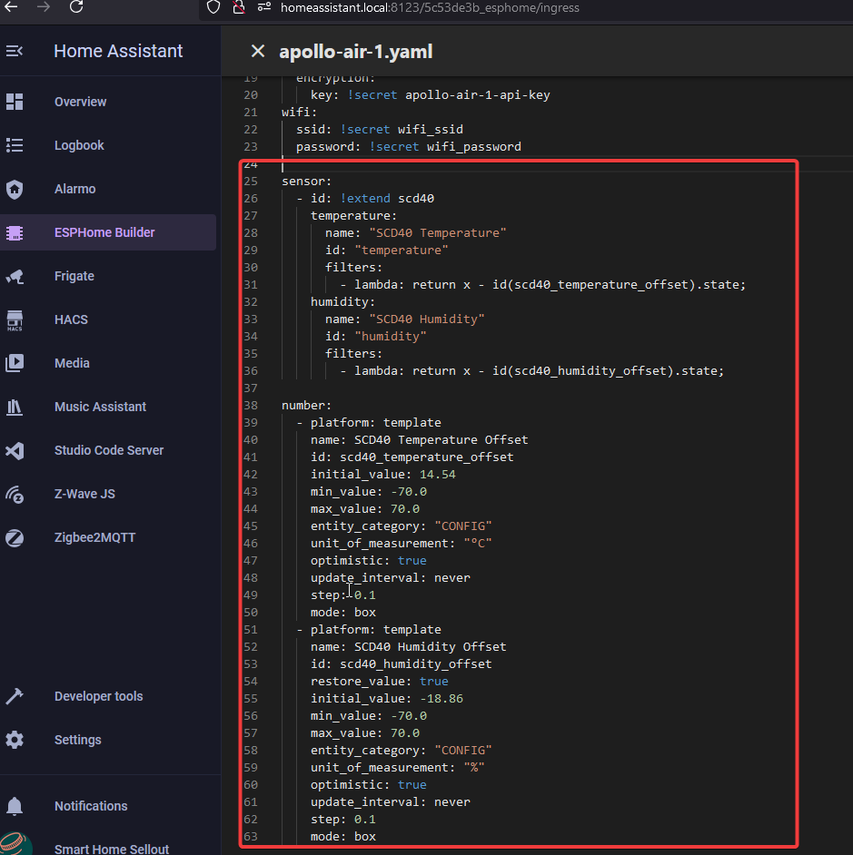

# How To Add Temp And Humidity From SCD40

1\. Select the ESPHome Builder in the sidebar then click "EDIT" on the device you want to change.


2\. Copy the YAML below and put it at the bottom on a new line with no spaces before it.

!!! note "This example is for the AIR-1"

    However this will also work with our MSR-2 and MTR-1 devices too!

```yaml
sensor:
  - id: !extend scd40
    temperature:
      name: "SCD40 Temperature"
      id: "temperature"
      filters:
        - lambda: return x - id(scd40_temperature_offset).state;
    humidity:
      name: "SCD40 Humidity"
      id: "humidity"
      filters:
        - lambda: return x - id(scd40_humidity_offset).state;

number:
  - platform: template
    name: SCD40 Temperature Offset
    id: scd40_temperature_offset
    initial_value: 14.54
    min_value: -70.0
    max_value: 70.0
    entity_category: "CONFIG"
    unit_of_measurement: "°C"
    optimistic: true
    update_interval: never
    step: 0.1
    mode: box
  - platform: template
    name: SCD40 Humidity Offset
    id: scd40_humidity_offset
    restore_value: true
    initial_value: -18.86
    min_value: -70.0
    max_value: 70.0
    entity_category: "CONFIG"
    unit_of_measurement: "%"
    optimistic: true
    update_interval: never
    step: 0.1
    mode: box
```



3\. In the top right of the same screen click "SAVE" and then "INSTALL".

4\. Once you see "INFO OTA successful" you are done. Click "STOP" to exit.


5\. Once you are finished, you will have two new boxes inside the Home Assistant ESPHome integration device page for your device where you can fill in an offset. Give them up to 1minute to take effect!

