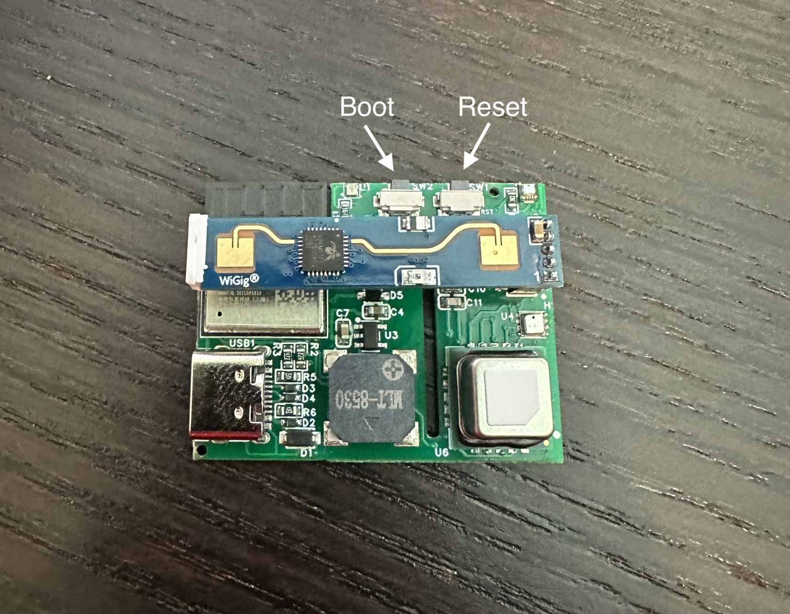

# Putting The MSR-1 In Boot Mode

This will cover how to put the MSR-1 into boot mode. This is sometimes needed for uploading new firmware if the device is struggling.

1. Unplug the device
2. Slide the back case off
3. Pull the device out of the case
4. Plug back into your computer
5. Press and hold the boot button, while holding it press and release the reset button, then release the boot button

6\. Continue on with uploading firmware document