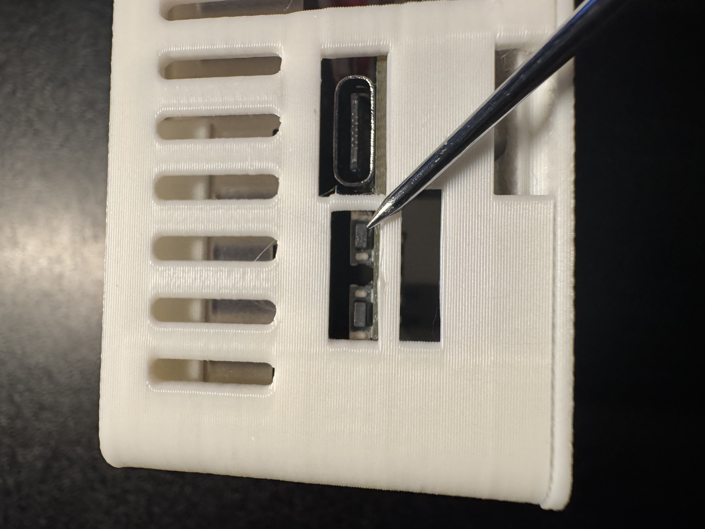
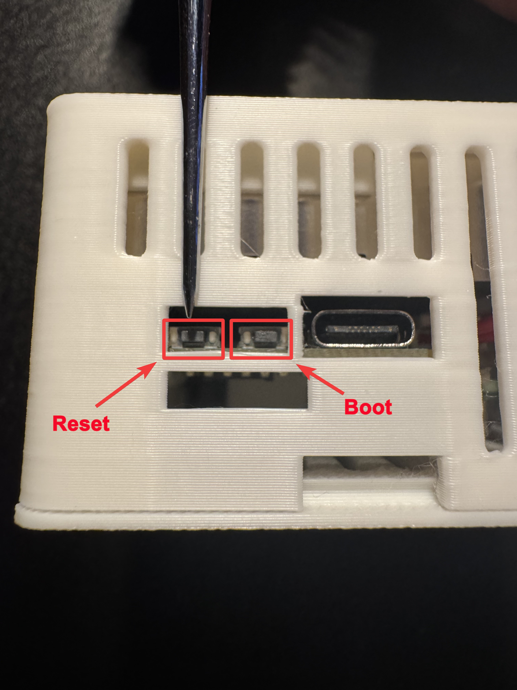

# Putting The AIR-1 In Boot Mode

!!! info "This will cover how to put the AIR-1 into boot mode."

    This is needed to force the device into boot mode to reflash the firmware.

##### Method 1: Boot Button Only

1\. Position the AIR-1 so that the USB-C port is facing you. On the left side of the USB-C port, locate a small opening to press the boot button (the right button).

2\. Push and hold the boot button. While still holding the button down, plug in a USB-C cable into the USB-C port of your AIR-1 then let go of the button.

3\. Continue with <a href="https://wiki.apolloautomation.com/products/air1/troubleshooting/air1-code/" target="_blank" rel="noreferrer nofollow noopener">uploading the firmware document</a>.

##### Method 2: Boot and Reset Buttons

1\. Unplug the device and locate the boot and reset buttons as shown in the image above.

2\. Plug it into your computer.

3\. Hold down the boot button, then press and release the reset button while keeping the boot button pressed. Finally, release the boot button.

4\. Continue with <a href="https://wiki.apolloautomation.com/products/air1/troubleshooting/air1-code/" target="_blank" rel="noreferrer nofollow noopener">uploading the firmware document</a>.