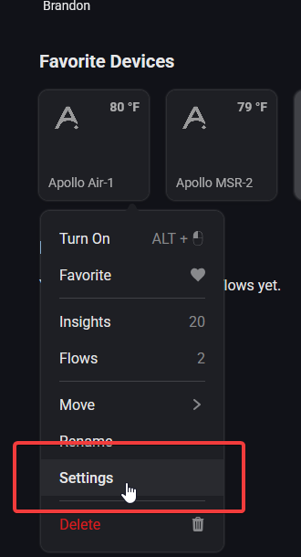
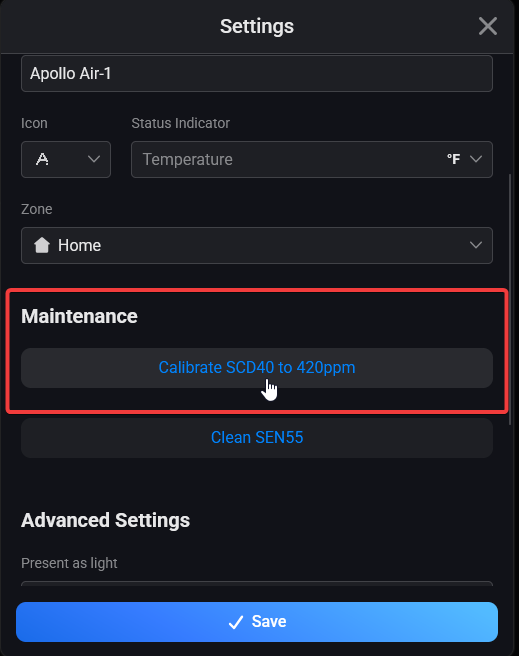
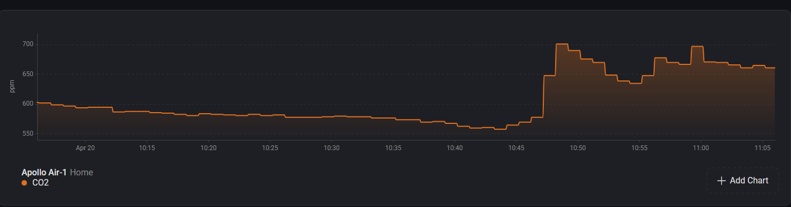
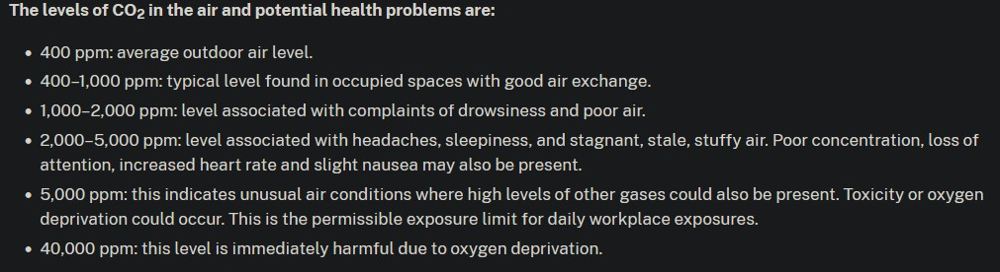

# CO2 Calibration

!!! tip "This should be done every 1-2 years."

    The <a href="https://sensirion.com/products/catalog/SCD40" title="Docmentation on SCD40 CO2 Sensor!" target="_blank" rel="noreferrer nofollow noopener">SCD40 CO2 sensor</a> has a long lifetime (<a href="https://sensirion.com/media/documents/48C4B7FB/66E05452/CD_DS_SCD4x_Datasheet_D1.pdf" title="scd10 datasheet showing lifetime over 10 years" target="_blank" rel="noreferrer nofollow noopener">over 10 years</a>) but it requires re-calibration after 1-2 years back to a 420 ppm baseline!

1\. Bring your sensor outside and plug it in. You might need a USB battery bank if you live in an apartment or otherwise cannot get power outside of your building.

2\. Open your Homey app or desktop browser and navigate to the Homey Dashboard.

3\. Navigate to your device, such as via the "Favorite Devices" section and right click (or on mobile short hold) then click on Settings.

4\. Scroll down until you see "Maintenance" and select it on mobile, then click on "Calibrate SCD40 to 420ppm" and you should see the CO2 readings at 420 ppm or near it.

It might take several attempts clicking the "Press" button for it to equalize correctly. If you don't see the SCD40 reporting 400-500 ppm then click the button again.

5\. Now your CO2 sensor should be calibrated! Be sure to setup some nice flows and check out the insights so you can monitor the CO2 levels.

!!! danger "Dangerous CO2 level considerations"

    CO2 levels in a closed, unventilated bedroom can quickly rise to concentrations that may impair focus or even pose health risks.

Note the steep decline in CO2 ppm detected due to the door and window being opened and fan turned on.

<a href="https://www.dhs.wisconsin.gov/chemical/carbondioxide.htm" target="_blank" rel="noreferrer nofollow noopener">Wisconsin Department of Health CO2 Level Chart</a>

!!! example "CO2 levels dropping due to HVAC Fan on a schedule"

    This could be improved by increasing air exchange to get below 1000 ppm for a safer environment.

