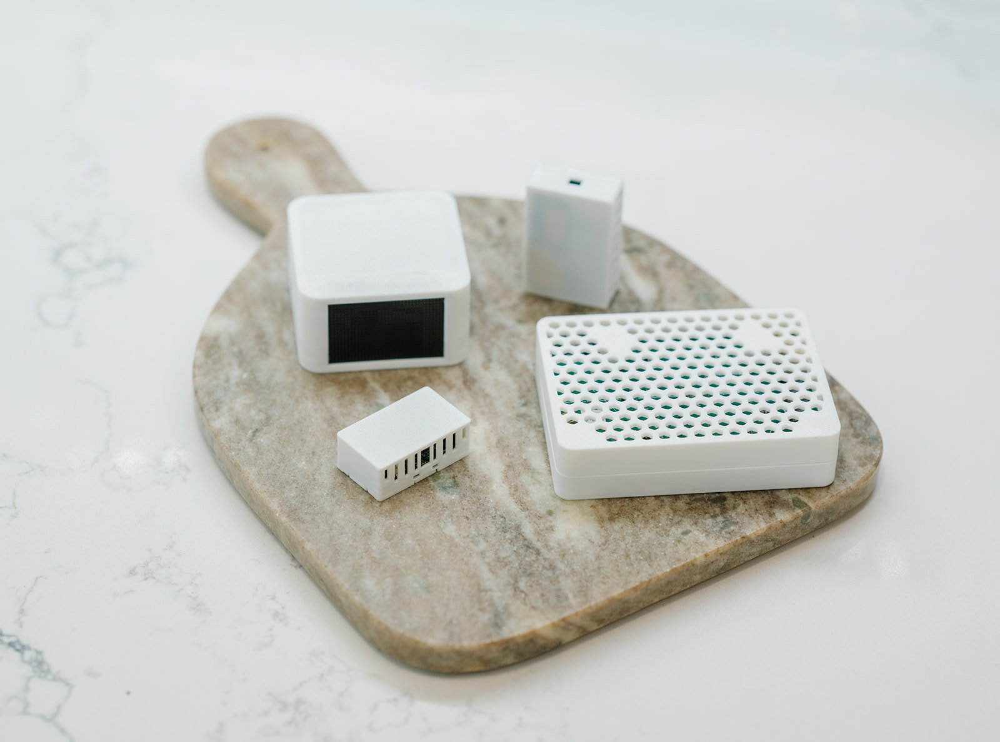

Apollo Automation is a small startup based in Lexington, Kentucky, dedicated to creating innovative, high-quality, and affordable smart home automation hardware. Founded in 2023 by a group of friends, the company was born out of frustration with existing solutions that lacked transparency and customization options. Named after Trevor’s dog, Apollo, the team set out to build products that offer complete local control without reliance on cloud services or subscriptions.

Apollo Automation focuses on designing and manufacturing open-source hardware and software that puts control in the hands of its users. The company engages closely with the Home Assistant community, providing fully customizable devices that integrate seamlessly with the platform. Their mission is to empower customers to build and control their own smart homes with ease, reliability, and privacy. Through monthly livestreams and an active Discord community, Apollo Automation remains accessible, transparent, and driven by user feedback, ensuring that their products meet the evolving needs of their customers.