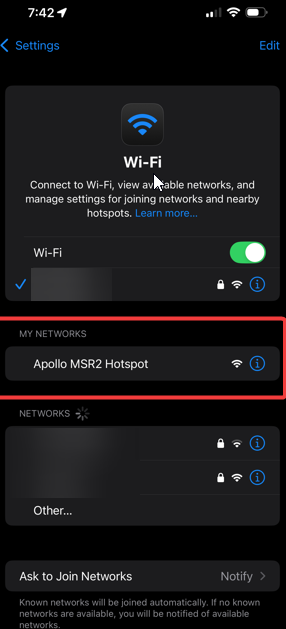
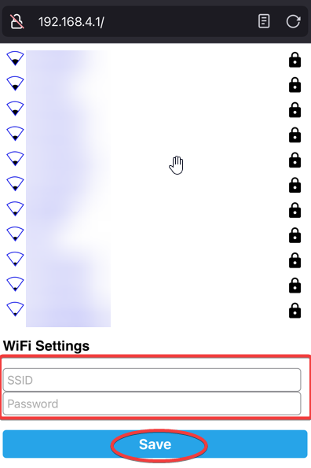
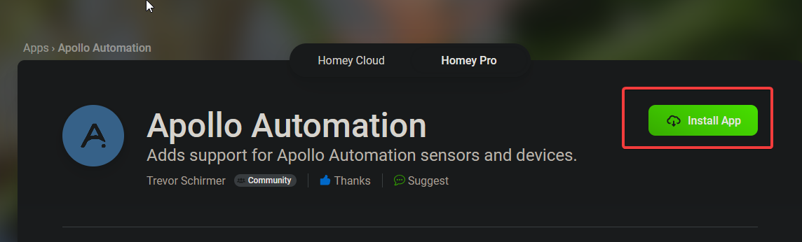
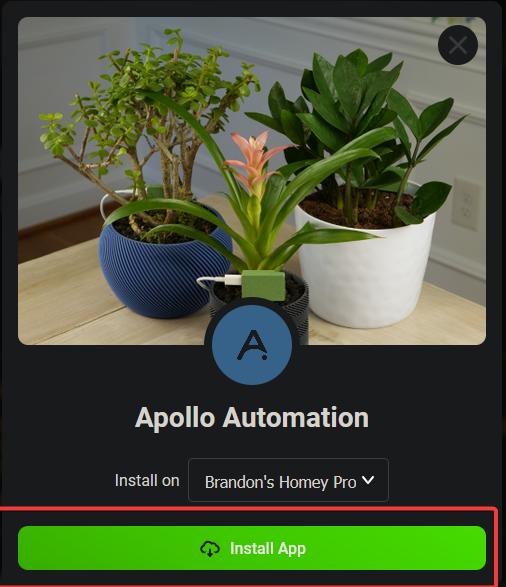
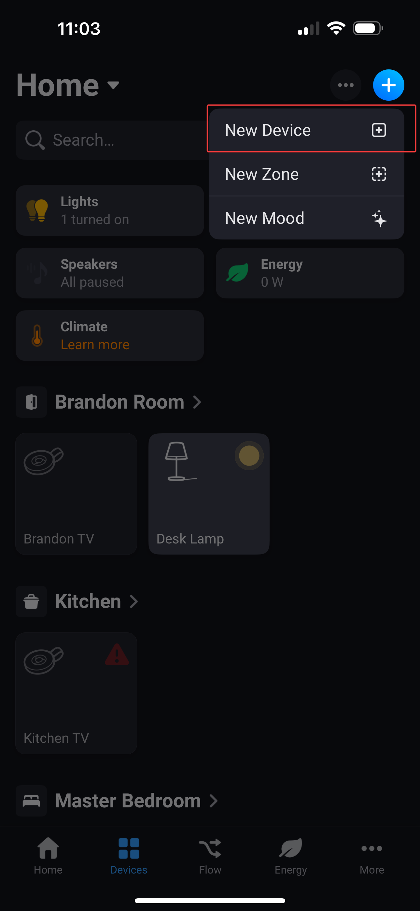
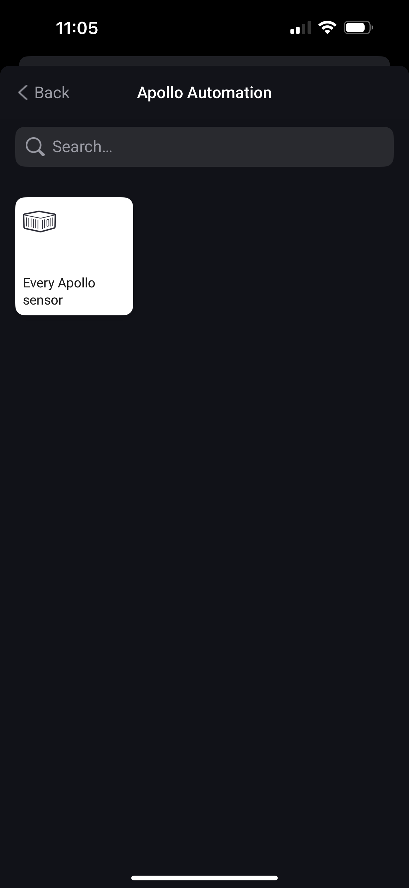
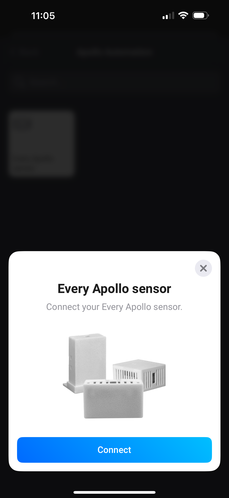
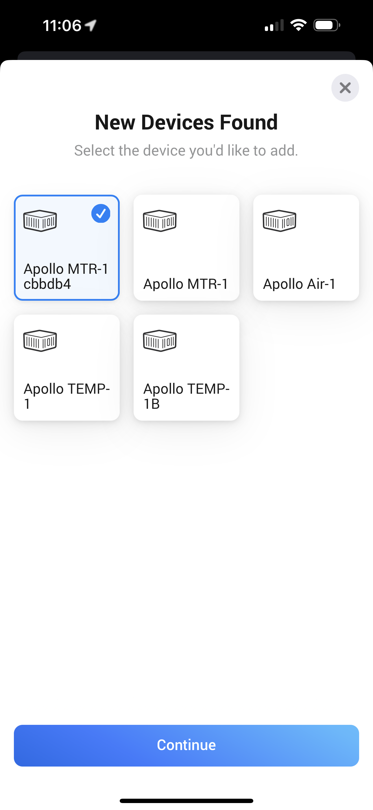
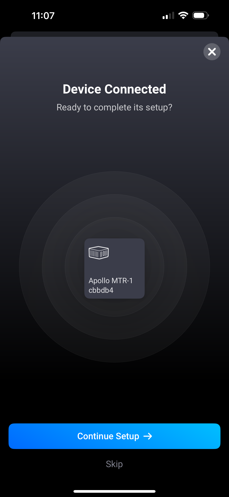
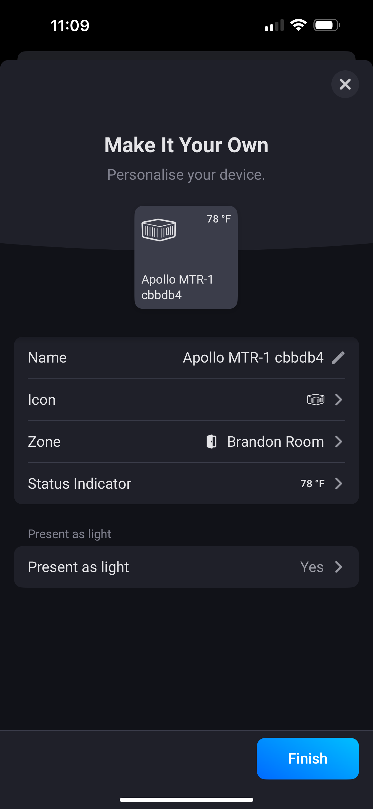

# Getting Started

This will walk you through the process of connecting your new Apollo Automation sensor to Homey. If at any point you get stuck, join our <a href="https://dsc.gg/apolloautomation" target="_blank" rel="noopener">Discord</a> for some help.

### Connecting Through Hotspot

To get your new Apollo sensor connected to your Wi-Fi, follow the steps below!

1\. Plug the sensor into a quality power brick. They require 5v and under an amp so most phone chargers will be fine. ESP devices are sensitive to power fluctuations and users have had some issues with really cheap power bricks. If your device is restarting or unavailable please try a different power brick.

2\. On your phone or PC, open the WiFi settings and connect to "Apollo MSR-2 Hotspot", it might take a minute for the WiFi network to show up.

3\. Once connected it should automatically open a dashboard for your sensor

If this does not automatically open the dashboard, please open your web browser and go to [http://192.168.4.1](http://192.168.4.1)

4\. Select the WiFi network that you would like your sensor to connect to or scroll to the bottom and type in your Wi-Fi network then click "**Save**".

!!! tip "Tip for Mesh Wi-Fi systems or multiple Access Points"

    If you have multiple access points or a mesh system please manually type in your Wi-Fi network so it will join with the strongest signal!

5\. Once connected, the sensor's dashboard will automatically close. You've successfully connected your sensor to your Wi-Fi.

[Click here for next steps!](https://wiki.apolloautomation.com/products/general/setup/getting-started/#connecting-to-home-assistant-via-esphome-integration){                                .md-button .md-button--primary }

### Adding Apollo Automation App in Homey:

1\. <a href="https://homey.app/en-us/app/com.apolloautomation/Apollo-Automation/test/" target="_blank" rel="noreferrer nofollow noopener">Navigate to this website</a> and click "Install App". For now this needs to be done from a desktop PC or a browser.

2\. Select the Homey device you want to install it on and then click "Install App" again!

3\. Your device will install the Apollo Automation Homey App then move to the next section.

### Connecting to Homey:

1\. Open the Homey App on your phone and navigate to the Devices tab at the bottom then select the (+) icon in the top right and choose "**New Device**". Choose "Allow" if it pops up asking to find Bluetooth devices, or you can change this later in settings.

2\. Select Apollo Automation under Brands in the bottom left then choose "Every Apollo Sensor". When prompted, click "Connect".

3\. Your Apollo devices will automatically show up and if not, please first connect it to your Wi-Fi following the steps outlined here.

4\. Select the device you want to add, in this case an Apollo MTR-1 and click Continue at the bottom.

5\. Click Continue Setup and choose a Zone to place your device in. If you are new to Homey you can choose Home and move it to another Zone later after you create more zones!

6\. Change any other default settings like the Name, icon, etc or just click Finish in the bottom right.

7\. You are done! Your sensor is now ready to create flows and add as a favorite to your dashboard!

[Click here to join our Discord for fast support! :simple-discord:](https://dsc.gg/apolloautomation){                                  .md-button .md-button--primary }