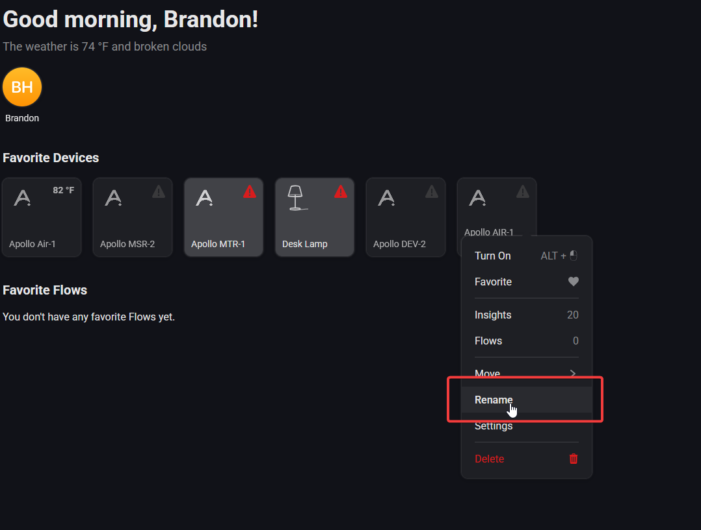
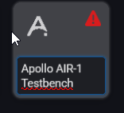

# Renaming Apollo Devices

1\. Open the Homey App or dashboard in a browser and right click a device or short hold and then select "Rename".

2\. Type in the new name and then hit enter. That's it, you're done!

