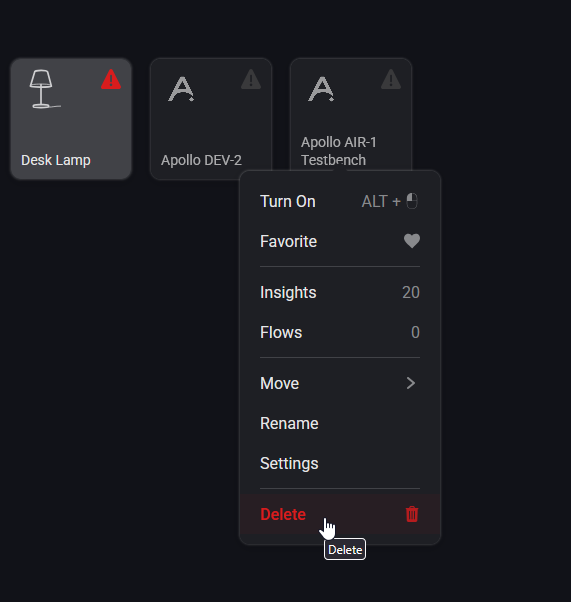
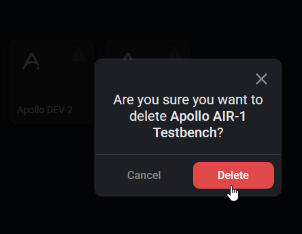

# Removing Devices from Homey

1\. Open your Homey app or desktop browser and navigate to the Homey Dashboard.

2\. Navigate to your device, such as via the "Favorite Devices" section and right click (or on mobile short hold) then click "Delete".

