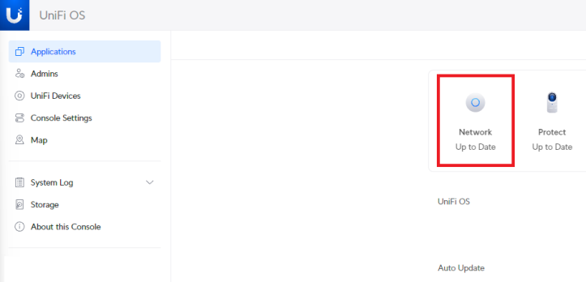
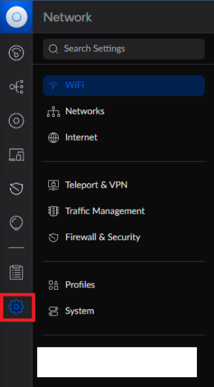
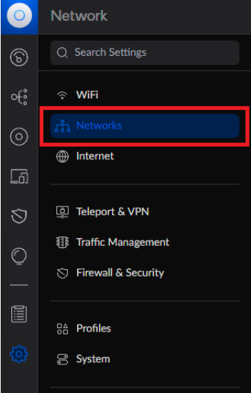
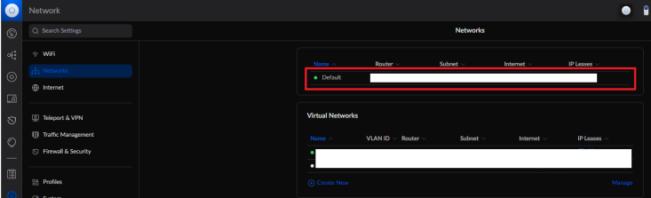
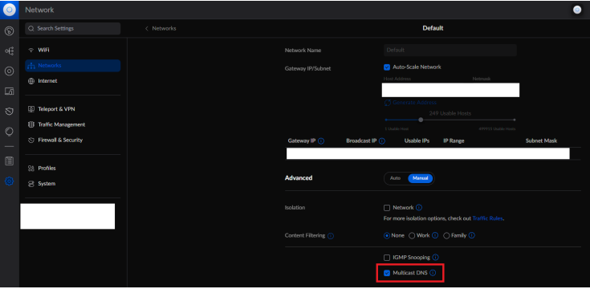
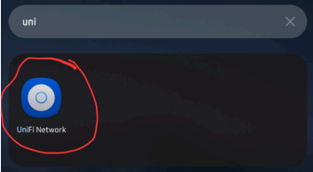
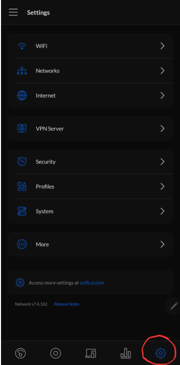
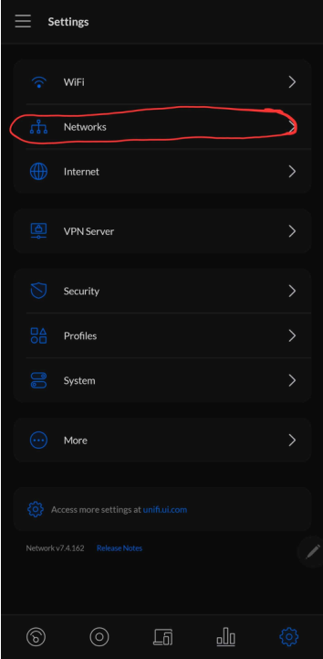
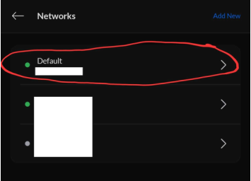
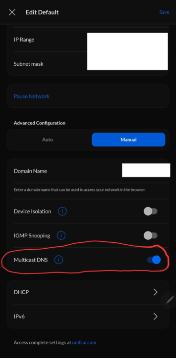

# Ubiquiti Unifi mDNS Auto Discover Issue

!!! tip "If mDNS is unchecked then Homey and ESPHome will not auto discover new devices"

    If you have different networks that Homey and ESPHome devices are on, then you will need mDNS working across both networks and firewall rules allowing access between them. Below are guides for using your PC and the Unifi iOS app to fix this issue.

##### **Method 1: Browser**

1\. Log into your Unifi network through your default IP address which is usually 192.168.1.1

2\. Select Network

3\. Select Settings

4\. Select Networks

5\. Select the Default Network

6\. Check Multicast DNS

7\. Now the Homey/ESPHome auto-discover issue should be fixed!

8\. If this does not work then you can also try checking IGMP Snooping (checkbox above Multicast DNS) on your IoT networks.

##### **Method 2: Unifi iOS App.**

1\. Open the UniFi app.

2\. Tap Settings icon in the bottom right.

3\. Tap Networks

4\. Tap Default Network.

5\. Tap IPv4 then turn on the Multicast DNS slider.

6\. Now the Homey/ESPHome auto-discover issue should be fixed!