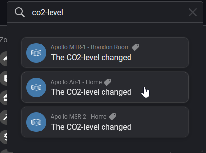

# High CO2 Notification

!!! tip "This guide will show you how to create a flow that sends a notification to everyone who's home when the CO2 is over a set threshold, 1500 ppm in this example."

    This guide is made using the web browser due to using Advanced Flows version of Homey as well!

1\. First we need to open a web browser such as Firefox and head to <a href="https://my.homey.app" target="_blank" rel="noreferrer nofollow noopener">the Homey webapp</a> and click on the Flow tab on the left side.

2\. Click "New Flow" then "Advanced Flow"

3\. Click "Add" and select "When".

4\. In the search bar at the top, type in "co2-level" and select the sensor you want to track.

5\. Place your node on your flow area with a left click.

&nbsp;