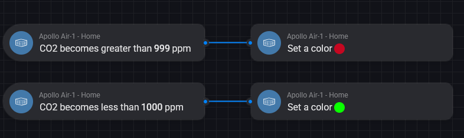

# High CO2 Notification

!!! tip "This guide will show you how to create a flow that sends a notification to everyone who's home when the CO2 is over a set threshold, 1000 ppm in this example."

    This guide is made using the web browser due to using Advanced Flows version of Homey!

1\. First we need to open a web browser such as Firefox and head to <a href="https://my.homey.app" target="_blank" rel="noreferrer nofollow noopener">the Homey webapp</a> and click on the Flow tab on the left side.

2\. Click "New Flow" then "Advanced Flow".

3\. Click "Add" and select "When".

4\. In the search bar at the top, type in "co2 becomes" and select the card for the sensor you want to track. We are choosing "CO2 becomes greater than" for the Apollo AIR-1 device.

5\. Place your card on your flow area with a left click. You should have this node on your flow canvas.

6\. Select "ppm" and type in your value, we will use 999.

7\. Duplicate steps 4 and 5 above but this time select "CO2 becomes less than" and place it on your flow canvas.Make sure to fill in your less than ppm value such as 1000.

8\. Click "Add" and select "Then" and search for "set a color" and choose the AIR-1 device option.

9\. Draw a line to connect "CO2 becomes greater than 999 ppm. Click the 3 dots and select a color - we have chosen red to indicate a problem.

10\. Duplicate steps 7 and 8 but this time select green for the color when "CO2 becomes less than 1000 ppm".

11\. Click "Add" and select "Then" and search "push" and choose "Send message to user".

12\. Draw a line to connect set a color to the push notification. Write in "The CO2 level in the bedroom is currently CO2 ppm. Open the Window, turn on HVAC, etc to lower this value!"  Then replace the second "CO2" and click the little tag icon and type in CO2 then select the blue CO2 option under Apollo AIR-1.

13\. Click "User" and choose "Everyone who's home" or your preferred option.

13\. Click "Add" and select "Delay" and then place it on your flow canvas. Change to minutes and input 5 for adding a 5 minute delay then drag a line from "set a color" to the delay.

14\. Click "Add" and select "Then" and search for "turn off" and choose the AIR-1 device option.

15\. Drag a line from the Delay in step 13 to the Turn off card and that's it! Click save at the top and give your flow a name.

16\. As a bonus, you can add a note reminding you what this automation does. Click "Add" then click "Note" and type in "CO2 level alert with RGB LEDs" on the note.

17\. You are done! Your sensor is now ready to create flows and add as a favorite to your dashboard!

[Run into issues? Click here to join our Discord for fast support! :simple-discord:](https://dsc.gg/apolloautomation){                                          .md-button .md-button--primary }