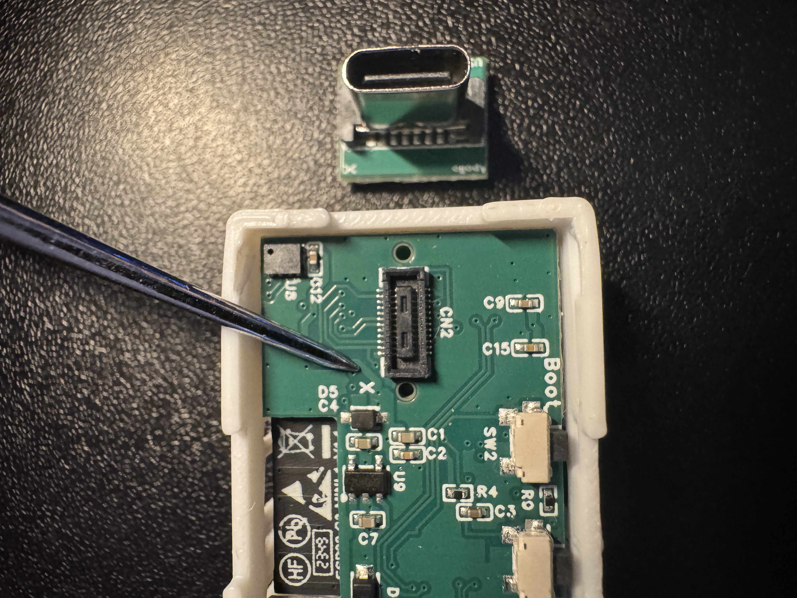
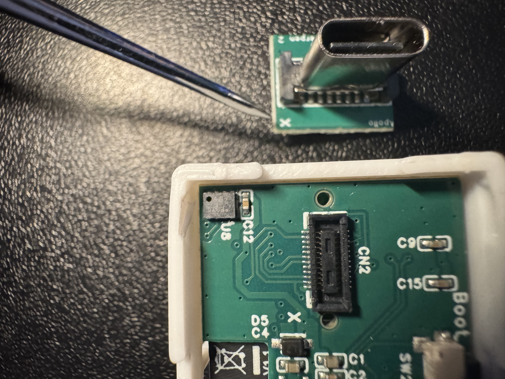
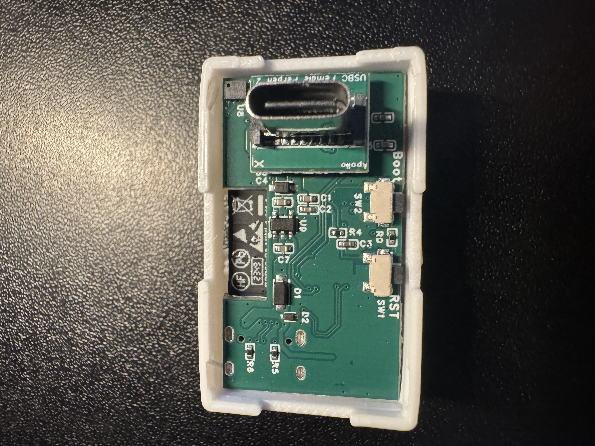
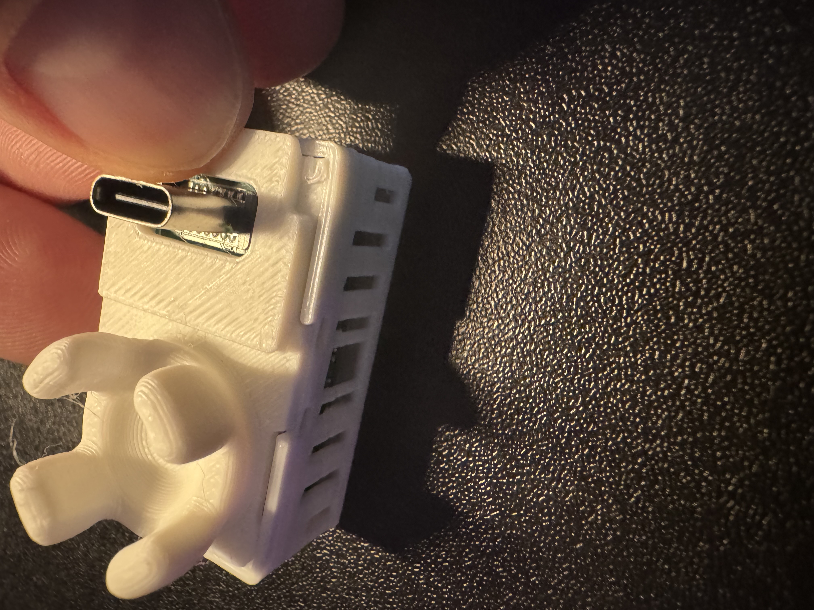
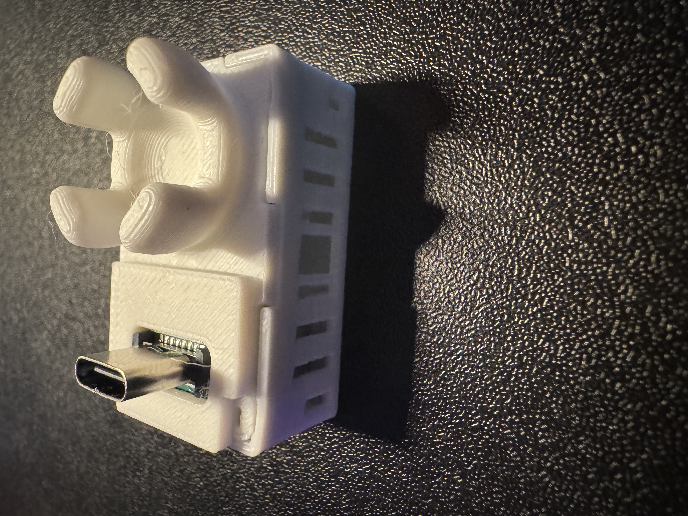

# Adding Rear Female USB-C To MSR-2

1\. Unplug your MSR-2 from power and remove the back

2\. Identify the "X" on the PCB on the back of your MSR-2 and the "X" on the top left corner of the Female Rear USB-C addon.

3\. Keep the "X" aligned on both sides and gently push down until it securely seats in the small mezzanine connector.

4\. Align the new back for your MSR-2 that came with the Female USB-C addon. It's possible you might have a flat back version and <a href="https://www.printables.com/model/932026-apollo-automation-msr-2-mmwave-co2-multisensor-for/files#preview.file.oGG7K" target="_blank" rel="noreferrer nofollow noopener">you can print that yourself too!</a>

5\. Push down on the corners closest to the USB-C addon first, and then push the back on securely on the other two corners.

