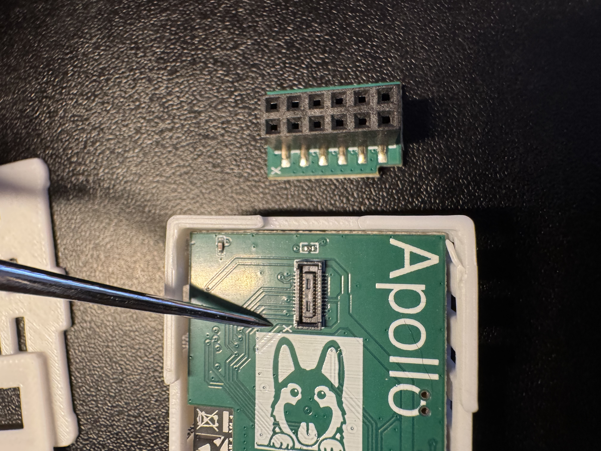
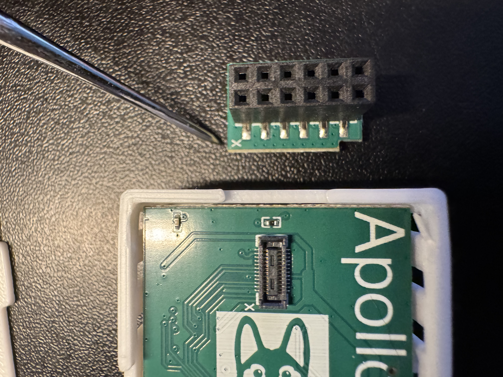
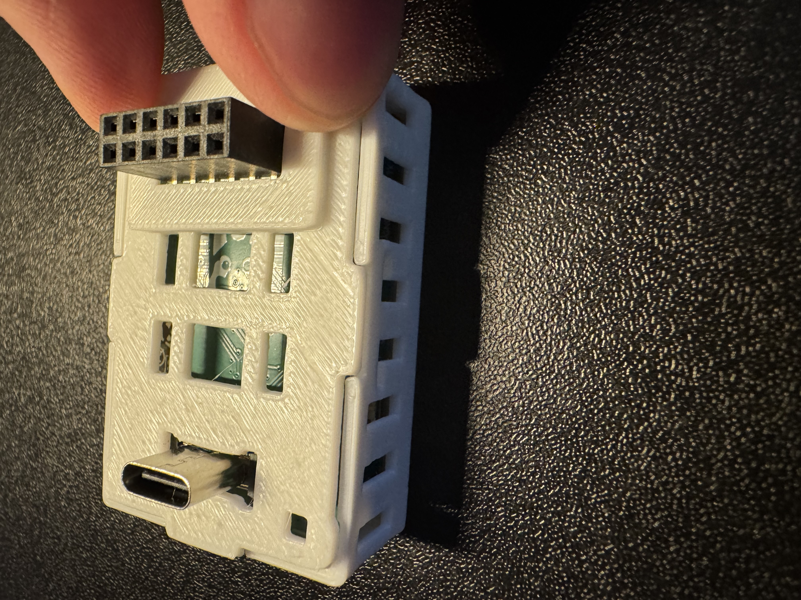
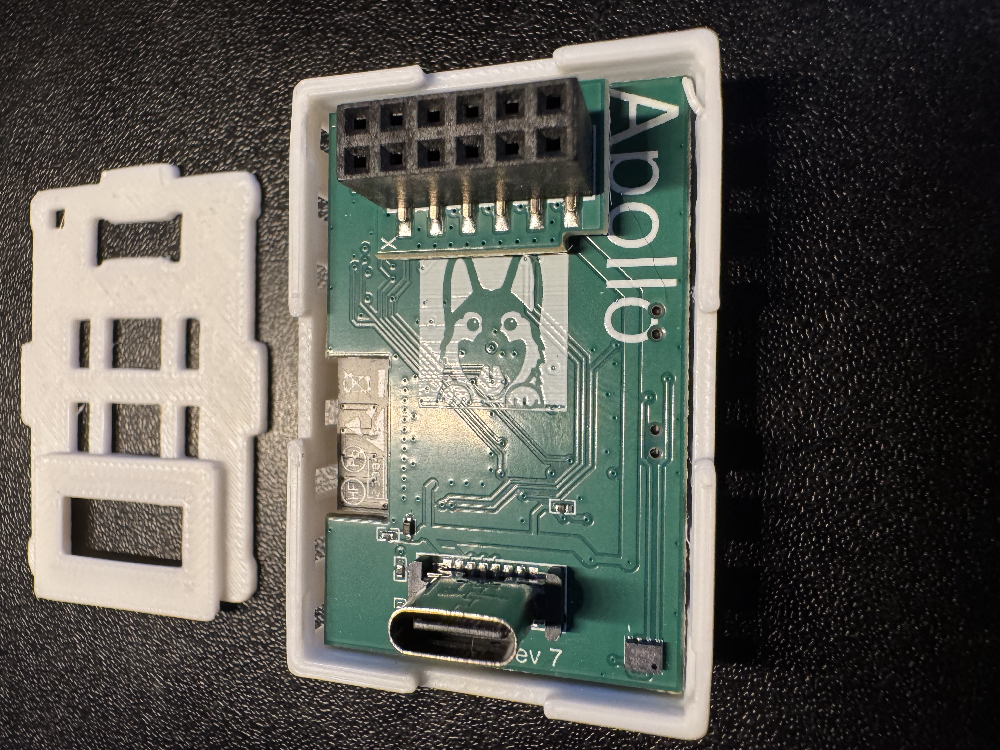
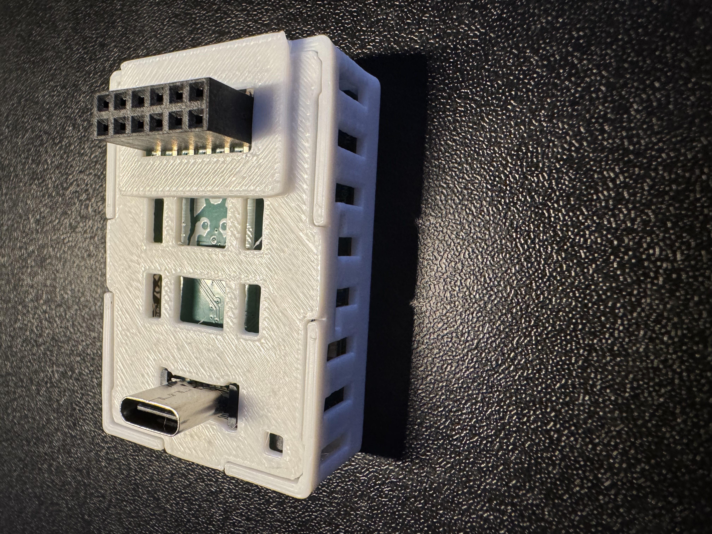
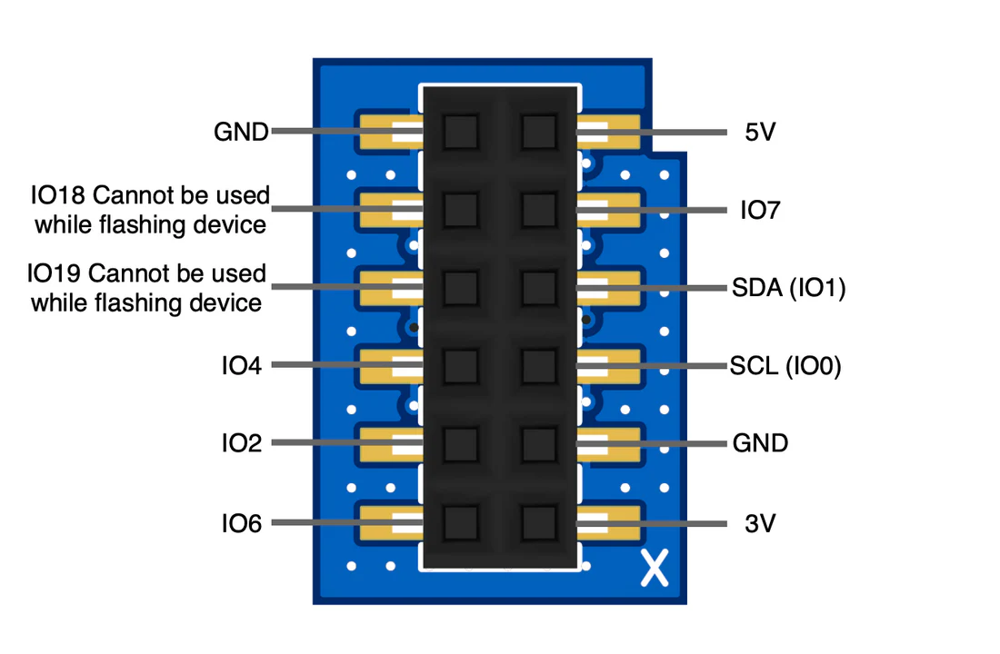

# Adding GPIO Header To MTR-1

1\. Unplug your MTR-1 from power and remove the stand if attached.

2\. Remove the backplate of the MTR-1.

3\. Identify the "X" on the PCB on the back of your MTR-1 and the "X" on the top left corner of the GPIO Header addon.

4\. Keep the "X" aligned on both sides and gently push down until it securely seats in the small mezzanine connector.

5\. Align the new back for your MTR-1 that came with the GPIO Header addon. Push down on the corners closest to the GPIO Header addon first, and then push the back on securely on the other two corners.

6\. The case should sit flush and you're now ready to add functionality to your device!

!!! ! tip "Make sure to check out our GPIO Header LED Strip Tutorial!"

    Brandon AKA SmartHomeSellout made this neat tutorial for how to connect a short LED strip to your MSR-2

    <a href="https://wiki.apolloautomation.com/products/msr2/examples/gpio-header-control-an-led-strip/" target="_blank" rel="noreferrer nofollow noopener">GPIO LED Strip Tutorial</a> 

&nbsp;