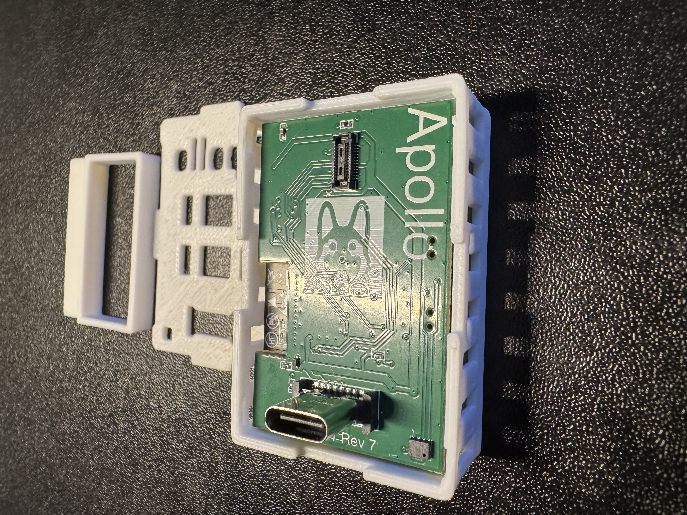
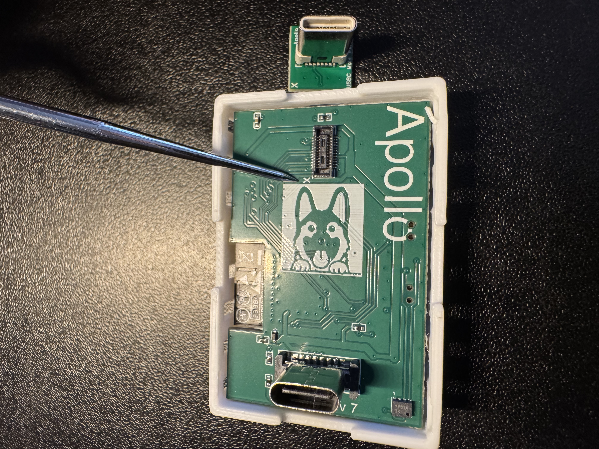
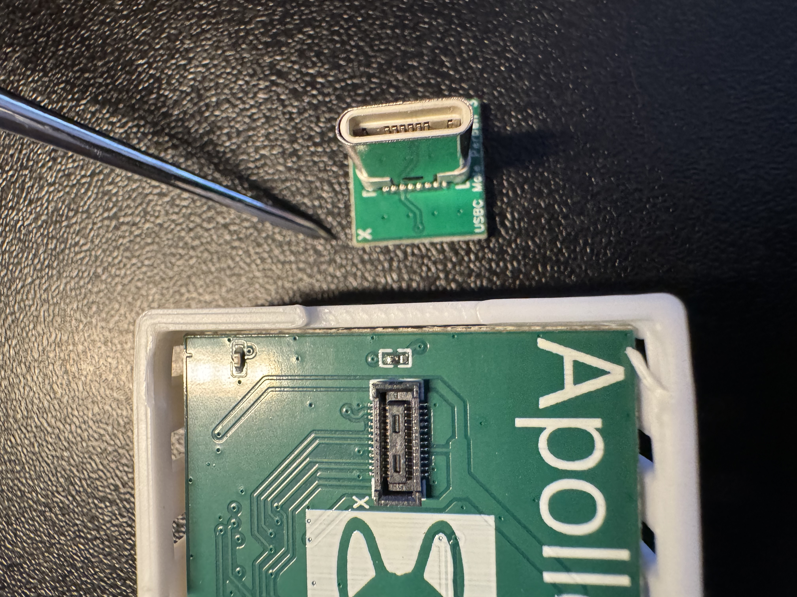
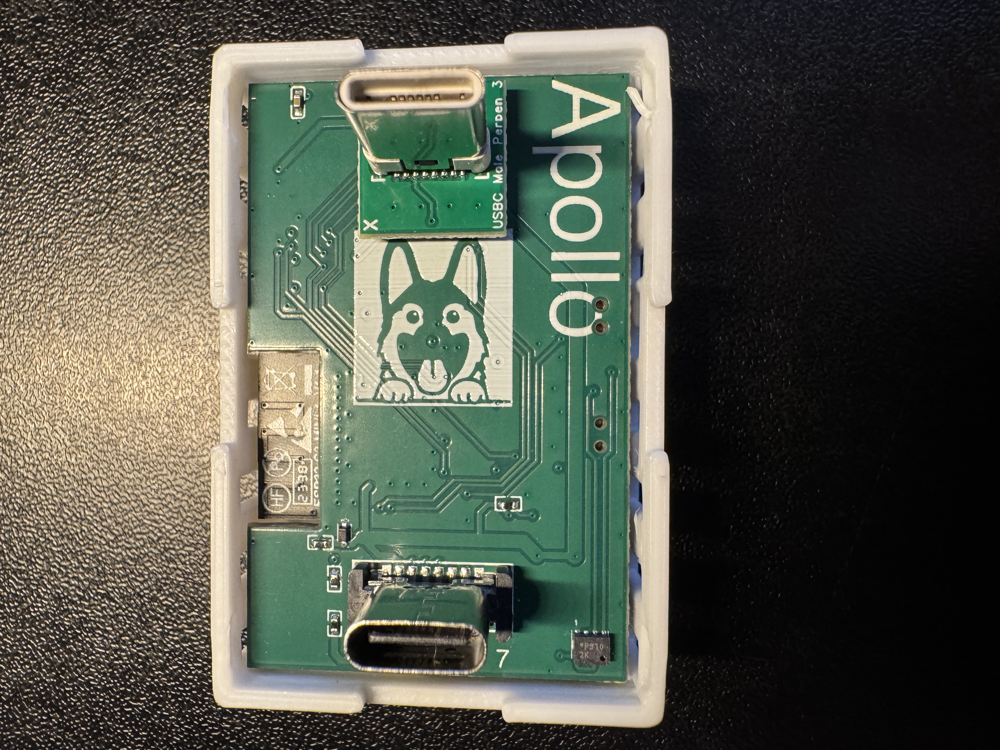
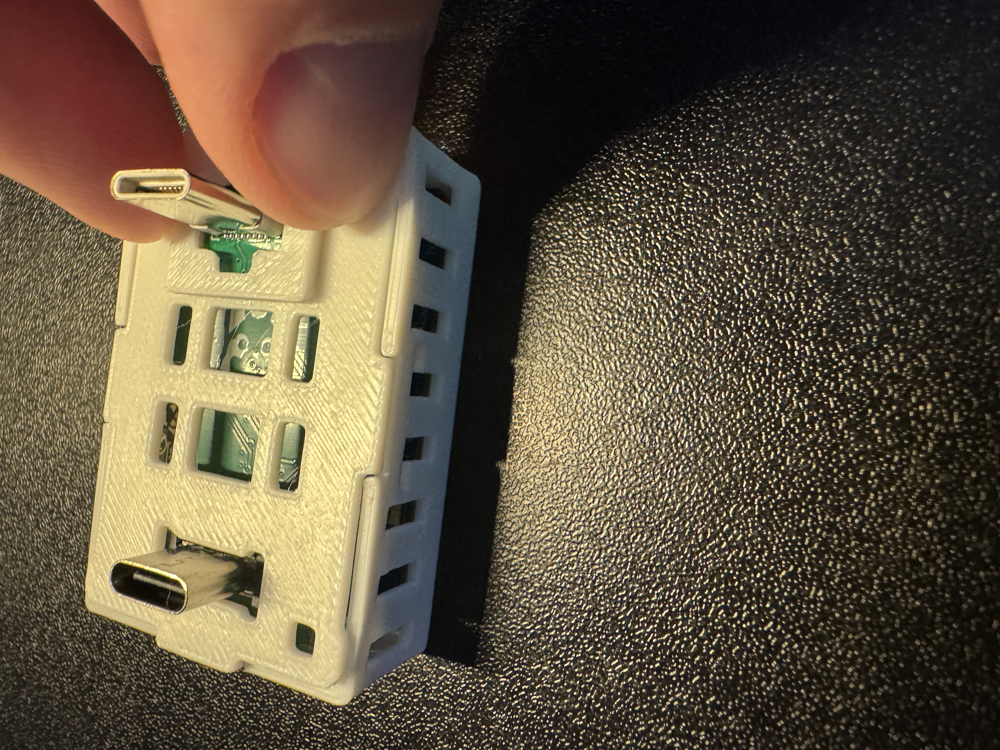
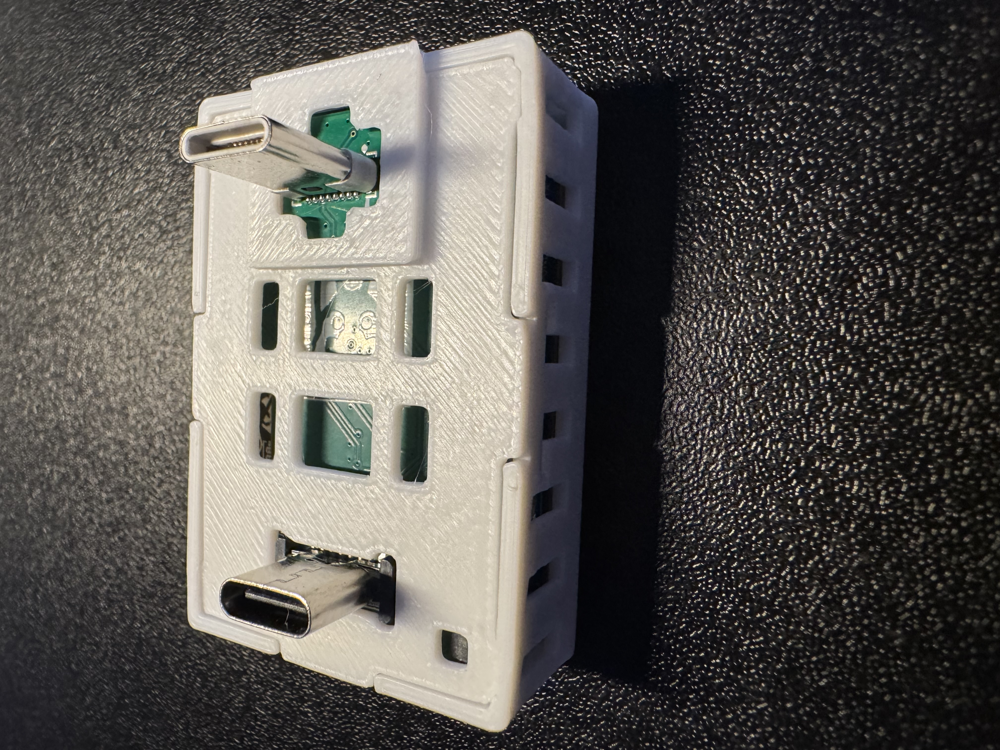

# Adding Rear male USB-C To MTR-1

1\. Unplug your MTR-1 from power and remove the stand if attached.

2\. Remove the backplate of the MTR-1.

3\. Identify the "X" on the PCB on the back of your MTR-1 and the "X" on the top left corner of the male Rear USB-C addon.

4\. Keep the "X" aligned on both sides and gently push down until it securely seats in the small mezzanine connector.

5\. Align the new back for your MTR-1 that came with the Male USB-C addon. Push down on the corners closest to the USB-C addon first, and then push the back on securely on the other two corners.

6\. The case should sit flush and you're now ready to plug into a USB-C Outlet!

