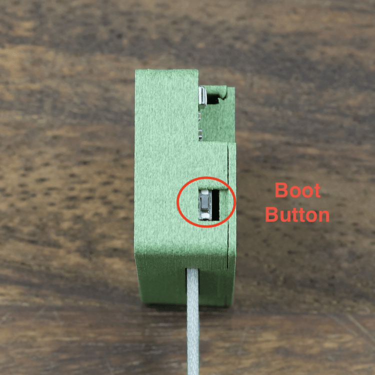

# Reset Wi-Fi Credentials on your PLT-1

1\. Plug the device into power.

2\. Long press the Boot button for 10 seconds

3\. The Wi-Fi credentials should be reset and it will broadcast its hotspot again.

4\. Connect to the hotspot titled "Apollo PLT-1 Hotspot" and enter your new Wi-Fi details!