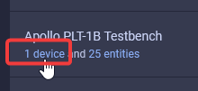
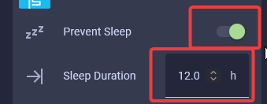

# Prevent Sleep

!!! tip "Put your sensors to sleep!"

    All of our battery powered device are able to go to sleep to save battery life. Our non-battery sensor devices like the AIR-1 and PLT-1 can also sleep to get better temperature and humidity measurements.

    The temperature offsets needed will be much lower for your sensors as the microcontroller will not put off as much heat when it is sleeping and then waking for short periods to report the sensor values.

1\. Head to the <a href="http://homeassistant.local:8123/config/integrations/integration/esphome" title="Click me to go to the ESPHome integrations page" target="_blank" rel="noreferrer nofollow noopener">ESPHome Integrations page</a>.

2\. Click on the name "1 device" below your Apollo device's name.

3\. Scroll down until you see "Prevent Sleep" and "Sleep Duration".

4\. Type in the amount of minutes you want your sensor to sleep in the "Sleep Duration" box. Defaults to 12 hours.

!!! warning "Read this before turning off Prevent Sleep!"

    When "Prevent Sleep" is toggled off, your sensor will immediately begin sleeping. Please make sure you are ready to make this sensor sleep before toggling off prevent sleep.

5\. When you are ready, toggle off "Prevent Sleep" and your sensor will go to sleep. It will wake up every 5 minutes, or on the interval you set in step 4. If you need to keep your sensor awake, head to our <a href="https://wiki.apolloautomation.com/products/general/battery-sensors/awake-ha-helper/" target="_blank" rel="noreferrer nofollow noopener">OTA Awake helper tutorial</a>!

6\. You can wake your sensor by <a href="https://wiki.apolloautomation.com/products/general/battery-sensors/wake-up-battery-sensor/" target="_blank" rel="noreferrer nofollow noopener">following this guide</a> or you can power cycle your device. If there is a battery in it, the battery will need to be removed or the reset button pressed.

!!! danger "Do not leave your sensor outside or let it get wet!"

    The PLT-1B should not be left outside for long periods of time or allowed to get wet. You will need to use another case around your PLT-1B if there will be high moisture content in the air or if it is expected to rain.