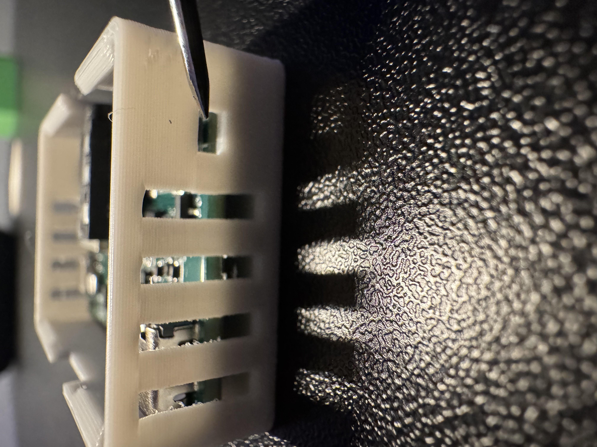
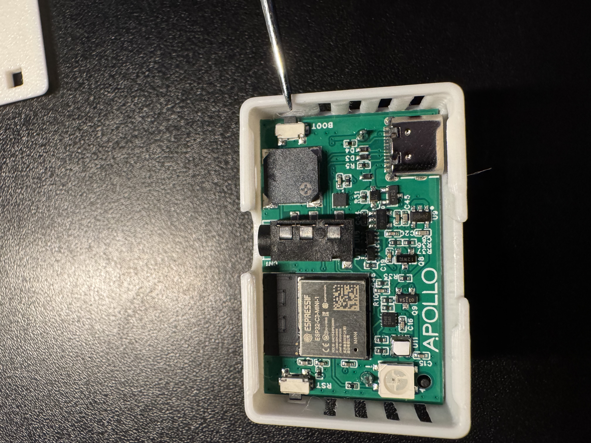

# Putting The TEMP-1 In Boot Mode

!!! info "This will cover how to put the TEMP-1 into boot mode."

    This is needed to force the device into boot mode to reflash the firmware.

##### Method 1: Boot Button Only

1\. Position the TEMP-1 so that the USB-C port is facing you. On the right side of the device, locate a small opening where you can use a paperclip to press the boot button.

If you prefer, please remove the lid by gently prying up on the small slit by the top of the case.

2\. Push and hold the boot button. While still holding the button down, plug in a USB-C cable into the USB-C port of your TEMP-1 then let go of the button.

3\. Continue with [uploading the firmware document](https://apolloautomation.github.io/docs/products/temp1/troubleshooting/temp1-code/).

##### Method 2: Boot and Reset Buttons

1\. Unplug the device and remove the case as shown in the images above

2\. Plug it into your computer.

3\. Hold down the boot button, then press and release the reset button while keeping the boot button pressed. Finally, release the boot button.

4\. Continue with [uploading the firmware document](https://apolloautomation.github.io/docs/products/temp1/troubleshooting/temp1-code/).