# Automation Examples using a TEMP-1B

###### Freezer Temperature Probe Example

This will guide you through how to setup an automation in Home Assistant using the temperature probe in your freezer! At the end, you will have an automation that sends your phone a notification when your temp is exceeded.

1\. Place the temperature probe into your freezer and then wait for it to normalize around 0°F (-18°C). Make sure your TEMP-1B is in a cool dry place - only the temp probe and wire can withstand the temperatures in the fridge, freezer, etc.

2\. Once normalized, look at the graph and determine a good value to set for both the maximum and minimum temperatures. My mini freezer seems to max out at 30°F so I would want to go slightly above that range. However, <a href="https://www.energy.gov/energysaver/refrigerator-freezer-use-and-temperature-tips" target="_blank" rel="noreferrer nofollow noopener">in most freezers, they should NOT reach above 0</a>°<a href="https://www.energy.gov/energysaver/refrigerator-freezer-use-and-temperature-tips" target="_blank" rel="noreferrer nofollow noopener">F</a> so you will likely need to input a lower value than me. my minimums are around -20°F.


3\. We now need to convert F to C since the max and min temps are measured in Celsius. My new values I will input are max probe temp 2°C and a min probe temp of -30°C. Reminder, yours will likely be different values, especially your max probe temp.

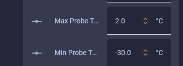

4\. The automation is now ready to be created -

5\. Click Settings -&gt; Automations & scenes -&gt; click Create Automation in the bottom left then "create new automation". <a href="http://homeassistant.local:8123/config/automation/edit/new" target="_blank" rel="noreferrer nofollow noopener">Click here to go straight there!</a>

6\. Click Add Trigger then Entity then Numeric state and search for your TEMP-1B device such as "temp-1b max probe temp" then in the box labeled "Above" type in the max probe temp number you found in step 2 above. Advanced users skip to step 10.

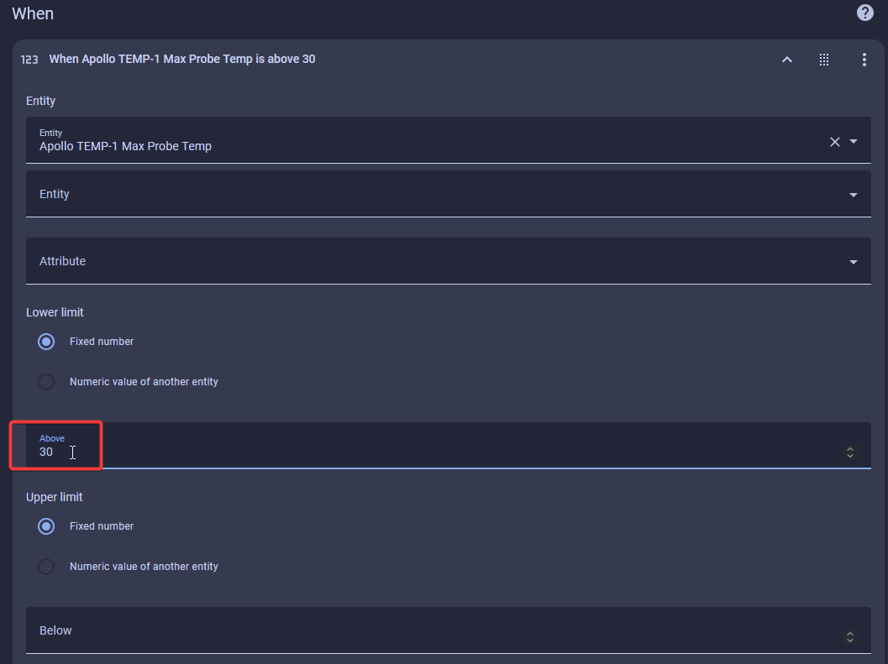

7\. Click Add Action then type in "iPhone" and select your phone. if you do not see your phone or have an Android, try typing in "notify" instead and scrolling down until you find your phone listed.


!!! tip "If you still do not see your device as shown in step 7 read this!"

    You need the Home Assistant mobile app installed on your phone for this step to work! If you do not have it, try another notification instead of using your phone such as a TTS notification on your speakers. This could be a fun way to announce that dinner is ready!

8\. Type in your preferred message and if you want, check the box for title and type in your title for the message as well. Mine says: "The temperature probe on your TEMP-1B reached its max temperature and your freezer might be having issues." and "Check the freezer!".


9\. Click save in the bottom right and then give it a Name and optionally a Description and a Category as well. You are done!


---

10\. YAML for Advanced Users

```yaml
alias: Freezer Over Max Temp Automation
description: Warning for the freezer when it reaches the max temperature.
triggers:
  - trigger: numeric_state
    entity_id:
      - number.apollo_temp_1b_max_probe_temp
    above: 30
conditions: []
actions:
  - action: notify.mobile_app_brandons_iphone
    metadata: {}
    data:
      title: Check the freezer!
      message: >-
        The temperature probe on your TEMP-1B reached its max temperature and
        your freezer might be having issues.
mode: single
```

###### Food Probe Example

This will guide you through how to setup an automation in Home Assistant using the food probe with Chicken(or anything) cooking to 165°F(73.9C). At the end, you will have an automation that sends your phone a notification when your temp is exceeded.

1\. Set your Max Probe Temp to 73.9°C. The offsets MUST be in Celsius even if you are using F in the automation below.

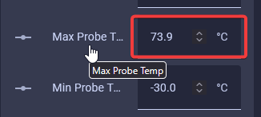

2\. Place the food probe inside your food once it's on the grill. Make sure your TEMP-1 is in a cool dry place - only the <a href="https://wiki.apolloautomation.com/products/temp1/addons/food-probe/" title="Click me for more info on installation of food probe and usage." target="_blank" rel="noreferrer nofollow noopener">food probe and the wire can withstand temperatures on a grill, in the oven, etc</a>.

3\. Click Settings -&gt; Automations & scenes -&gt; click Create Automation in the bottom left. <a href="http://homeassistant.local:8123/config/automation/edit/new" target="_blank" rel="noreferrer nofollow noopener">Click here to go straight there!</a>

4\. Click Add Trigger then Entity then Numeric state and search for your TEMP-1b device such as "temp-1b max probe temp" then in the box labeled "Above" type in the max probe temp number you want for your food - In this example we will use 165°F(73.9C) such as the temperature it's safe to cook Chicken to. Advanced users skip to step 8.

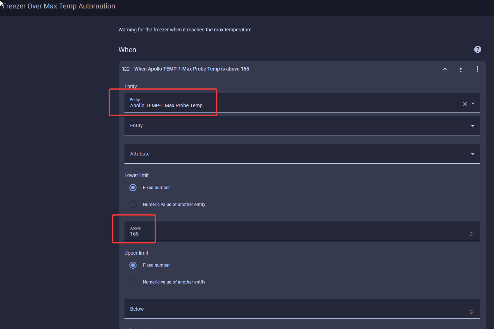

5\. Click Add Action then type in "iPhone" and select your phone. if you do not see your phone or have an Android, try typing in "notify" instead and scrolling down until you find your phone listed.


!!! tip "If you still do not see your device as shown in step 7 read this!"

    You need the Home Assistant mobile app installed on your phone for this step to work! If you do not have it, try another notification instead of using your phone such as a TTS notification on your speakers. This could be a fun way to announce that dinner is ready!

6\. Type in your preferred message and if you want, check the box for title and type in your title for the message as well. Mine says: "The temperature probe on your TEMP-1B reached its max temperature and your food is ready." and "Check the food!".


7\. Click save in the bottom right and then give it a Name and optionally a Description and a Category as well. You are done!


---

8\. YAML for Advanced Users

```yaml
alias: Food Over Max Temp Automation
description: Warning for the food when it reaches the max temperature.
triggers:
  - trigger: numeric_state
    entity_id:
      - number.apollo_temp_1b_max_probe_temp
    above: 165
conditions: []
actions:
  - action: notify.mobile_app_brandons_iphone
    metadata: {}
    data:
      title: Check the food!
      message: >-
        The temperature probe on your TEMP-1B reached its max temperature and your food is ready.
mode: single
```

###### Cook Chicken Example

This will guide you through adding a button to your dashboard called "Chicken Monitor" and an automation that runs when the button is pressed! This will turn the RGB LED Green when running, message your phone when it starts and when it finishes, plus when the temperature is reached, then turn the RGB LED off. Thanks to Discord user RalphP for this!

1\. Create a new toggle helper called "Chicken Monitor". Please <a href="https://wiki.apolloautomation.com/products/general/battery-sensors/awake-ha-helper/" target="_blank" rel="noreferrer nofollow noopener">click here</a> for step by step directions on creating a toggle helper.

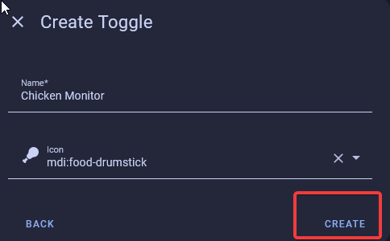

2\. Edit your dashboard, add a button card, select Chicken Monitor, and then save.

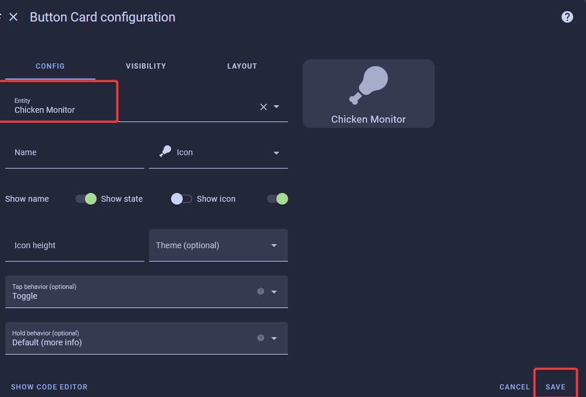

3\. Click Settings -&gt; Automations & scenes -&gt; click Create Automation in the bottom left then "create new automation". <a href="http://homeassistant.local:8123/config/automation/edit/new" target="_blank" rel="noreferrer nofollow noopener">Click here to go straight there!</a>

4\. Click Add Trigger then Entity then State and search for "Chicken Monitor" then in the box labeled "To" select "On". Advanced users skip to step 25 for the YAML.

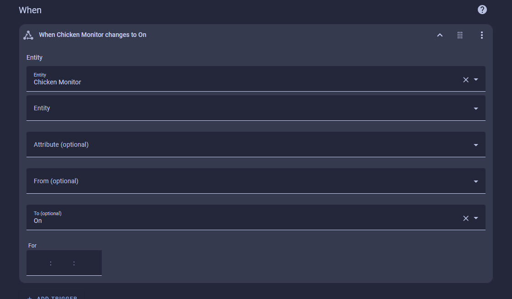

5\. Create a Trigger ID for this called "Chicken Monitor On".

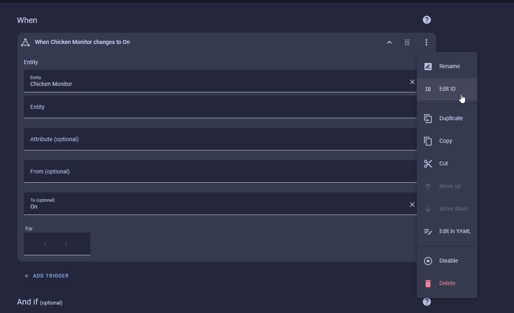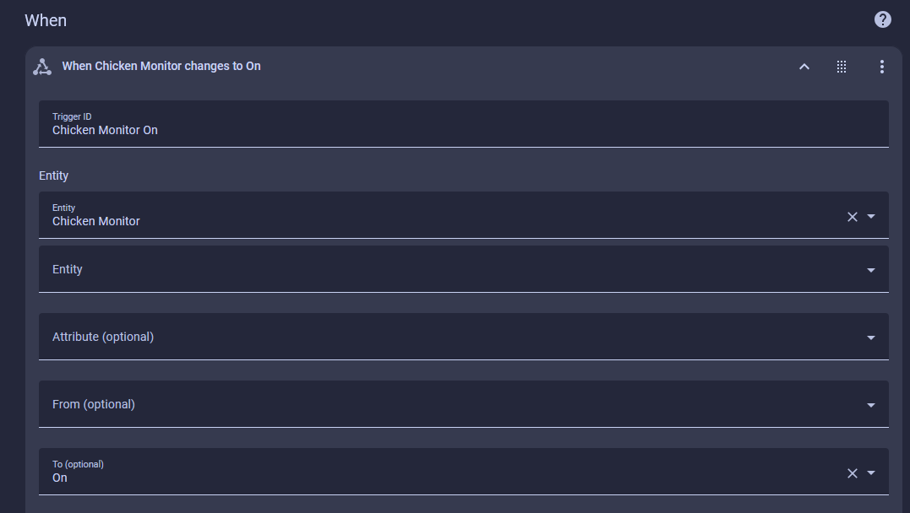

6\. Click Add Trigger then Entity then State and search for "Chicken Monitor" then in the box labeled "To" select "Off". Create a Trigger ID for this called "Chicken Monitor Off".


7\. Click Add Trigger then Entity then Numeric state and search for your temp-1 food probe entity such as "temp-1 max probe temp" then in the box labeled "Above" type in the max probe temp number you want for your food - In this example we will use 160°F(71.1C) because the Chicken will rest and reach 165°F once removed from the oven/grill.


8\. Create a Trigger ID for this called "Temp Reached".

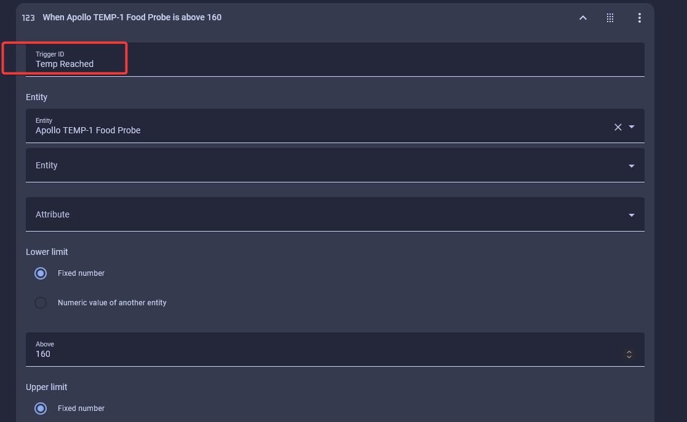

9\. Click Add Action and search "choose" then select it.

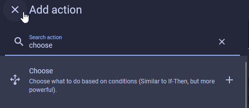

10\. Under option 1 select "Add Condition" then search "trigger id" and select Triggered by.


11\. Check off the option "Button Pressed" that we created in step 5 above.

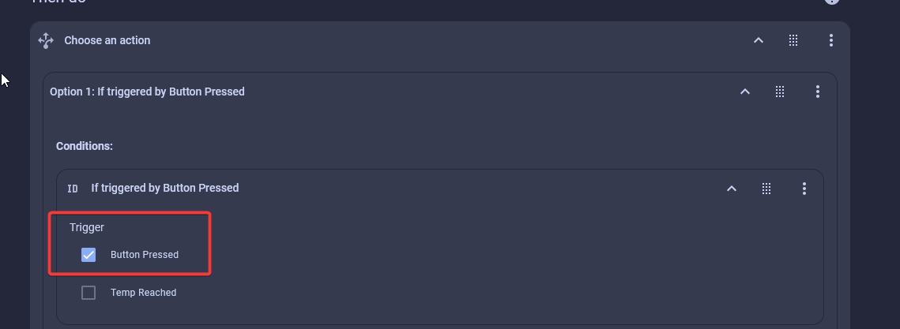

12\. While still under Option 1 in the choose action: Click Add Action and search "light" then select Light: Turn on.

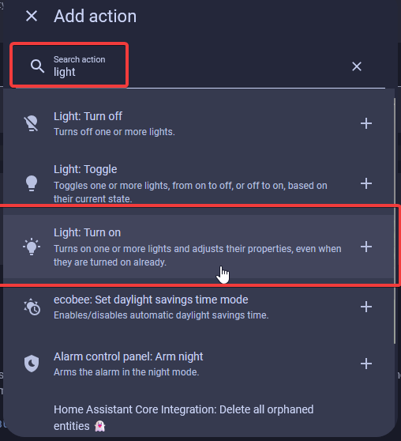

13\. Click choose entity then search for your device such as "Temp-1 RGB Light".

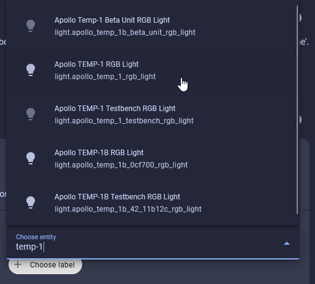

14\. Click "Advanced Options" and then click the check box for Color name then select a color from the dropdown such as Green.


15\. While still under Option 1 in the choose action: Click Add Action and search "mobile" and then select your phone in the list.

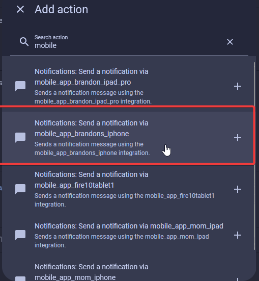

16\. Write in a custom title and or message- the message is required but the title is not.

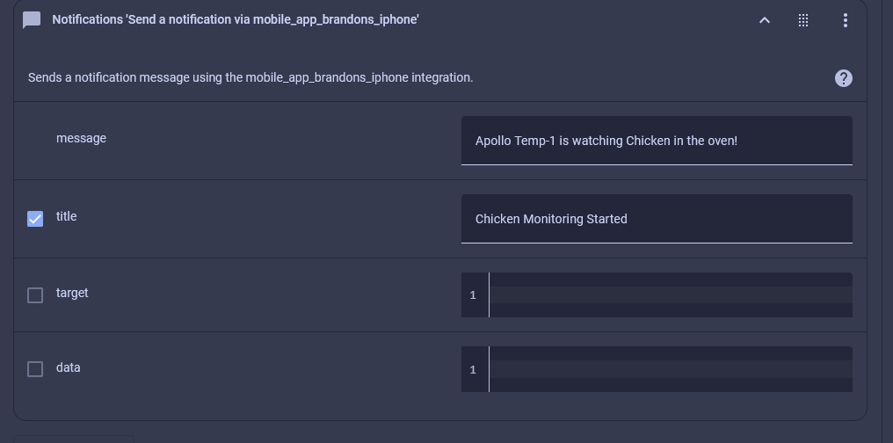

17\. This is how option 1 will look when you are done with this part:

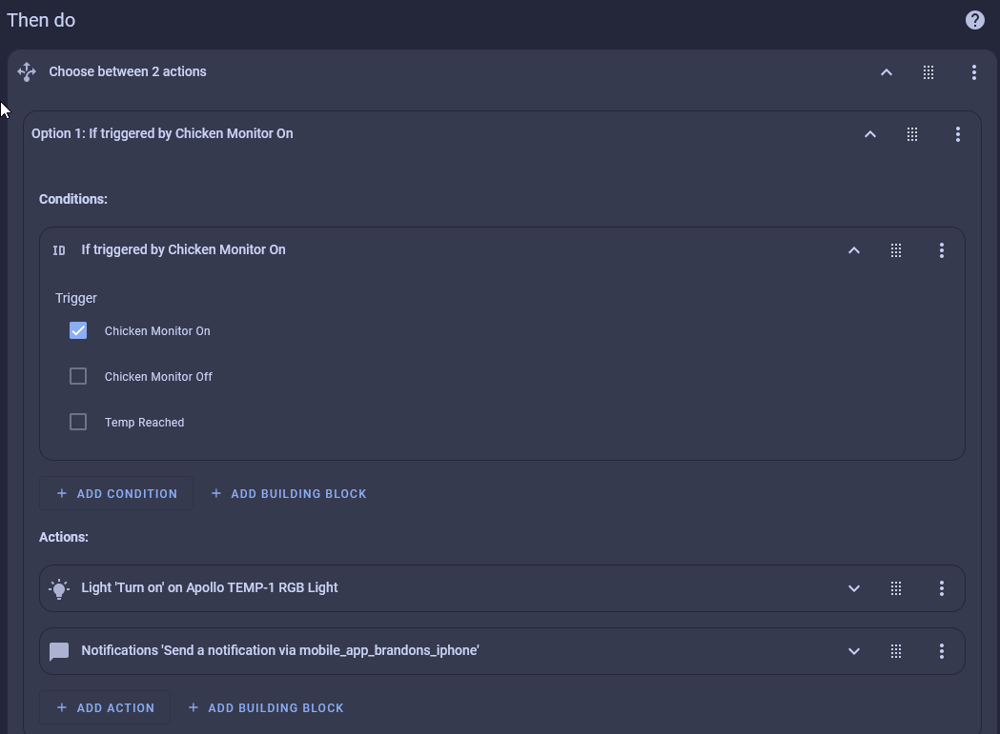

18\. Click "Add Option" at the bottom then under option 2 select "Add Condition" then search "trigger id" and select Triggered by.


19\. Check off the option "Temp Reached" that we created in step 7 above.

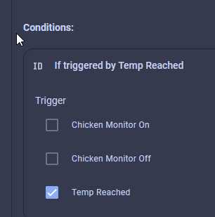

20\. While still under Option 2 in the choose action: Click Add Action and search "repeat" then select "Until" in the dropdown.


21\. Under Until Conditions, select "Add condition" then search "state".

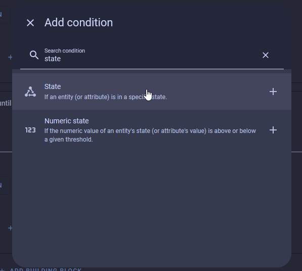

22\. Type in Chicken Monitor and select it, then click "Off" in the dropdown for the state of the sensor.

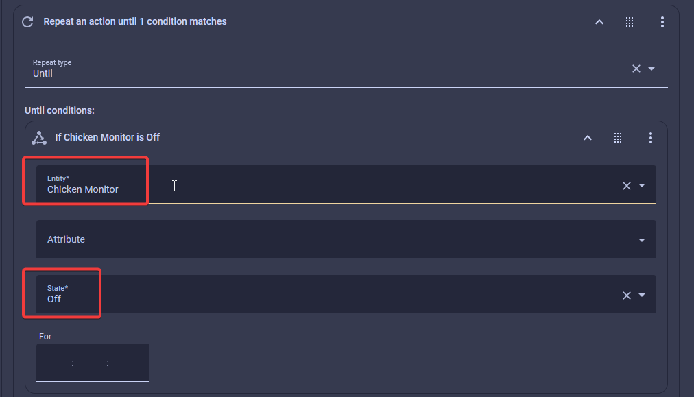

23\. Click "Add Action" under the "until" condition we created above. Be very careful to select the correct "Add Action" button as shown below.

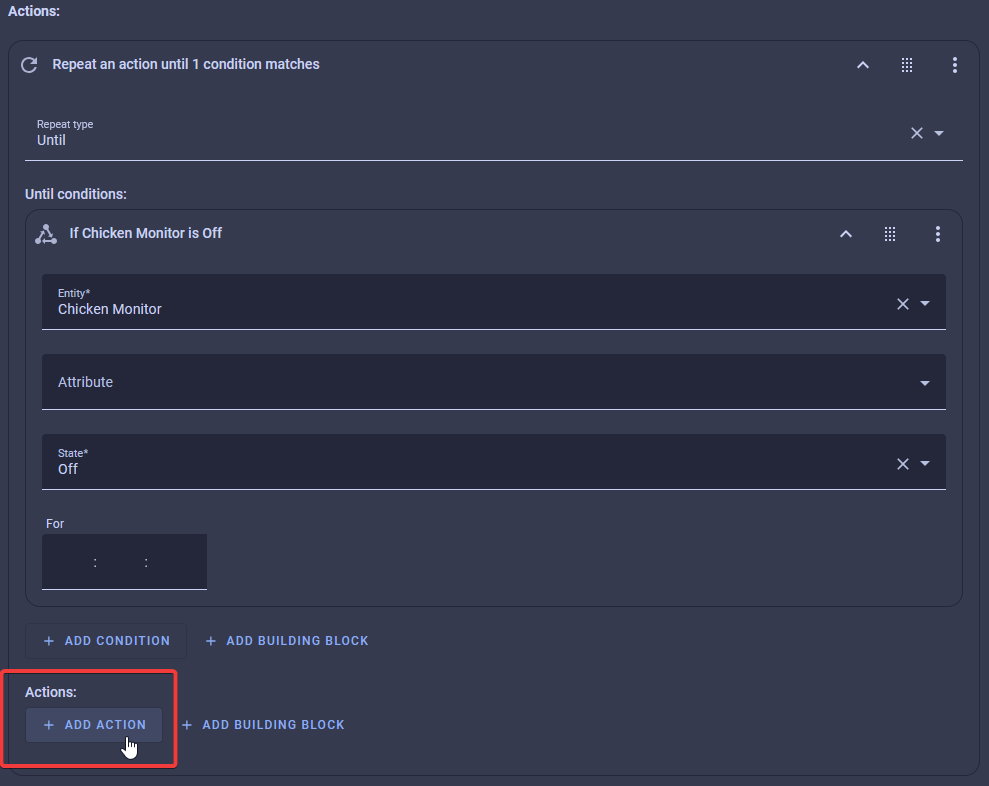

24\. Search "light toggle" in the search bar shown then select "Choose entity" and select your the rgb led for your device

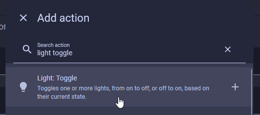

25\. Head down to Add Action under Option 2 and search "mobile" then select your phone as you did above in step 15. Give it a message and a title as shown below.

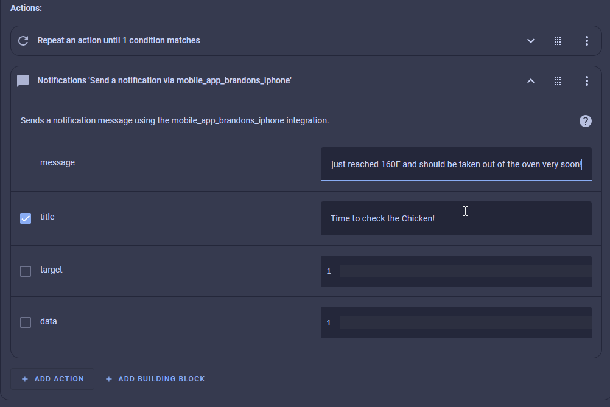

26\. Optionally add another action here for speaking out loud on your smart speakers such as Homepods. Click add Action then search "TTS". This requires you to have piper and a few other things already setup.

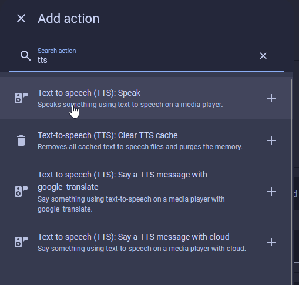

27\. Click "Add Option" (this is now Option 3). We will choose add condition then search "triggered by" and then choose the "Chicken Monitor Off" Trigger ID that we created in step 6.

28\. While still under Option 3 in the choose action: Click Add Action and search "light" then select Light: Turn off.


29\. Click choose entity then search for your device such as "Temp-1 RGB Light".


30\. Choose "Add Action" and search mobile like we did above and select your mobile phone. Give it an optional title and message as shown below.


31\. Click save in the bottom right then give it a name and save

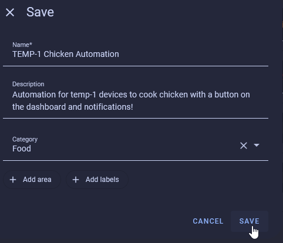

32\. You now have one automation which unifies the button you created in the dashboard and alerts you when your chicken is almost done via a phone notification, a blinking green led, and an optional TTS notification to your smart speakers! Thanks again to discord user RalphP for this example!