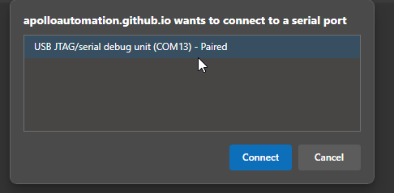
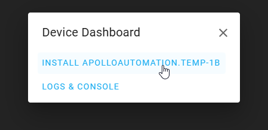
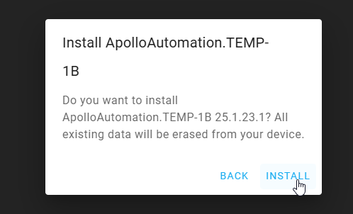
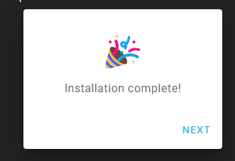

# Factory Re-Flash TEMP-1B

!!! info "If your device becomes unresponsive and you've exhausted the other troubleshooting methods you can reflash the factory firmware by following the below guide."

    This needs to be done in Chrome, Edge, or another Chromium based browser.

If your device has already been connected to Home Assistant please <a href="https://wiki.apolloautomation.com/products/general/troubleshooting/removing-device-from-home-assistant" target="_blank" rel="noreferrer nofollow noopener">remove it from the ESPHome integration</a> and the ESPHome Device Builder before continuing.

1\. <a href="https://wiki.apolloautomation.com/products/temp1b/troubleshooting/temp1b-boot-mode/" target="_blank" rel="noopener">Put your device in boot mode</a> by holding down the boot button and then plugging in the USB cable.

2\. Navigate to our installer page and click connect under Battery Firmware [Apollo TEMP-1 Installer](https://apolloautomation.github.io/TEMP-1/)

!!! failure "Remove the battery!"

    This will not work properly if the battery is still supplying power to the TEMP-1B. Please remove the battery if you are having issues!

3\. Select the open com port then click Connect.

4\. Click "Install ApolloAutomation.TEMP-1B".

5\. Click "INSTALL".

6\. Once you see "Installation complete!" you are finished. Click Next then close out of the browser window.

!!! warning "Power cycle your device before doing anything else!"

    Your device is still in boot mode and needs to be power cycled aka power removed to make it boot in a normal mode!

7\. Please <a href="https://wiki.apolloautomation.com/products/general/setup/getting-started/" target="_blank" rel="noopener">proceed to the getting started guide</a> and setup your sensor as a new device!