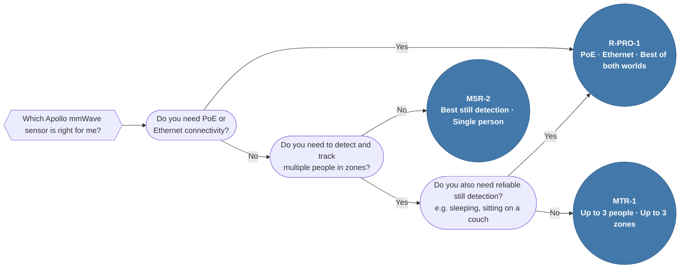

!!! info "Welcome to Apollo Automation Docs!"

    Your go-to resource for setup guides, troubleshooting, and tips for every Apollo device. Found an error or need help? [Open a GitHub issue](https://github.com/ApolloAutomation/docs/issues), hop into our [Discord](https://link.apolloautomation.com/discord), or email [support@apolloautomation.com](mailto:support@apolloautomation.com).

### Which mmWave Sensor Should I Buy?

### Most Popular

* [Getting started with your brand new Apollo device](https://wiki.apolloautomation.com/products/general/setup/getting-started/)
* [Updating Firmware](https://wiki.apolloautomation.com/products/general/calibrating-and-updating/updating-firmware/)
* [Add Bluetooth Proxy functionality to your Apollo device](https://wiki.apolloautomation.com/products/general/setup/bluetooth-proxy/)

### Radar & Zones

* [Tuning out false positives with the MSR-2](https://wiki.apolloautomation.com/products/general/calibrating-and-updating/mmwave-videos/)
* [Setting up zones on MTR-1 with the HLK app](https://wiki.apolloautomation.com/products/mtr1/setup/zones-hlk/)
* [Beta test our new Zone Mapper tool!](https://github.com/ApolloAutomation/zone-mapper) - [Use this custom card along with Zone Mapper!](https://github.com/ApolloAutomation/zone-mapper-card)
* [Tune your new R-PRO-1 PoE mmWave sensor](https://wiki.apolloautomation.com/products/rpro1/calibrating-and-updating/zones-ha/)

### Quick References

* [Understanding your AIR-1 and the various sensors it exposes](https://wiki.apolloautomation.com/products/air1/setup/general-tips/)
* [How to re-calibrate your CO2 sensor](https://wiki.apolloautomation.com/products/general/calibrating-and-updating/co2-calibration/)
* [Put your Apollo devices to sleep!](https://wiki.apolloautomation.com/products/general/battery-sensors/prevent-sleep/)
* [Setup your new M-1 LED Matrix with Multiple Panels](https://wiki.apolloautomation.com/products/m1/setup/m1-multiple-panels/)
* [3D Print your own case in any color or material](https://wiki.apolloautomation.com/products/general/links/)

<h3>Community</h3>

* [Discord - Support, community, updates, live streams](https://link.apolloautomation.com/discord)
* [YouTube - Tutorials and live streams](https://www.youtube.com/@ApolloAutomation)

<h3>What is Apollo Automation?</h3>

Apollo Automation builds high-quality, affordable, open-source home automation hardware - designed and assembled in Lexington, KY. What started as a side project among friends (named after Trevor's dog, Apollo) grew into a full-fledged business driven by community feedback. We build everything in-house, keep our designs transparent, and host a monthly livestream on Discord and YouTube so you can connect with us directly.

<h3>What do we offer?</h3>

Sensors and devices that solve real problems in home automation - presence detection, air quality monitoring, plant care, and more. Every product ships with ESPHome firmware, full Home Assistant integration, and support from a team that actually uses what we build.