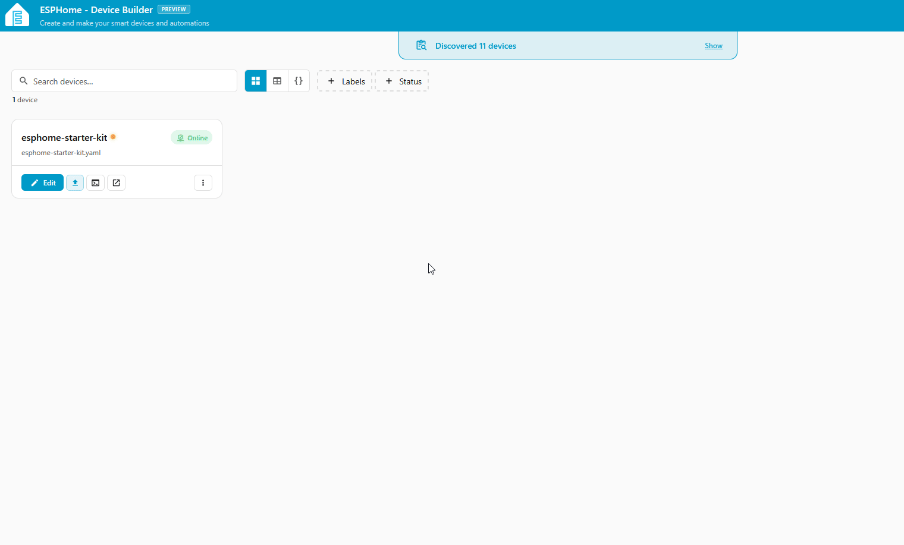

# Build a Button-Controlled RGB Light

This tutorial uses the Button module and the RGB & Buzzer module connected to the ESP32-C6, all sitting in the starter kit case.

!!! note "Before you start"

    Work through these pages first. This tutorial assumes your device is flashed and both modules are connected:

    * [First Steps](/products/ESPHome-Starter-Kit/setup/first-steps/) to create your starter kit device in ESPHome Device Builder.
    * [Adding the Button Module](/products/ESPHome-Starter-Kit/modules/button-module/) to wire up the input.
    * [Adding the LED & Buzzer Module](/products/ESPHome-Starter-Kit/modules/rgb-buzzer-module/) to wire up the RGB output.

## Build the automation

ESPHome Device Builder has a new GUI for building <a href="https://esphome.io/automations/" target="_blank" rel="noreferrer nofollow noopener">automations</a>, so you can wire a trigger to an action without hand-writing YAML. The trigger is the *when* of the automation, the thing that makes it fire. The action is the *then do*, what happens when it fires. If you've built automations in Home Assistant, this is the same mental model.

1.  Open your starter kit device in ESPHome Device Builder and click **Edit**. If you need a refresher on the editor, see the [Device Builder Tour](/products/ESPHome-Starter-Kit/learning-the-basics/device-builder-tour/#editor).
2.  In the editor's left pane, expand the **Automations** dropdown and click **Add Automation**.

    

3.  Set up the trigger:

    <div class="annotate" markdown>

    - **What should this automation react to?** → **A configured component**
    - **Which configured component?** → **Button Module (binary_sensor.gpio)**
    - **Which trigger?** → **Binary Sensor → On Click** (1)

    </div>

    1.  The trigger dropdown also offers **On Double Click**, **On Multi Click**, **On Press**, **On Release**, **On State**, and **On State Change** for other button gestures. Swap any of these in once you're comfortable with the On Click flow.

4.  Click **Continue**. You land on the **Binary Sensor → On Click** editor with the **Target** already set to your Button module.
5.  Set up the action:

    <div class="annotate" markdown>

    - Under **Actions**, click **+ Add action**.
    - In the **Add action** dialog, stay on the **By target** tab and choose **Light → Toggle** under the RGB LED group.
    - On the new action, click the **ID** dropdown and select **RGB LEDs**. (1)

    </div>

    1.  The **ID** dropdown only needs changing if your device also has an **Onboard RGB LED** component configured. If **RGB LEDs** is the only light, it's already selected.

??? note "What the GUI built in YAML"

    The form pane and the YAML editor on the right of the editor stay in sync, so the GUI you just used and the YAML pane are two views of the same config. Your button section now grows an `on_click` trigger with a `light.toggle` action:

    ```yaml
    binary_sensor:
      - platform: gpio
        name: Button Module
        pin:
          inverted: true
          mode:
            input: true
            pullup: true
          number: 6
        id: button_module
        on_click:
          then:
            - light.toggle: rgb_leds
    ```

    See [Device Builder Tour → YAML editor (right)](/products/ESPHome-Starter-Kit/learning-the-basics/device-builder-tour/#yaml-editor-right) for the full breakdown of the YAML pane.

## Install the firmware

Your automation is saved in Device Builder, but the device is still running its old firmware. Compile and install the new code to push the change.

1. Click **Save** in the bottom right of the editor.
2. Click **Install**, then pick **On the Network** to push the new firmware over Wi-Fi.
3. Wait for the compile and flash to finish. The device reboots once the install is done.


## Test the automation

With the device back online, press the button on the Button module. You should hear a soft click, and the RGB LEDs turn on. Press it again and they turn off.


!!! success "You've built your first GUI automation!"

    The same trigger-then-action pattern works for every automation you'll build in Device Builder. Swap the trigger (motion, temperature crossing a threshold, a schedule) or the action (turn on, dim, play a buzzer tone) and you have a new automation.

#### Next Steps

<a href="../../tutorials/light-effects/" class="md-button md-button--primary"> Next - Light Effects</a>