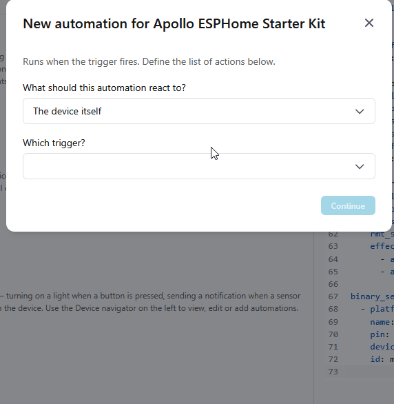
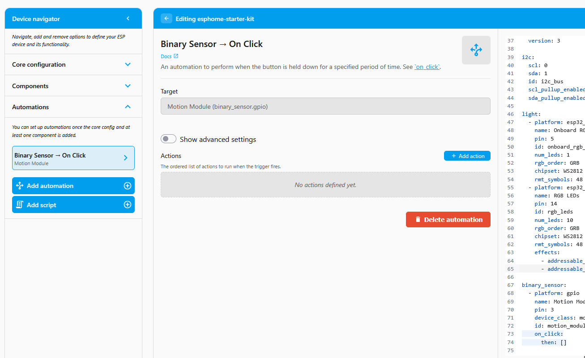
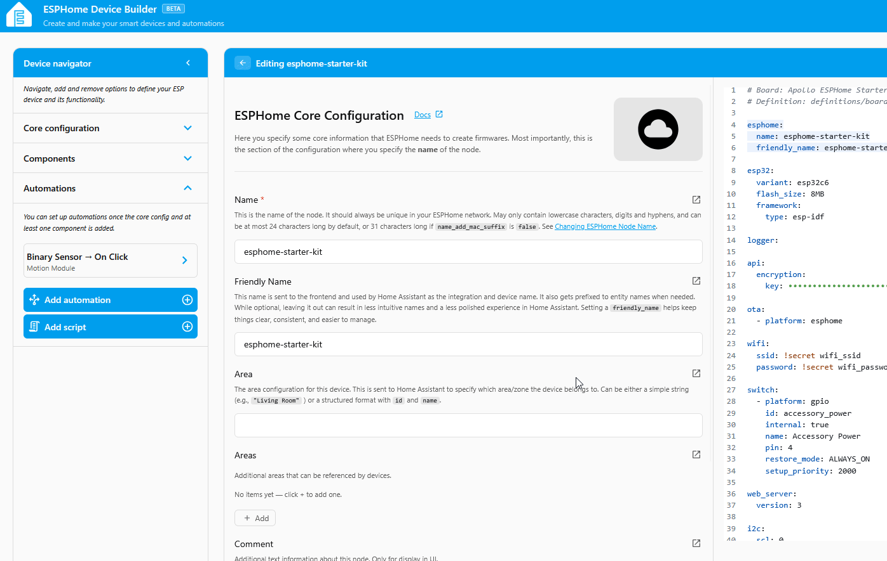
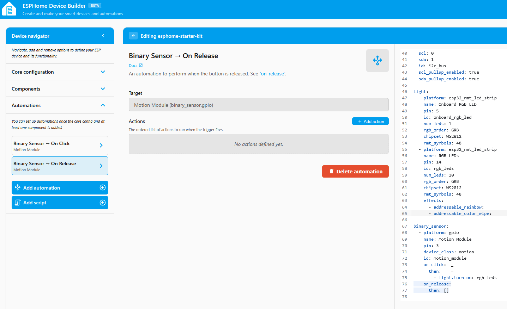
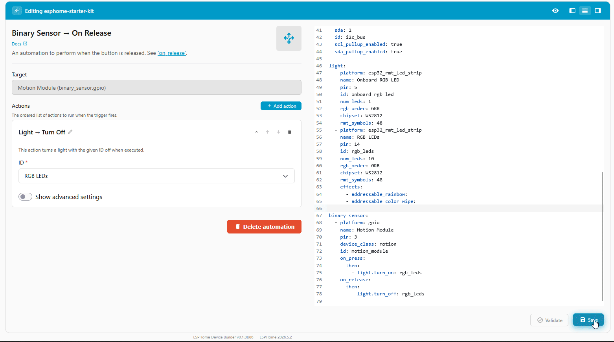

# Turn On a Light with Motion

<span class="difficulty lvl-1">Difficulty: Level 1</span>

This tutorial uses the Motion module and the LED & Buzzer module connected to the ESP32-C6. When the PIR sensor detects movement, the RGB light turns on, and when the movement stops, the light turns back off. It's the same trigger-then-action pattern as the [Button Controlled LEDs](button-controlled-leds.md) automation, swapping the button trigger for a motion trigger.

!!! note "Before you start"

    Work through these pages first. This tutorial assumes your device is flashed and both modules are connected:

    * [First Steps](../setup/first-steps.md) to create your starter kit device in ESPHome Device Builder.
    * [Adding the Motion Module](../modules/motion-module.md) to wire up the PIR sensor.
    * [Adding the LED & Buzzer Module](../modules/rgb-buzzer-module.md) to wire up the RGB light.

## Build the automation

ESPHome Device Builder has a GUI for building <a href="https://esphome.io/automations/" target="_blank" rel="noreferrer nofollow noopener">automations</a>, so you can wire a trigger to an action without hand-writing YAML. The trigger is the *when*, the thing that makes it fire. The action is the *then do*, what happens when it fires. You'll build two automations on the same Motion module: one that turns the lights on when motion is detected, and one that turns them off when motion stops.

#### Turn the lights on

1.  Open your starter kit device in ESPHome Device Builder and click **Edit**. If you need a refresher on the editor, see the [Device Builder Tour](../learning-the-basics/device-builder-tour.md#editor).
2.  In the editor's left pane, expand the **Automations** dropdown and click **Add Automation**.

    

3.  Set up the trigger:

    <div class="annotate" markdown>

    - **What should this automation react to?** → **A configured component**
    - **Which configured component?** → **Motion Module (binary_sensor.gpio)**
    - **Which trigger?** → **Binary Sensor → On Press** (1)

    </div>

    1.  **On Press** fires the moment the sensor detects motion. The dropdown also offers **On Release** (the moment motion stops) and **On State** for other occupancy behaviors. You'll use **On Release** in the next section to turn the lights back off.

    

4.  Click **Continue**. You land on the **Binary Sensor → On Press** editor with the **Target** already set to your Motion module.
5.  Set up the action:

    <div class="annotate" markdown>

    - Under **Actions**, click **+ Add action**.
    - In the **Add action** dialog, stay on the **By target** tab and scroll down towards the bottom, then choose **Light → Turn On** under the RGB LED group.
    - On the new action, click the **ID** dropdown and select **RGB LEDs**. (1)

    </div>

    1.  The **ID** dropdown only needs changing if your device also has an **Onboard RGB LED** component configured. If **RGB LEDs** is the only light, it's already selected.

    

??? note "What the GUI built in YAML"

    The form pane and the YAML editor on the right of the editor stay in sync. Your motion section now grows an `on_press` trigger with a `light.turn_on` action:

    ```yaml
    binary_sensor:
      - platform: gpio
        name: Motion Module
        pin: 3
        device_class: motion
        id: motion_module
        on_press: # (1)!
          then:
            - light.turn_on: rgb_leds
    ```

    1.  `on_press` is the YAML name for the **On Press** trigger you picked in the GUI.

    See [Device Builder Tour → YAML editor (right)](../learning-the-basics/device-builder-tour.md#yaml-editor-right) for the full breakdown of the YAML pane.

#### Turn the lights off

Right now the lights turn on with motion but never turn off. Add a second trigger to the same Motion module so the lights switch off once motion clears.

<div class="annotate" markdown>

1.  Add another automation, this time choosing **Binary Sensor → On Release** as the trigger for the Motion module. (1)

    

2.  Give it a **Light → Turn Off** action targeting **RGB LEDs**. (2)

    

</div>

1.  PIR sensors hold their "motion detected" state for a few seconds after movement stops, so **On Release** fires shortly after the room goes still, not the instant you stop moving.
2.  As before, the **ID** dropdown only needs changing if your device also has an **Onboard RGB LED** component configured. If **RGB LEDs** is the only light, it's already selected.

??? note "What the GUI built in YAML"

    Your motion section now has both triggers:

    ```yaml
    binary_sensor:
      - platform: gpio
        name: Motion Module
        pin: 3
        device_class: motion
        id: motion_module
        on_press: # (1)!
          then:
            - light.turn_on: rgb_leds
        on_release: # (2)!
          then:
            - light.turn_off: rgb_leds
    ```

    1.  The **On Press** trigger from the first automation.
    2.  `on_release` is the YAML name for the **On Release** trigger, firing when the sensor stops reporting motion.

## Install the firmware

Your automation is saved in Device Builder, but the device is still running its old firmware. Compile and install the new code to push the change.

1. Click **Save** in the bottom right of the editor.
2. Click **Install**, then pick **On the Network** to push the new firmware over Wi-Fi.
3. Wait for the compile and flash to finish. The device reboots once the install is done.



## Test the automations

!!! success "You've built a motion-activated light!"

    Same trigger-then-action pattern, new trigger. Swap the action (play a buzzer tune, dim the light, send a notification) or the trigger (a button, a temperature threshold, a schedule) and you have a new automation.

With the device back online, wave your hand in front of the PIR sensor. The RGB light turns on as soon as motion is detected, then turns off shortly after the sensor stops seeing movement. If the light triggers right after boot with nothing moving, give the sensor a moment. PIR sensors need a brief warm-up after powering on, usually 5 to 10 seconds, before their readings stabilize.

<a href="../temp-reactive-leds/" class="md-button md-button--primary"> Next - Temp-Reactive LEDs</a>

--8<-- "_snippets/community-help.md"
