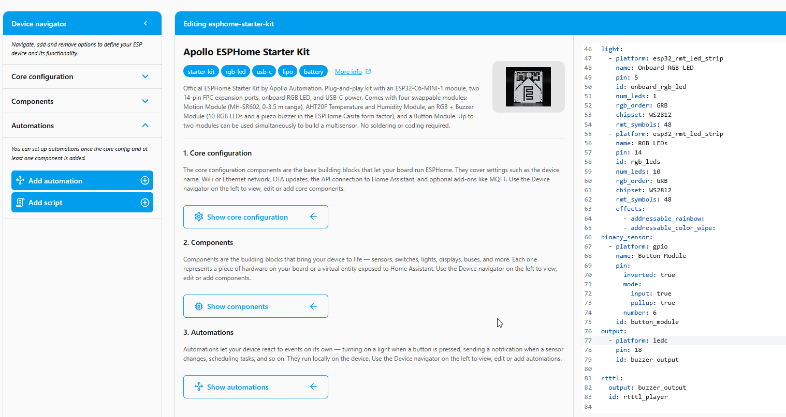
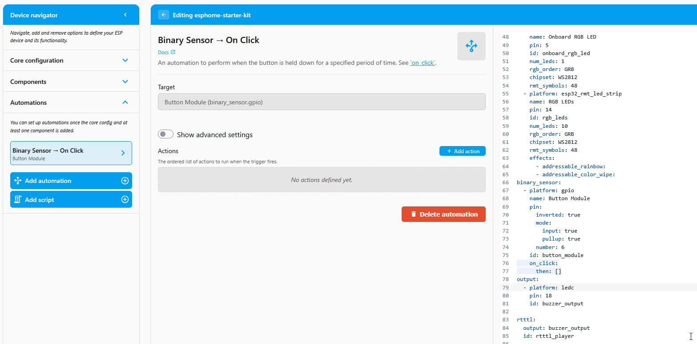

# Play a Tune with the Button

This tutorial uses the Button module and the LED & Buzzer module connected to the ESP32-C6. When you click the button, the piezo buzzer plays a short tune. It's the same trigger-then-action pattern as the [Button Controlled LEDs](button-controlled-leds.md) automation, swapping the light action for a buzzer action.

!!! note "Before you start"

    Work through these pages first. This tutorial assumes your device is flashed and both modules are connected:

    * [First Steps](../setup/first-steps.md) to create your starter kit device in ESPHome Device Builder.
    * [Adding the Button Module](../modules/button-module.md) to wire up the input.
    * [Adding the LED & Buzzer Module](../modules/rgb-buzzer-module.md) to wire up the buzzer output.

## How the buzzer plays tunes

The buzzer plays songs written in **RTTTL** (Ring Tone Text Transfer Language), the same compact text format old phones used for ringtones. A tune is a single line that names the song, sets the tempo and default note length, then lists the notes:

```
scale_up:d=32,o=5,b=100:c,c#,d,d#,e,f,f#,g,g#,a,a#,b
```

When you added the LED & Buzzer module, Device Builder created an `rtttl` component with the id `rtttl_buzzer` wired to the buzzer output. The automation below hands that component a tune string to play.

## Build the automation

ESPHome Device Builder has a GUI for building <a href="https://esphome.io/automations/" target="_blank" rel="noreferrer nofollow noopener">automations</a>, so you can wire a trigger to an action without hand-writing YAML. The trigger is the *when*, the thing that makes it fire. The action is the *then do*, what happens when it fires.

1.  Open your starter kit device in ESPHome Device Builder and click **Edit**. If you need a refresher on the editor, see the [Device Builder Tour](../learning-the-basics/device-builder-tour.md#editor).
2.  In the editor's left pane, expand the **Automations** dropdown and click **Add Automation**.

    

3.  Set up the trigger:

    <div class="annotate" markdown>

    - **What should this automation react to?** → **A configured component**
    - **Which configured component?** → **Button Module (binary_sensor.gpio)**
    - **Which trigger?** → **Binary Sensor → On Click** (1)

    </div>

    1.  The trigger dropdown also offers **On Double Click**, **On Multi Click**, **On Press**, **On Release**, **On State**, and **On State Change** for other button gestures. Swap any of these in once you're comfortable with the On Click flow.

    

4.  Click **Continue**. You land on the **Binary Sensor → On Click** editor with the **Target** already set to your Button module.
5.  Set up the action:

    <div class="annotate" markdown>

    - Under **Actions**, click **+ Add action**.
    - In the **Add action** dialog, click **By type** then search Rtttl and choose **Rtttl → Play**.
    - In the **Rtttl** (tune) field, paste an RTTTL string. Copy the one below to get started, or use one of the [examples below](#find-more-tunes). (1)

    </div>

    1.  If your device has more than one `rtttl` component, set the **ID** to **rtttl_buzzer**. With a single buzzer it's already selected.

    Copy this tune and paste it into the **Rtttl** field:

    ```text
    The Simpsons:d=4,o=5,b=160:c.,e,f#,8a,g.,e,c,8a4,8f#4,8f#4,8f#4,2g4,8p,8p,8f#4,8f#4,8f#4,8g4,a4.,8c,16p,8c,16p,8c,2c
    ```

    

??? note "What the GUI built in YAML"

    The form pane and the YAML editor on the right of the editor stay in sync. Your button section now grows an `on_click` trigger with an `rtttl.play` action:

    ```yaml
    binary_sensor:
      - platform: gpio
        name: Button Module
        pin:
          inverted: true
          mode:
            input: true
            pullup: true
          number: 6
        id: button_module
        on_click:
          then:
            - rtttl.play: "The Simpsons:d=4,o=5,b=160:c.,e,f#,8a,g.,e,c,8a4,8f#4,8f#4,8f#4,2g4,8p,8p,8f#4,8f#4,8f#4,8g4,a4.,8c,16p,8c,16p,8c,2c"
    ```

    See [Device Builder Tour → YAML editor (right)](../learning-the-basics/device-builder-tour.md#yaml-editor-right) for the full breakdown of the YAML pane.

## Install the firmware

Your automation is saved in Device Builder, but the device is still running its old firmware. Compile and install the new code to push the change.

1. Click **Save** in the bottom right of the editor.
2. Click **Install**, then pick **On the Network** to push the new firmware over Wi-Fi.
3. Wait for the compile and flash to finish. The device reboots once the install is done.


## Test the automation

With the device back online, press the button on the Button module. You should hear the buzzer play your tune. Press it again to replay it.

!!! tip "No sound?"

    The buzzer is an output, not a switch, so it has no web server control of its own. The only way to hear it is to trigger it, like the button click above. If it stays silent, confirm the LED & Buzzer module is connected and that the install finished without errors.

## Find more tunes

Swap the tune string in your action for any valid RTTTL line. Here are a few to get started, copy the whole line into the **Rtttl** field:

??? example "Mario"

    ```
    smb:d=4,o=5,b=100:16e6,16e6,32p,8e6,16c6,8e6,8g6,8p,8g,8p,8c6,16p,8g,16p,8e,16p,8a,8b,16a#,8a,16g.,16e6,16g6,8a6,16f6,8g6,8e6,16c6,16d6,8b,16p,8c6,16p,8g,16p,8e,16p,8a,8b,16a#,8a,16g.,16e6,16g6,8a6,16f6,8g6,8e6,16c6,16d6,8b,8p,16g6,16f#6,16f6,16d#6,16p,16e6,16p,16g#,16a,16c6,16p,16a,16c6,16d6,8p,16g6,16f#6,16f6,16d#6,16p,16e6,16p,16c7,16p,16c7,16c7,p,16g6,16f#6,16f6,16d#6,16p,16e6,16p,16g#,16a,16c6,16p,16a,16c6,16d6,8p,16d#6,8p,16d6,8p,16c6
    ```

??? example "Cantina"

    ```
    Cantina:d=4,o=5,b=250:8a,8p,8d6,8p,8a,8p,8d6,8p,8a,8d6,8p,8a,8p,8g#,a,8a,8g#,8a,g,8f#,8g,8f#,f.,8d.,16p,p.,8a,8p,8d6,8p,8a,8p,8d6,8p,8a,8d6,8p,8a,8p,8g#,8a,8p,8g,8p,g.,8f#,8g,8p,8c6,a#,a,g
    ```

??? example "Star Wars Imperial Death March"

    ```
    StarWars/Imp:d=4,o=5,b=112:8d.,16p,8d.,16p,8d.,16p,8a#4,16p,16f,8d.,16p,8a#4,16p,16f,d.,8p,8a.,16p,8a.,16p,8a.,16p,8a#,16p,16f,8c#.,16p,8a#4,16p,16f,d.,8p,8d.6,16p,8d,16p,16d,8d6,8p,8c#6,16p,16c6,16b,16a#,8b,8p,16d#,16p,8g#,8p,8g,16p,16f#,16f,16e,8f,8p,16a#4,16p,2c#
    ```

Want more? <a href="https://picaxe.com/rtttl-ringtones-for-tune-command/" title="Example RTTTL Tones" target="_blank" rel="noreferrer nofollow noopener">Browse a big list of RTTTL ringtones here</a>, and <a href="https://adamonsoon.github.io/rtttl-play/" title="Test RTTTL Tones" target="_blank" rel="noreferrer nofollow noopener">preview any tune in your browser here</a> before pasting it in. Paste the song into the **Rtttl** field of your action, then **Save** and **Install** again to hear the new tune.

!!! success "You've built a button-triggered buzzer!"

    Same trigger-then-action pattern, new action. Swap the trigger (motion, a temperature threshold, a schedule) or the tune, and you have a new automation.

[Check out these Holiday themed buzzer examples too! :material-music-note:](https://wiki.apolloautomation.com/products/general/holiday-songs/){ .md-button .md-button--primary }