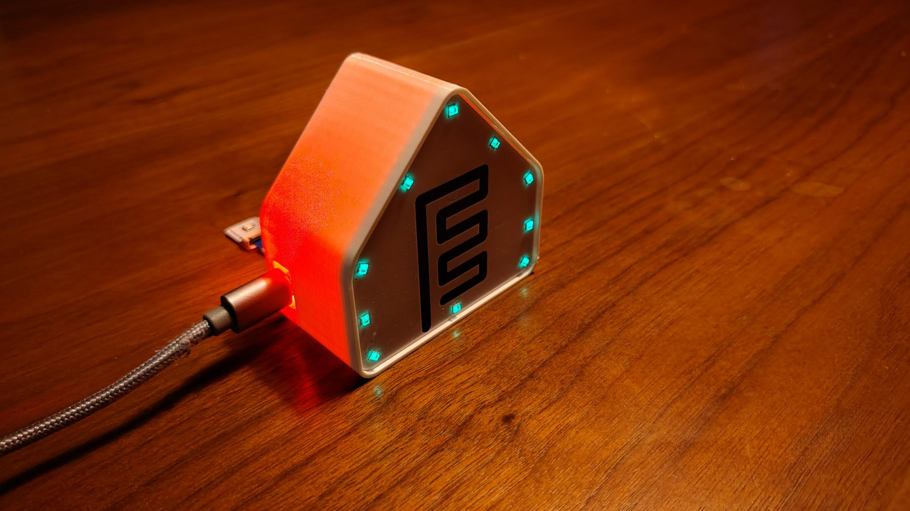
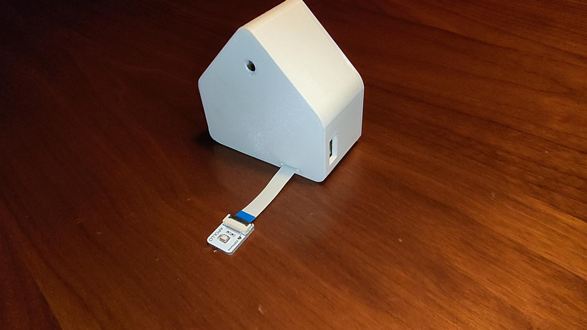

# Community Corner

The Community Corner is dedicated to sharing some really great projects created by the community. It could be anything: a 3D-printed case, a clever automation, a cool use case, you name it. Post your build on our forums, Discord, or Reddit and we'll see if it's worthy of being displayed for the masses.

[Join our Discord :simple-discord:](https://link.apolloautomation.com/discord){ .md-button .md-button--discord }
[Community Forum :material-forum:](https://forum.apolloautomation.com/){ .md-button .md-button--primary }

## 3D Prints

### LED & Buzzer Module Case

*Created by @_cadster on Discord*

A printable housing for the LED & Buzzer module. Print one and give your notification module a finished look on a desk or shelf. It also has a slot in the back for a ribbon cable to attach another module, such as the button!

[Download the .STEP file :material-download:](../../assets/apollo_starterkit_housing_var2.step){ .md-button .md-button--primary }

