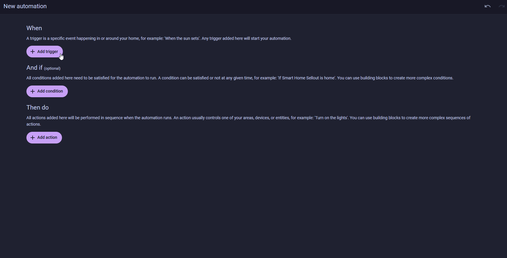
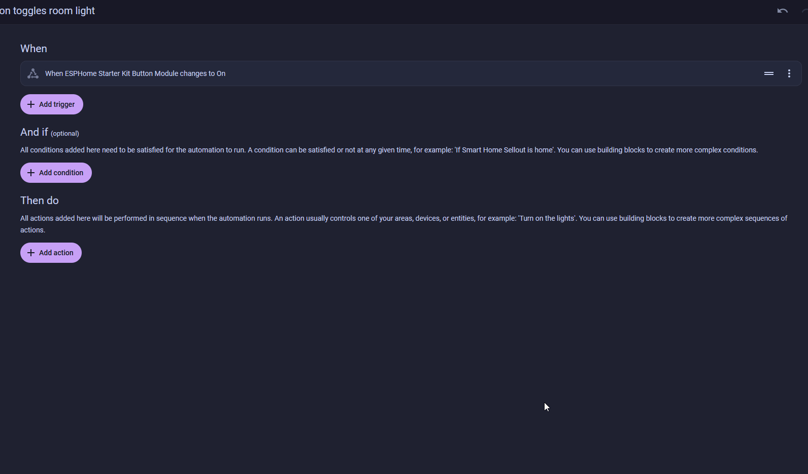
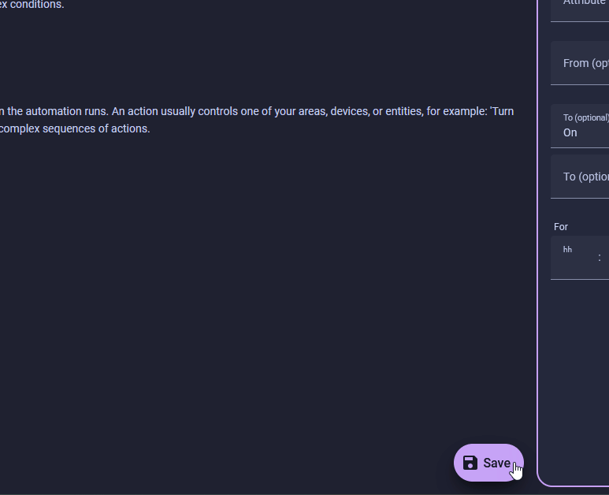

# Button Toggles a Room Light

<span class="difficulty lvl-1">Difficulty: Level 1</span>

This is an alternative way to use the Starter Kit's button. Instead of toggling the kit's own RGB LEDs on the device, the button fires a **Home Assistant automation** that toggles any light in your home. Same physical button, but now it can target any entity or fire any script or scene in Home Assistant. It's one or the other, though: if you've already built the on-device [Button Controlled LEDs](../automations/button-controlled-leds.md) automation, remove it in ESPHome Device Builder first, otherwise a single press toggles both the kit's RGB LEDs and your room light.

!!! note "Before you start"

    Work through these pages first. This tutorial assumes your device is flashed, the Button module is wired up, and the kit is connected to Home Assistant:

    * [First Steps](../setup/first-steps.md) to create your starter kit device in ESPHome Device Builder.
    * [Adding the Button Module](../modules/button-module.md) to wire up the input.
    * [Connect to Home Assistant](../tutorials/connect-to-home-assistant.md) to bring the device's entities into HA.

## Build the automation

1. Open [Settings → Automations & scenes](https://my.home-assistant.io/redirect/automations/) in Home Assistant.
2. Click **+ Create automation** in the bottom right, then choose **Create new automation**.
3. Under **Triggers**, click **+ Add trigger**, type `state`, and choose **State**.

    <div class="annotate" markdown>

    - In the **Entity** field, type `button module` and select **Button Module**.
    - **To** → `On` (1)

    </div>

    1.  The button registers as a binary sensor. `On` maps to a pressed state - the moment you push the button down. Home Assistant fires the automation at that instant.

    

4. Under **Then do**, click **+ Add action**, type `toggle light`, and select **Light: Toggle**.

    <div class="annotate" markdown>

    - **Light: Toggle** handles both directions: on if the light is off, off if it's on. (1)
    - Under **Targets**, click **+ Choose entity**, search for your light such as `Brandons Room`, and select it. (2)

    </div>

    1.  If you'd rather it always turn on or always turn off, use **Light: Turn on** or **Light: Turn off** instead.
    2.  You can also set a **Color**, **Color temperature**, or **Brightness** here for when the light turns on. Toggling it off ignores them.

    

5. Click **Save**.
6. Give the automation a name like `Button toggles room light`, then click **Save** again.

    

??? note "What the automation looks like in YAML"

    Home Assistant stores automations as YAML. Select **Edit in YAML** from the three-dot menu on the automation to see or paste the raw config. Your entity IDs will differ from the example below.

    ```yaml
    alias: Button toggles room light
    description: ""
    triggers:
      - trigger: state
        entity_id:
          - binary_sensor.esphome_starter_kit_button_module
        to:
          - "on"
    conditions: []
    actions:
      - action: light.toggle
        metadata: {}
        target:
          entity_id: light.brandons_room
        data: {}
    mode: single
    ```

## Test the automation

Press the button on the Button module. The light you targeted toggles. Press again and it toggles back.

!!! success "Your kit is now a physical remote for Home Assistant!"

    Any light in your home - a bedside lamp, a ceiling group, a smart bulb strip - is one button press away. Swap `light.toggle` for `light.turn_on` with a `brightness_pct` to land on a specific brightness, or target a light group to control a whole room at once.

<a href="../trash-night-reminder/" class="md-button md-button--primary"> Next - Trash Night Reminder</a>

--8<-- "_snippets/community-help.md"
