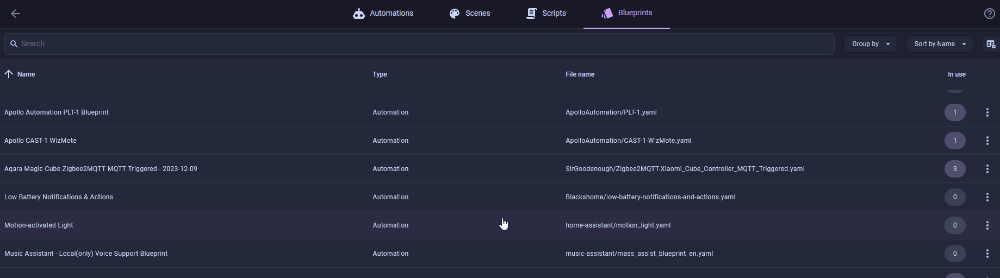
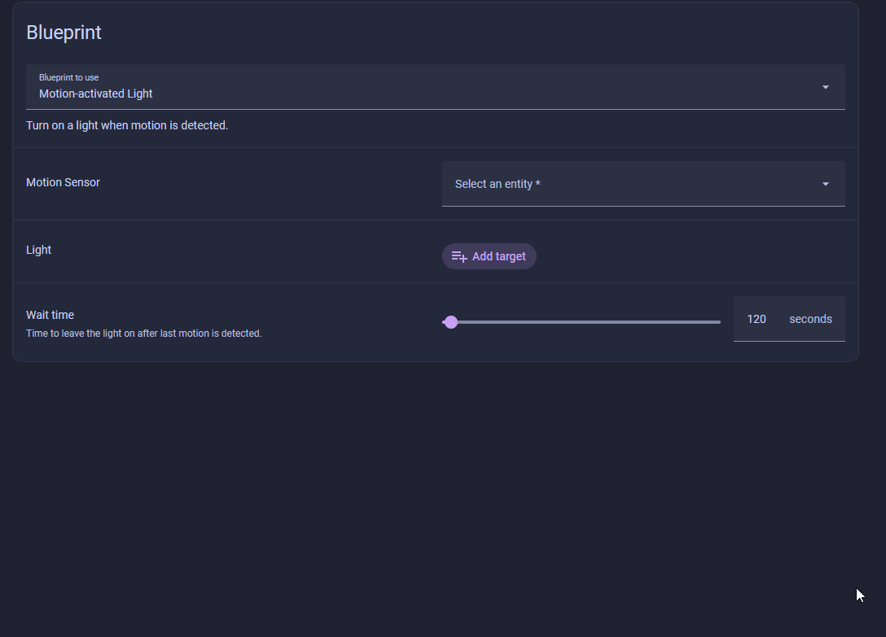
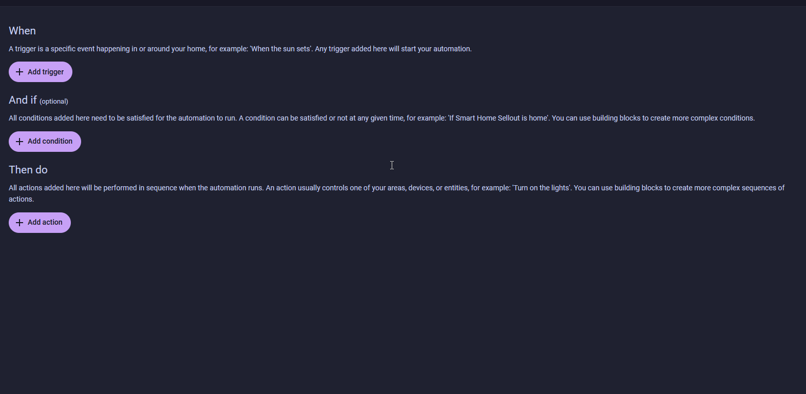
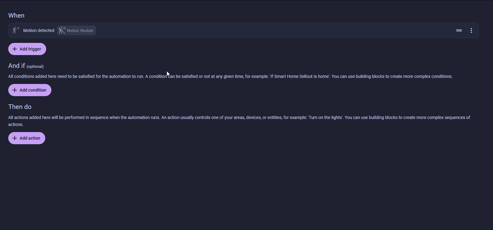
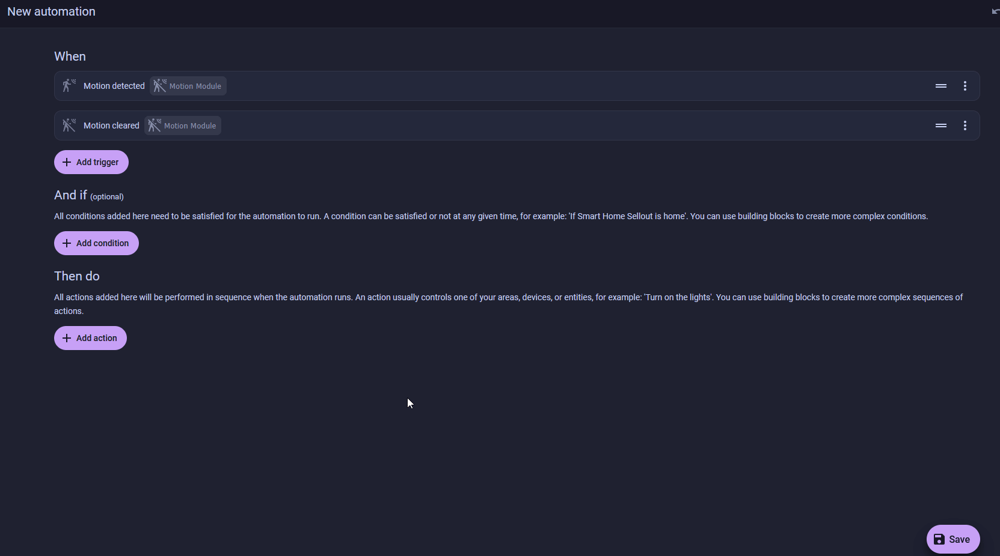
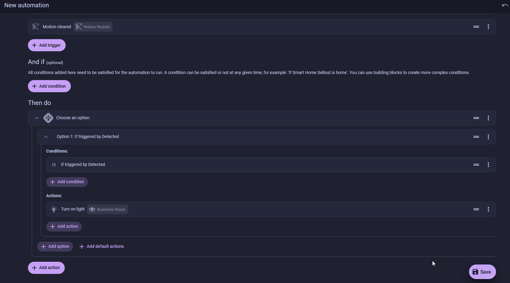
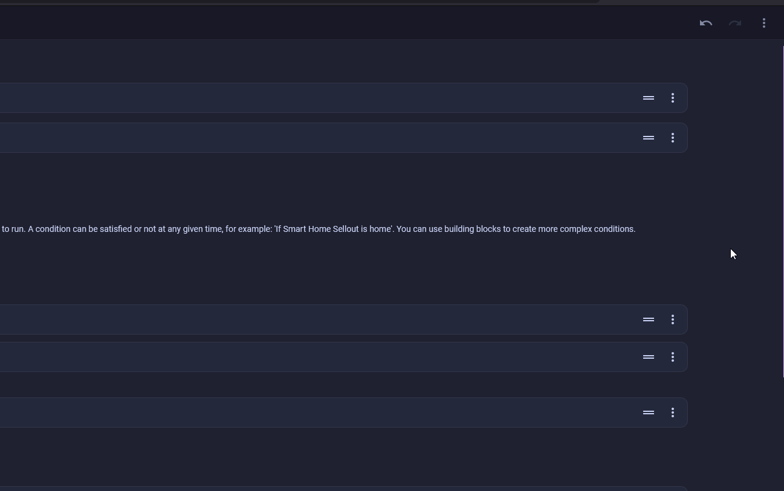
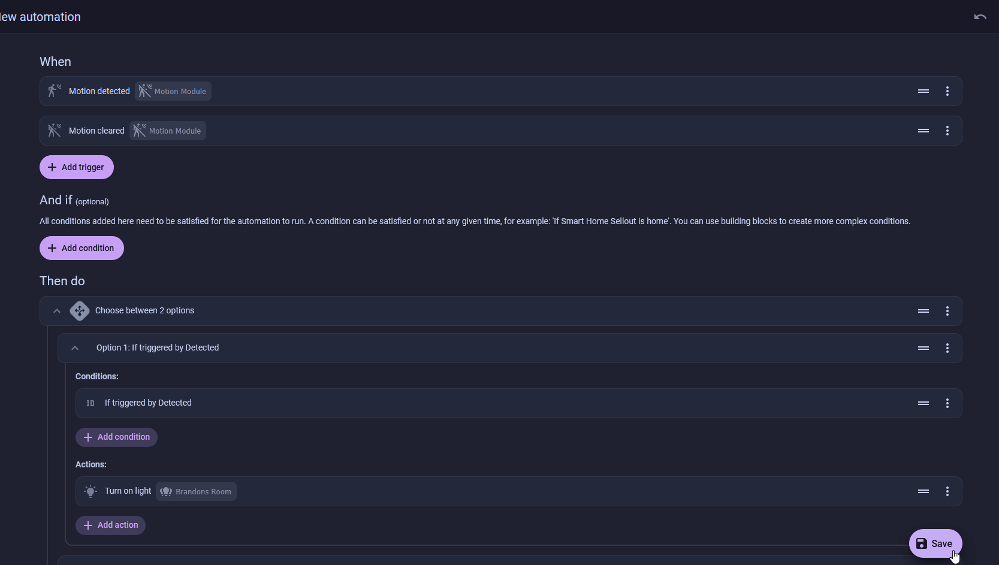

# Motion-Activated Room Lights

This is where the kit stops being a learning toy and starts earning its keep. Your Starter Kit's motion sensor reports into Home Assistant, so it can switch on the actual lights in a room, a smart bulb, a wall switch, a lamp on a plug, then switch them back off once the room goes quiet.

<div class="annotate" markdown>

This automation lives in **Home Assistant** and controls *other* lights in your home, not the kit's own LED. (1)

</div>

1.  Don't confuse it with the on-device [Turn On a Light with Motion](../automations/motion-activated-light.md) automation, which runs on the kit itself and only controls the kit's RGB LED. Use that one to learn ESPHome, use this one to actually light up a room.

!!! note "Before you start"

    * Your kit is added to Home Assistant. If it isn't yet, work through [Connect to Home Assistant](../tutorials/connect-to-home-assistant.md) first.
    * The [Motion module](../modules/motion-module.md) is connected, so the kit reports a **Motion Module** sensor that reads `on` when it sees movement.
    * You have at least one light Home Assistant can already control, and you know its name.

## Place the sensor first

The automation is only as good as what the sensor can see, so aim it before you build anything. The kit's MH-SR602 sensor has about a 100&deg; cone and picks up movement out to roughly 5 meters (16 feet), and it's most reliable inside 3.5 meters (11 feet).

* Point it across the path people walk, like a doorway or hallway, not straight at a couch where they sit still. A PIR sensor fires on movement crossing its cone, so foot traffic trips it far more reliably than someone barely moving.
* Set it about 1.5 to 2 meters (5 to 6.5 feet) off the floor and tilt it slightly downward so the cone covers the room rather than the far wall.
* Keep it away from sunny windows, heating vents, and radiators. A fast change in heat can trip a PIR sensor on its own and leave your lights flicking on with no one there.

Pick one path below, or do both. Level 1 uses Home Assistant's built-in blueprint and takes about two minutes. Level 2 builds the same behavior by hand so you can see how it works and grow it later.

## Level 1: Use the built-in blueprint

<span class="difficulty lvl-1">Difficulty: Level 1</span>

A blueprint is a fill-in-the-blanks automation. Home Assistant ships one called **Motion-activated Light** that does exactly this job: light on when a sensor sees motion, off after a set quiet period.

<div class="annotate" markdown>

1. Open [Settings → Automations & scenes → Blueprints](https://my.home-assistant.io/redirect/blueprints/) and look for **Motion-activated Light**. If it's there, skip to step 3. (1)

    

2. If it's missing, click **Import Blueprint** in the bottom right, paste the URL below, then click **Preview** and **Import Blueprint**.

    ```text
    https://github.com/home-assistant/core/blob/dev/homeassistant/components/automation/blueprints/motion_light.yaml
    ```

3. Click **Create Automation** on the blueprint, then fill in the three fields:
    * **Motion Sensor** → your kit's **Motion Module** sensor.
    * **Light Target** → the light you want to control.
    * **Wait time** → seconds to leave the light on after the last movement. 120 is a sensible start. (2)

    

</div>

1.  Home Assistant lets you delete the default blueprints, so it's common for this one to be missing. The import in step 2 puts it back.
2.  Reopen the automation and change this any time the light drops too soon or stays on too long.

Click **Save**, give the automation a name like `Motion Activated Lights`, and if you like, add a label such as `Lighting` to group it with your other light automations. Click **Save** to finish.

Walk into the room and the light comes on. Stand still past the wait time and it goes back off.

## Level 2: Build it by hand

<span class="difficulty lvl-2">Difficulty: Level 2</span>

The blueprint hides the moving parts. Building the automation yourself shows you the trigger-and-action pattern behind every Home Assistant automation, and it leaves you room to add more behavior later.

You could make two automations, one to turn the light on and one to turn it off. Instead you'll keep both in a single automation using **trigger IDs**, a label on each trigger, feeding a **Choose** action that runs a different branch depending on which trigger fired.

<div class="annotate" markdown>

1. Open [Settings → Automations & scenes](https://my.home-assistant.io/redirect/automations/), click **Create Automation**, then **Create new automation**.
2. Click **Add Trigger**, search **motion**, and click **Motion detected**. Set its target to your **Motion Module** sensor. Open the trigger's menu (the three dots), choose **Rename**, and set the **Trigger ID** to `Detected`. (1)

    

3. Add another trigger the same way, this time **Motion cleared** on the same **Motion Module**, with **For** → 2 minutes. Set its **Trigger ID** to `Clear`. (2)

    

4. Under **Then do**, add **Building Blocks → Choose**.
5. In **Option 1**, add a **Triggered by** condition set to `Detected`, then an action of **Light → Turn on** targeting your room light.

    

6. Add **Option 2** with a **Triggered by** condition of `Clear` and a **Light → Turn off** action on the same light.

    

7. Click the three dots in the top right, choose **Change mode**, select **Restart**, then click **Change mode** to confirm. (3)

    

</div>

1.  The trigger ID is just a name. The **Choose** action reads it to decide which branch to run.
2.  The **For** delay means **Clear** only fires after the room has been still for two full minutes, so the light doesn't drop the moment you hold still.
3.  `restart` makes fresh motion reset the off-timer. The default `single` mode would ignore movement until the run finished.

??? note "The finished automation in YAML"

    Paste this into **Edit in YAML** and swap in your own entity names.

    ```yaml
    alias: Motion Activated Lights
    description: ""
    triggers:
      - trigger: motion.detected
        target:
          entity_id: binary_sensor.esphome_starter_kit_motion_module # (1)!
        options:
          for: "00:00:00"
        id: Detected
      - trigger: motion.cleared
        target:
          entity_id: binary_sensor.esphome_starter_kit_motion_module
        options:
          for:
            hours: 0
            minutes: 2
            seconds: 0
        id: Clear
    conditions: []
    actions:
      - choose:
          - conditions:
              - condition: trigger
                id:
                  - Detected
            sequence:
              - action: light.turn_on
                metadata: {}
                target:
                  entity_id: light.brandons_room # (2)!
                data: {}
          - conditions:
              - condition: trigger
                id:
                  - Clear
            sequence:
              - action: light.turn_off
                metadata: {}
                target:
                  entity_id: light.brandons_room
                data: {}
    mode: restart
    ```

    1.  Your sensor's entity ID may differ. Start typing in the editor and pick it from the list. It usually follows `binary_sensor.<device-name>_motion_module`.
    2.  Swap `light.brandons_room` for your own light in both branches.

Click **Save**, give the automation a name like `Motion Activated Lights`, and if you like, add a label such as `Lighting` to group it with your other light automations. Click **Save** to finish.



Now walk in. The light comes on, the room goes still, and after the quiet period it turns off. From here you can add a [condition](https://www.home-assistant.io/docs/scripts/conditions/) so it only runs after sunset, or point the `Detected` branch at a whole scene.

--8<-- "_snippets/community-help.md"
