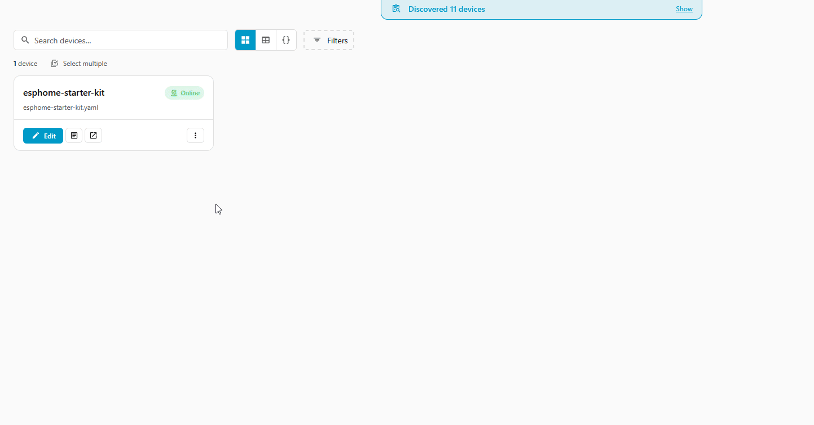
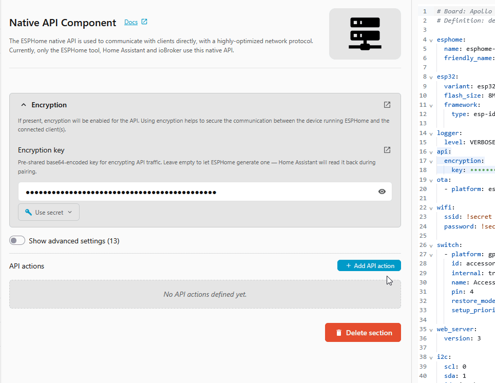
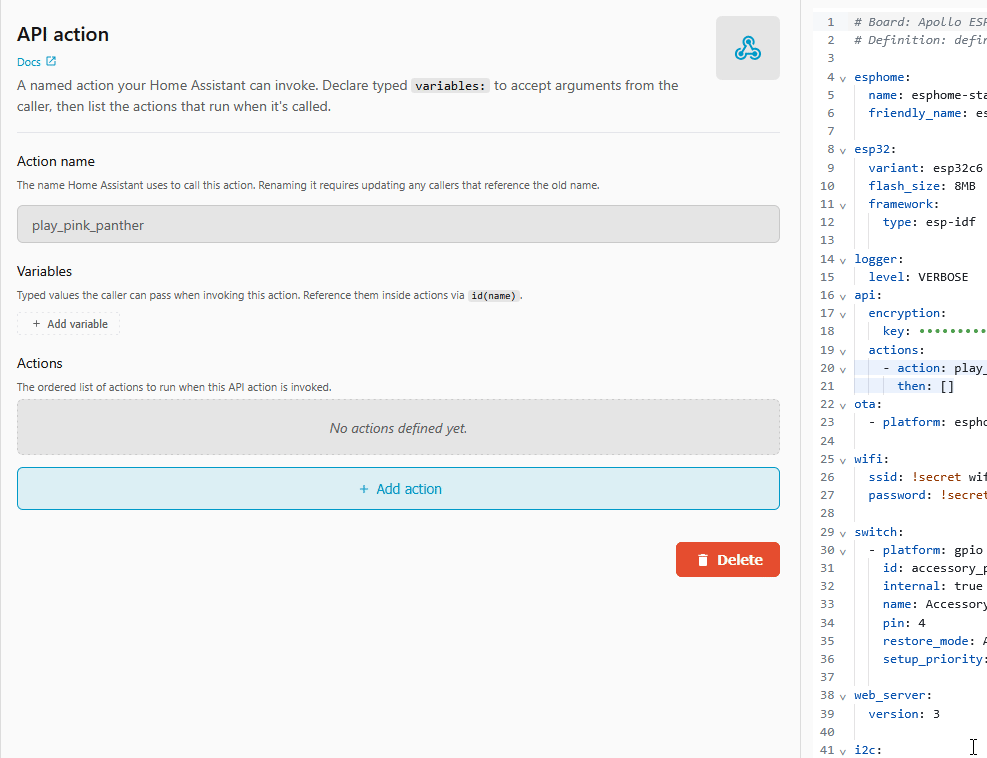
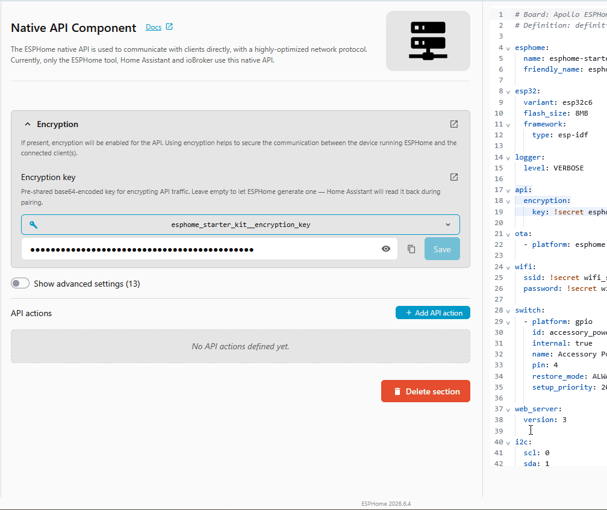
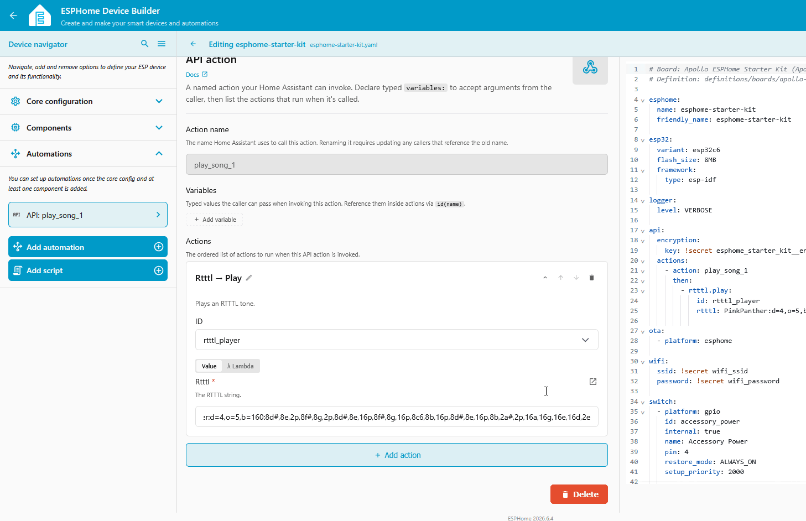
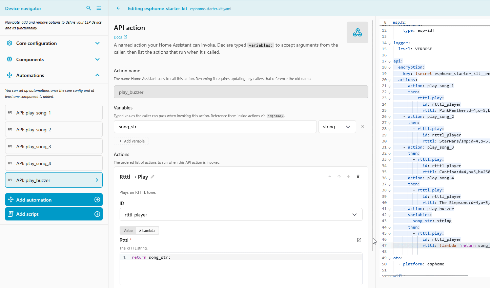
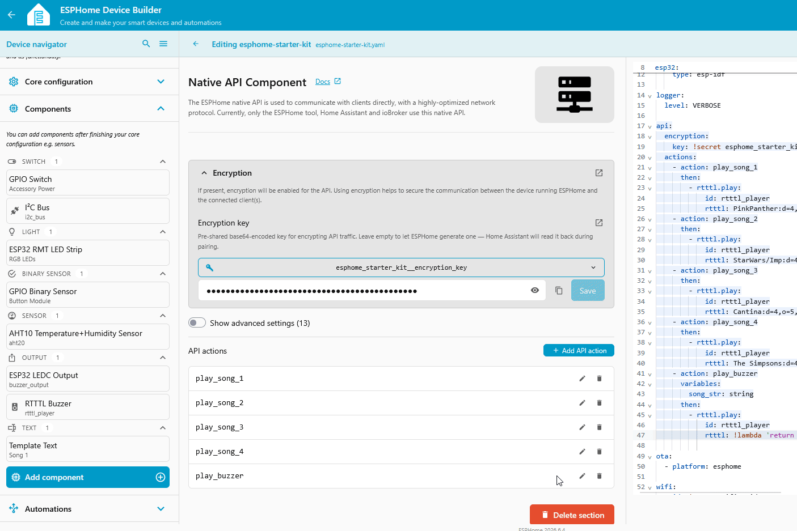
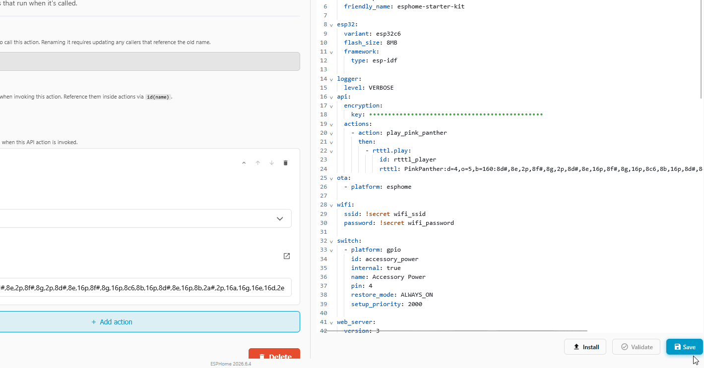

# Play a Tune from Home Assistant

<p class="automation-steps-heading">🌱 New here? Try these first:</p>
<div class="automation-steps">
  <div class="step">
    <a class="step-title" href="../../automations/play-a-tune/">Play a Tune with the Button</a>
    <span class="difficulty lvl-1">Difficulty: Level 1</span>
  </div>
  <div class="step">
    <a class="step-title" href="../button-toggles-room-light/">Button Toggles a Room Light</a>
    <span class="difficulty lvl-1">Difficulty: Level 1</span>
  </div>
</div>

The buzzer is an output, not a switch, so it never shows up as an entity you can toggle in Home Assistant. To play tunes from Home Assistant you expose an **API action**: a named command on the device that Home Assistant can call. You build it right in the Device Builder editor, no hand-written YAML required.

!!! note "Before you start"

    Work through these pages first. This tutorial assumes your device is flashed, the LED & Buzzer module is wired up, and the kit is connected to Home Assistant:

    * [First Steps](../setup/first-steps.md) to create your starter kit device in ESPHome Device Builder.
    * [Adding the LED & Buzzer Module](../modules/rgb-buzzer-module.md) to wire up the buzzer output.
    * [Connect to Home Assistant](../tutorials/connect-to-home-assistant.md) to bring the device into Home Assistant.

!!! warning "Add the LED & Buzzer module first"

    An API action here plays a tune with `rtttl.play`, which only exists once the module's `rtttl:` component is on the device. Add the action on a device without the module and the install fails with **Unable to find action with the name 'rtttl.play'**. If you hit that error, go back to [Adding the LED & Buzzer Module](../modules/rgb-buzzer-module.md) and finish all four **Add** clicks. The last one drops in the `rtttl:` block that makes `rtttl.play` work.

## Add the API action

Start with a single named song, or set up a bank of swappable song slots. Pick a tab:

=== "Level 1 · One song"

    <span class="difficulty lvl-1">Difficulty: Level 1</span>

    #### Add one song

    The simplest version is a single action that plays one fixed tune. In Home Assistant it becomes a one-click action you can drop into any automation.

    <div class="annotate" markdown>

    1.  Open your starter kit device in ESPHome Device Builder and click **Edit**, then open the **Core configuration** tab and select **Native API**.

        

    2.  Click **Add API Action** and enter `play_pink_panther` as the **Action name**. (1)

        

    3.  Click **Add action**, choose **Rtttl → Play** from the top of the list, and paste the Pink Panther theme into the **Rtttl** field:

        ```text
        PinkPanther:d=4,o=5,b=160:8d#,8e,2p,8f#,8g,2p,8d#,8e,16p,8f#,8g,16p,8c6,8b,16p,8d#,8e,16p,8b,2a#,2p,16a,16g,16e,16d,2e
        ```

        

    </div>

    1.  The name you enter here becomes the Home Assistant action `esphome.esphome_starter_kit_play_pink_panther`. Behind the scenes the editor writes an `api:` → `actions:` block, which you can watch appear in the YAML pane.

    ??? note "What the editor built in YAML"

        The form and the YAML pane stay in sync. Your `api:` block now has one action:

        ```yaml
        api:
          actions:
            - action: play_pink_panther
              then:
                - rtttl.play:
                    id: rtttl_player
                    rtttl: PinkPanther:d=4,o=5,b=160:8d#,8e,2p,8f#,8g,2p,8d#,8e,16p,8f#,8g,16p,8c6,8b,16p,8d#,8e,16p,8b,2a#,2p,16a,16g,16e,16d,2e
        ```

=== "Level 2 · Song slots"

    <span class="difficulty lvl-2">Difficulty: Level 2</span>

    #### Add song slots

    Naming an action after its song reads nicely in Home Assistant, but if you want a handful of songs you can swap out later, set them up as numbered slots instead. This is how the [H-2](https://github.com/ApolloAutomation/H-2) exposes its buzzer songs: four song slots plus one play-anything action. (H-2 routes each slot through a script so its physical song buttons can share the same tune. The Starter Kit has no song buttons, so we skip the scripts and play the tune directly.)

    1.  Open your starter kit device in ESPHome Device Builder and click **Edit**, then open the **Core configuration** tab and select **Native API**.

        

    2.  Add a slot for each of the four tunes below. Each slot is its own API action, so **repeat these steps once per song**:

        <div class="annotate" markdown>

        - From the **Core configuration** tab, open **Native API**, then click **Add API Action**.
        - Enter the **Action name** (`play_song_1` through `play_song_4`). (1)
        - Click **Add action** and choose **Rtttl → Play** from the top of the list.
        - Paste the tune into the **Rtttl** field.

        </div>

        1.  A slot keeps its name whatever tune is in it, so you can repoint `play_song_3` at a new song later without renaming it or breaking any automation that calls it. Find more tunes on the [Play a Tune page](../automations/play-a-tune.md#find-more-tunes).

        The gif shows the first slot; the tunes for all four are below.

        

        **`play_song_1`** — Pink Panther

        ```text
        PinkPanther:d=4,o=5,b=160:8d#,8e,2p,8f#,8g,2p,8d#,8e,16p,8f#,8g,16p,8c6,8b,16p,8d#,8e,16p,8b,2a#,2p,16a,16g,16e,16d,2e
        ```

        **`play_song_2`** — Imperial March

        ```text
        StarWars/Imp:d=4,o=5,b=112:8d.,16p,8d.,16p,8d.,16p,8a#4,16p,16f,8d.,16p,8a#4,16p,16f,d.,8p,8a.,16p,8a.,16p,8a.,16p,8a#,16p,16f,8c#.,16p,8a#4,16p,16f,d.,8p,8d.6,16p,8d,16p,16d,8d6,8p,8c#6,16p,16c6,16b,16a#,8b,8p,16d#,16p,8g#,8p,8g,16p,16f#,16f,16e,8f,8p,16a#4,16p,2c#
        ```

        **`play_song_3`** — Cantina

        ```text
        Cantina:d=4,o=5,b=250:8a,8p,8d6,8p,8a,8p,8d6,8p,8a,8d6,8p,8a,8p,8g#,a,8a,8g#,8a,g,8f#,8g,8f#,f.,8d.,16p,p.,8a,8p,8d6,8p,8a,8p,8d6,8p,8a,8d6,8p,8a,8p,8g#,8a,8p,8g,8p,g.,8f#,8g,8p,8c6,a#,a,g
        ```

        **`play_song_4`** — Simpsons

        ```text
        The Simpsons:d=4,o=5,b=160:c.,e,f#,8a,g.,e,c,8a4,8f#4,8f#4,8f#4,2g4,8p,8p,8f#4,8f#4,8f#4,8g4,a4.,8c,16p,8c,16p,8c,2c
        ```

    3.  Add a play-anything action. Go back to **Core configuration → Native API → Add API Action** once more:

        <div class="annotate" markdown>

        - In **Action name**, enter `play_buzzer`.
        - Under **Variables**, click **+ Add variable**, name it `song_str`, and set the type to **string**.
        - Under **Actions**, add **Rtttl → Play**. In the **Rtttl** field, switch from **Value** to **λ Lambda** and enter `return song_str;` (1). That hands whatever tune Home Assistant sends straight to the buzzer.

        </div>

        1.  Use **λ Lambda**, not **Value**. A plain **Value** treats `song_str` as literal text, a tune named "song_str" that won't play, while the lambda returns the variable's contents. Leave the quotes off `song_str` so it stays the variable and not a string.

        

    ??? note "What the editor built in YAML"

        The four slots plus the play-anything action:

        ```yaml
        api:
          actions:
            - action: play_song_1
              then:
                - rtttl.play:
                    id: rtttl_player
                    rtttl: PinkPanther:d=4,o=5,b=160:8d#,8e,2p,8f#,8g,2p,8d#,8e,16p,8f#,8g,16p,8c6,8b,16p,8d#,8e,16p,8b,2a#,2p,16a,16g,16e,16d,2e
            - action: play_song_2
              then:
                - rtttl.play:
                    id: rtttl_player
                    rtttl: StarWars/Imp:d=4,o=5,b=112:8d.,16p,8d.,16p,8d.,16p,8a#4,16p,16f,8d.,16p,8a#4,16p,16f,d.,8p,8a.,16p,8a.,16p,8a.,16p,8a#,16p,16f,8c#.,16p,8a#4,16p,16f,d.,8p,8d.6,16p,8d,16p,16d,8d6,8p,8c#6,16p,16c6,16b,16a#,8b,8p,16d#,16p,8g#,8p,8g,16p,16f#,16f,16e,8f,8p,16a#4,16p,2c#
            - action: play_song_3
              then:
                - rtttl.play:
                    id: rtttl_player
                    rtttl: Cantina:d=4,o=5,b=250:8a,8p,8d6,8p,8a,8p,8d6,8p,8a,8d6,8p,8a,8p,8g#,a,8a,8g#,8a,g,8f#,8g,8f#,f.,8d.,16p,p.,8a,8p,8d6,8p,8a,8p,8d6,8p,8a,8d6,8p,8a,8p,8g#,8a,8p,8g,8p,g.,8f#,8g,8p,8c6,a#,a,g
            - action: play_song_4
              then:
                - rtttl.play:
                    id: rtttl_player
                    rtttl: The Simpsons:d=4,o=5,b=160:c.,e,f#,8a,g.,e,c,8a4,8f#4,8f#4,8f#4,2g4,8p,8p,8f#4,8f#4,8f#4,8g4,a4.,8c,16p,8c,16p,8c,2c
            - action: play_buzzer
              variables:
                song_str: string
              then:
                - rtttl.play:
                    id: rtttl_player
                    rtttl: !lambda 'return song_str;'
        ```

    #### Edit songs from the dashboard

    The slots above are fixed tunes, and `play_buzzer` plays a tune you pass in each time. If you'd rather keep a few named songs you can edit and replay right from the dashboard, store each one in a **text** field with its own **play button**. Both show up on the web server and in Home Assistant, so you can paste a new tune and play it without touching the config or reflashing. This is how the [H-2](https://github.com/ApolloAutomation/H-2) exposes its songs.

    1.  From the **Components** tab, search **Template Text** and select it. Then:

        <div class="annotate" markdown>

        - Set the **Name** to `Song 1` and set **Mode** to **Text**.
        - Turn on **Optimistic**. (1)
        - Set the **ID** to `song_1`. (2)
        - Turn on **Restore value** so edits survive a reboot.

        </div>

        1.  Lets the field store what you type. Without it the install fails with *"Either optimistic mode must be enabled, or set_action must be set"*.
        2.  The play buttons reference these IDs by name, so they have to match exactly, or the install fails with *"Couldn't find ID 'song_1'"*.

        

        Repeat for **Song 2**, **Song 3**, and **Song 4**, giving each the matching **ID** (`song_2`, `song_3`, `song_4`). To have a tune ready to play right away, paste an RTTTL string into each field's **Initial value**; otherwise leave it empty and paste one in from the dashboard before pressing Play.

    2.  Add a **Template Button** component named `Play Song 1`, then wire up what it plays:

        - Scroll down and click **Add Automation**, choose **Button → On press**, and click **Continue**.
        - Click **Add action** and choose **Rtttl → Play**.
        - Switch the **Rtttl** field to **λ Lambda** and enter `return id(song_1).state;`.

        

        <div class="annotate" markdown>

        Repeat for `Play Song 2` through `Play Song 4`, pointing each at its own text field. (1)

        </div>

        1.  Use the matching text field in each button's lambda:

            - `Play Song 2`: `return id(song_2).state;`
            - `Play Song 3`: `return id(song_3).state;`
            - `Play Song 4`: `return id(song_4).state;`

        <!-- TODO(image): gif of the web server / Home Assistant showing the Song text fields and Play buttons -->

    ??? note "What the editor built in YAML"

        ```yaml
        text:
          - platform: template
            name: "Song 1"
            id: song_1
            icon: mdi:music-note
            entity_category: config
            mode: text
            optimistic: true
            restore_value: true
          - platform: template
            name: "Song 2"
            id: song_2
            icon: mdi:music-note
            entity_category: config
            mode: text
            optimistic: true
            restore_value: true
          - platform: template
            name: "Song 3"
            id: song_3
            icon: mdi:music-note
            entity_category: config
            mode: text
            optimistic: true
            restore_value: true
          - platform: template
            name: "Song 4"
            id: song_4
            icon: mdi:music-note
            entity_category: config
            mode: text
            optimistic: true
            restore_value: true

        button:
          - platform: template
            name: "Play Song 1"
            icon: mdi:play
            on_press:
              - rtttl.play:
                  id: rtttl_player
                  rtttl: !lambda 'return id(song_1).state;'
          - platform: template
            name: "Play Song 2"
            icon: mdi:play
            on_press:
              - rtttl.play:
                  id: rtttl_player
                  rtttl: !lambda 'return id(song_2).state;'
          - platform: template
            name: "Play Song 3"
            icon: mdi:play
            on_press:
              - rtttl.play:
                  id: rtttl_player
                  rtttl: !lambda 'return id(song_3).state;'
          - platform: template
            name: "Play Song 4"
            icon: mdi:play
            on_press:
              - rtttl.play:
                  id: rtttl_player
                  rtttl: !lambda 'return id(song_4).state;'
        ```

    <div class="annotate" markdown>

    Install, then open the web server or your Home Assistant dashboard. Each **Song** field holds an RTTTL string you can edit, and its **Play Song** button plays whatever's in it. Paste a tune into a field, then press its button. (1)

    </div>

    1.  Pressing Play on an empty field logs *"Unable to determine name; missing ':'"*. The field needs a tune first.

## Install the software

Your actions are saved in Device Builder, but the device is still running its old software. Compile and install the new code to push them.

1.  Click **Save** in the bottom right of the editor.
2.  Click **Install**, then pick **On the Network** to push the new software over Wi-Fi. (1)
    { .annotate }

    1.  We say software because it's the friendlier word. The technically correct term is firmware: code that runs directly on the chip instead of on a computer. That's the word ESPHome's own docs use.

3.  Wait for the compile and flash to finish. The device reboots once the install is done.



## Call it from Home Assistant

With the device back online, each action you added shows up in Home Assistant. Test one from Developer Tools before wiring it into anything. Pick the same tab you followed above.

=== "Level 1 · One song"

    1.  Click the button below to open **Developer Tools → Actions**:

        [](https://my.home-assistant.io/redirect/developer_services/)

    2.  In the **Action** field, search `play_pink_panther` and pick **ESPHome: esphome-starter-kit play_pink_panther**.
    3.  Click **Perform action**. The buzzer plays the Pink Panther theme, no extra data needed.

    <div class="annotate" markdown>

    The same action works inside any automation. (1)

    </div>

    1.  Pick `esphome.esphome_starter_kit_play_pink_panther` with no extra data. Handy triggers: a doorbell chime, a wash cycle finishing, or a morning wake-up. For a second tune, add another API action the same way, or set up a bank of swappable slots with **Level 2 · Song slots** above.

=== "Level 2 · Song slots"

    1.  Click the button below to open **Developer Tools → Actions**:

        [](https://my.home-assistant.io/redirect/developer_services/)

    2.  In the **Action** field, search `play_song_1` and pick **ESPHome: esphome-starter-kit play_song_1**.
    3.  Click **Perform action**. The buzzer plays that slot's tune, no extra data needed.

        <!-- TODO(image): gif of Developer Tools > Actions calling play_song_1 and the buzzer playing -->

    <div class="annotate" markdown>

    Every other slot is there the same way (`play_song_2`, `play_song_3`, `play_song_4`), plus `play_buzzer` to play any tune you pass in. The same actions work inside any automation. (1)

    </div>

    1.  For a slot, pick its action (like `esphome.esphome_starter_kit_play_song_2`) with no extra data. For `esphome.esphome_starter_kit_play_buzzer`, set a **song_str** to any RTTTL string, for example `scale_up:d=32,o=5,b=100:c,c#,d,d#,e,f,f#,g,g#,a,a#,b`. Handy triggers: a doorbell chime, a wash cycle finishing, or a morning wake-up scale.

## Find more tunes

Any valid RTTTL line works as a tune. The [Play a Tune page](../automations/play-a-tune.md#find-more-tunes) has a set of ready-to-paste songs (Mario, Cantina, the Imperial March) and links for browsing and previewing more. For seasonal ones, see the [Holiday Songs](https://wiki.apolloautomation.com/products/general/holiday-songs/) collection.

Home Assistant can play the buzzer now. Your kit went from a button-only buzzer to one any automation can reach. Swap the trigger or the tune and you have a new audible notification, no extra hardware.

--8<-- "_snippets/community-help.md"
