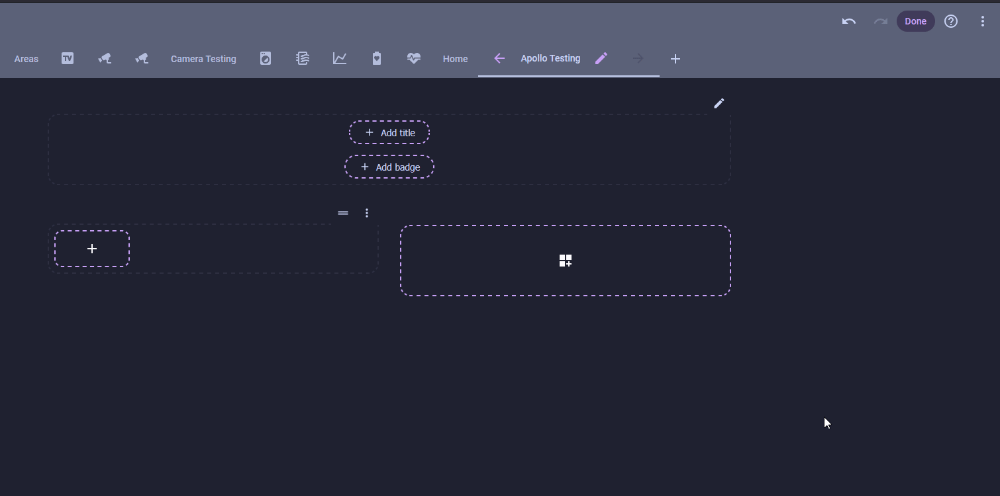
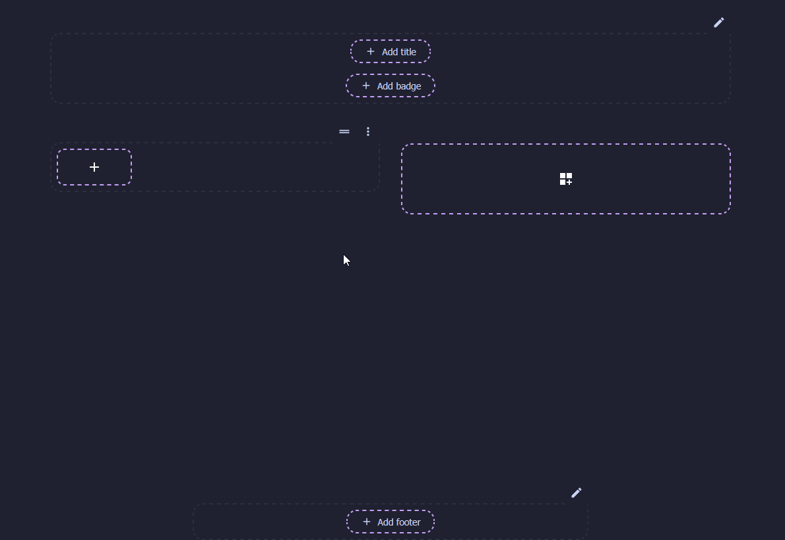

# Temperature on Your Dashboard

Your kit reads the temperature and humidity of whatever room it's in. Putting those readings on a Home Assistant dashboard turns it into a glanceable display you'll actually check. Everything here uses cards that ship with Home Assistant, so there's nothing to install.

!!! note "Before you start"

    * Your kit is added to Home Assistant. If not, start with [Connect to Home Assistant](../tutorials/connect-to-home-assistant.md).
    * The [Temperature and Humidity module](../modules/temperature-humidity-module.md) is connected, so Home Assistant has a **Temperature** sensor and a **Humidity** sensor from the kit.

Level 1 is the everyday display. Level 2 is an optional upgrade you can add on top. Open your dashboard, click the pencil in the top right to start editing, then follow whichever level you like.

## Level 1: Tile cards

<span class="difficulty lvl-1">Difficulty: Level 1</span>

A Tile card is the small, modern card you see across most Home Assistant dashboards: an icon, a name, and the current reading. You'll add one for temperature and one for humidity.

<div class="annotate" markdown>

1. With the dashboard in edit mode, click **Add Card** and open the **By entity** tab.
2. Search `starter kit` and check both the **Temperature** and **Humidity** sensors. (1)
3. Click **Tile** to lay them out as two tiles, then click **Save**.

    

</div>

1.  The preview fills in with the live reading as soon as you pick an entity, so you can confirm you grabbed the right ones.

You now have a trustworthy temp and humidity sensor on your dashboard. Take it to the next level and set up alerts to notify you when your humidity gets high, or turn your AC on when your room gets over 75&deg;F!

## Level 2: A humidity gauge

<span class="difficulty lvl-2">Difficulty: Level 2</span>

A Gauge card shines when a higher reading really does mean worse, and indoor humidity is exactly that. Push past about 60% and you start inviting mold, musty air, and dust mites. The dial runs from green to red as the room gets muggy, so trouble is obvious at a glance.

<div class="annotate" markdown>

1. Click **Add Card** and search for **Gauge**.
2. Set **Entity** to your kit's **Humidity** sensor and give it a **Name** like `Kitchen Humidity`.
3. Set **Minimum** to `0` and **Maximum** to `100`, the full percentage range.
4. Toggle on **Display as needle gauge**, then turn on **Severity** and set green at `0`, yellow at `50`, and red at `60`. (1)

    

</div>

1.  Indoor humidity is comfortable around 30 to 50%. Yellow from 50% is your cue to ventilate, and red past 60% is where mold and dust mites thrive.

Temperature and humidity now live on your dashboard. Drop the cards into a [Sections view](https://www.home-assistant.io/dashboards/sections/) next to the rest of a room's controls and you're off to building out a great dashboard!

??? note "Both cards in YAML"

    Edit any card and choose **Show code editor** to paste these in. Swap in your own entity names; yours usually follow `sensor.<device-name>_temperature`.

    ```yaml
    # Level 1: two Tile cards
    type: tile
    entity: sensor.esphome_starter_kit_temperature
    ---
    type: tile
    entity: sensor.esphome_starter_kit_humidity
    ```

    ```yaml
    # Level 2: humidity Gauge with severity colors
    type: gauge
    entity: sensor.esphome_starter_kit_humidity
    min: 0
    max: 100
    needle: true
    severity:
      green: 0
      yellow: 50
      red: 60
    name: Kitchen Humidity
    ```

--8<-- "_snippets/community-help.md"
