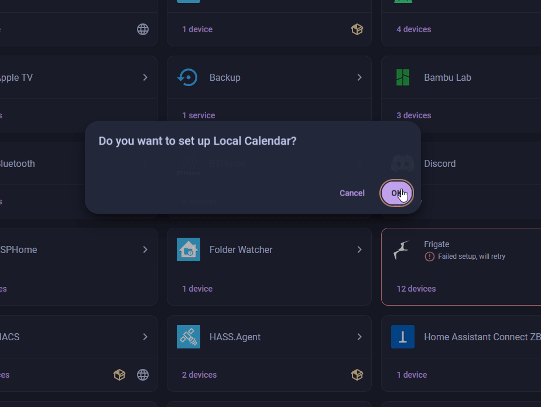
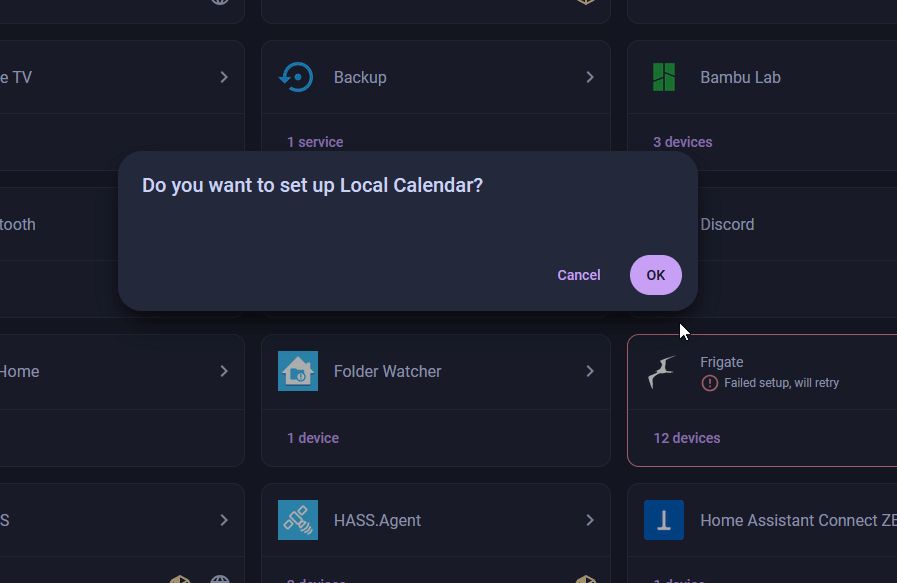
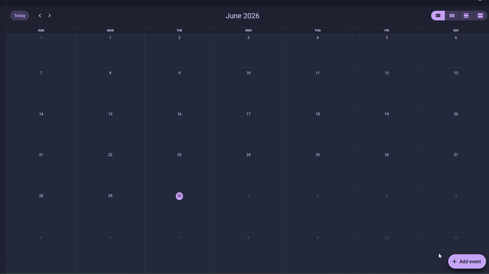
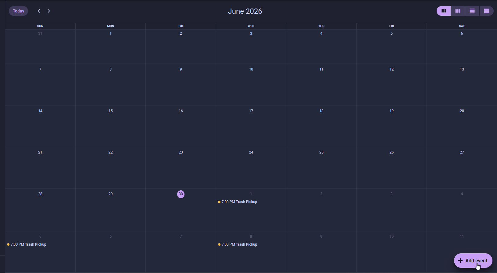

# Trash Night Reminder

<span class="difficulty lvl-2">Difficulty: Level 2</span>

<p class="automation-steps-heading">🌱 New here? Try these first:</p>
<div class="automation-steps">
  <div class="step">
    <a class="step-title" href="../button-toggles-room-light/">Button Toggles a Room Light</a>
    <span class="difficulty lvl-1">Difficulty: Level 1</span>
  </div>
  <div class="step">
    <a class="step-title" href="../motion-activated-room-lights/">Motion-Activated Room Lights</a>
    <span class="difficulty lvl-1">Difficulty: Level 1</span>
  </div>
</div>

Never miss bin night again. Two **Home Assistant Local Calendars** - one for trash, one for recycle - drive a single automation that lights up the Starter Kit's RGB LEDs in a different color for each pickup. When the event starts the LEDs come on; when the event ends they go off.

!!! note "Before you start"

    Work through these pages first. This tutorial assumes your device is flashed, the LED & Buzzer module is wired up, and the kit is connected to Home Assistant:

    * [First Steps](../setup/first-steps.md) to create your starter kit device in ESPHome Device Builder.
    * [Adding the LED & Buzzer Module](../modules/rgb-buzzer-module.md) to wire up the RGB output.
    * [Connect to Home Assistant](../tutorials/connect-to-home-assistant.md) to bring the device's entities into HA.

## Create the calendars

Home Assistant's **Local Calendar** integration stores events entirely inside Home Assistant - no Google account or external service required.

**Add the Trash calendar**

1. Click the button below to start adding the **Local Calendar** integration:

    [](https://my.home-assistant.io/redirect/config_flow_start/?domain=local_calendar)

2. Name it `Trash` and click **Submit**. Home Assistant creates a calendar entity called `calendar.trash`.

    

**Add the Recycle calendar**

3. Click the **Add integration** button below, name this one `Recycle`, and click **Submit**. This creates `calendar.recycle`.

    [](https://my.home-assistant.io/redirect/config_flow_start/?domain=local_calendar)

    

**Add recurring events**

Add a repeating event to each calendar to match your actual pickup schedule.

4. Click the button below to open the **Calendar** view:

    [](https://my.home-assistant.io/redirect/calendar/)

5. Select the day before your pickup and click **Add event**.

    <div class="annotate" markdown>

    - **Calendar** → **Trash**
    - **Title** → `Trash Pickup`
    - Set the **start time** and **end time** to a window that evening, for example 7 PM to 9 PM. (1)
    - Enable **Repeat** and set it to **Weekly** on that day. If your trash goes out more than once a week, scroll down and select the other day too.

    </div>

    1.  The LEDs turn on at the start time and off at the end time, so this is your reminder window. Keep it to one evening rather than running it into the next day.

6. Click **Save**.

    

??? note "Do the same for the Recycle calendar"

    Select the day before recycle pickup, click **Add event**, and fill it in:

    - **Calendar** → **Recycle**
    - **Title** → `Recycle Pickup`
    - Set the **start time** and **end time** to a window that evening, for example 7 PM to 9 PM.
    - Enable **Repeat** and set it to **Weekly** on that day. If recycle goes out more than once a week, scroll down and select the other day too.
    - Click **Save**.

    

## Build the automation

One automation handles both calendars. Four triggers - event start and event end for each calendar - feed into a **Choose** action that picks the right color or turns the LEDs off depending on which trigger fired.

**Create the automation**

1. Click the button below to open **Settings → Automations & scenes**, then click **+ Create automation** → **Create new automation**:

    [](https://my.home-assistant.io/redirect/automations/)

**Add the triggers**

Add four triggers, one at a time. Each one is a **Calendar** trigger, and each gets a **Trigger ID** so the action block can tell them apart. You set the ID from the trigger's three-dot menu, the same way the [Motion-Activated Room Lights](motion-activated-room-lights.md) automation does.

2. Click **+ Add trigger**, search **Calendar**, and pick the **Calendar** trigger.

    - **Calendar** → `Trash`
    - **Event** → **Start**
    - Open the trigger's three-dot menu, choose **Rename**, and set the **Trigger ID** to `trash_start`.

3. Click **+ Add trigger** and add another **Calendar** trigger.

    - **Calendar** → `Trash`
    - **Event** → **End**
    - Three-dot menu, **Rename**, **Trigger ID** → `trash_end`.

4. Click **+ Add trigger** and add another **Calendar** trigger.

    - **Calendar** → `Recycle`
    - **Event** → **Start**
    - Three-dot menu, **Rename**, **Trigger ID** → `recycle_start`.

5. Click **+ Add trigger** and add another **Calendar** trigger.

    - **Calendar** → `Recycle`
    - **Event** → **End**
    - Three-dot menu, **Rename**, **Trigger ID** → `recycle_end`.

**Add the choose action**

6. Under **Then do**, click **+ Add action** and search for **Choose**.

    The **Choose** block works like a branching decision: it checks each option's condition in order and runs the first one that matches.

7. On the first **Option**, click **+ Add condition** and choose **Triggered by**. Set the **Trigger ID** to `trash_start`. Under the option's **Sequence**, click **+ Add action** → **Perform action** → `light.turn_on`:

    <div class="annotate" markdown>

    - **Target** → your RGB LED entity
    - **RGB color** → Red `255`, Green `140`, Blue `0` (amber) (1)
    - **Brightness** → `100%`

    </div>

    1.  Amber is a warm, high-visibility "take out the trash" color that's easy to tell apart from the blue recycle night across a room. See [Tune the colors](#tune-the-colors) below to match your local bin colors.

8. Click **+ Add option**. Condition: **Triggered by** → `recycle_start`. Sequence: `light.turn_on` targeting the same RGB LED entity:

    - **RGB color** → Red `0`, Green `128`, Blue `255` (blue)
    - **Brightness** → `100%`

9. Click **+ Add option**. Condition: **Triggered by** → set both `trash_end` and `recycle_end`. Sequence: `light.turn_off` targeting the RGB LED entity.

10. Name the automation `Trash night reminder` and click **Save**.

??? note "What the automation looks like in YAML"

    Select **Edit in YAML** from the three-dot menu on the automation to see or paste the raw config. Your entity IDs will differ from the example below.

    ```yaml
    alias: Trash night reminder
    description: Light up the RGB LEDs when a trash or recycle calendar event starts
    triggers:
      - trigger: calendar
        event: start
        entity_id: calendar.trash
        id: trash_start
      - trigger: calendar
        event: end
        entity_id: calendar.trash
        id: trash_end
      - trigger: calendar
        event: start
        entity_id: calendar.recycle
        id: recycle_start
      - trigger: calendar
        event: end
        entity_id: calendar.recycle
        id: recycle_end
    conditions: []
    actions:
      - choose:
          - conditions:
              - condition: trigger
                id: trash_start
            sequence:
              - action: light.turn_on
                target:
                  entity_id: light.esphome_starter_kit_rgb_leds
                data:
                  rgb_color: [255, 140, 0]
                  brightness_pct: 100
          - conditions:
              - condition: trigger
                id: recycle_start
            sequence:
              - action: light.turn_on
                target:
                  entity_id: light.esphome_starter_kit_rgb_leds
                data:
                  rgb_color: [0, 128, 255]
                  brightness_pct: 100
          - conditions:
              - condition: trigger
                id:
                  - trash_end
                  - recycle_end
            sequence:
              - action: light.turn_off
                target:
                  entity_id: light.esphome_starter_kit_rgb_leds
    mode: single
    ```

!!! success "Your kit is now a physical reminder for Home Assistant events!"

    The same pattern works for any calendar-driven reminder - medication schedules, bin days for a second home, watering days for the garden. Swap the colors, the calendar name, or the action and you have a new reminder with no extra hardware.

## Tune the colors

Change the `rgb_color` values in the automation to match your local bin colors or whatever stands out best in your home.

| Color | RGB values | Suggested use |
| --- | --- | --- |
| Amber | `255, 140, 0` | General trash |
| Blue | `0, 128, 255` | Recycling |
| Green | `0, 200, 0` | Compost or yard waste |
| White | `255, 255, 255` | Bulk pickup or a second reminder |

--8<-- "_snippets/community-help.md"
