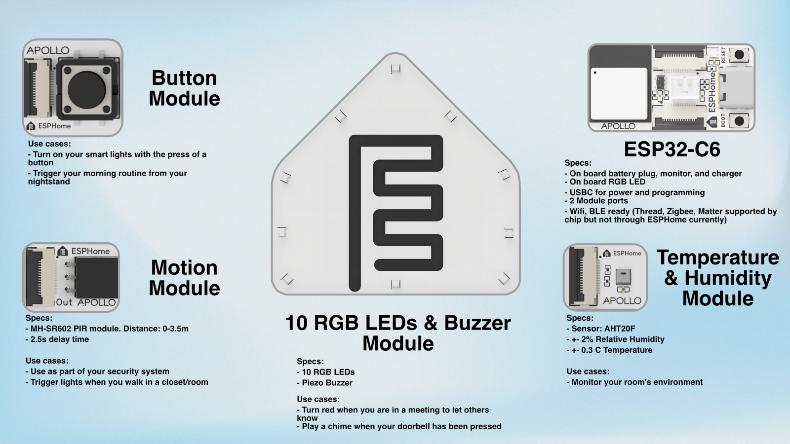

# Welcome to the ESPHome Starter Kit

Welcome to the start of your ESPHome journey with the all-new **ESPHome Starter Kit**!

By the end of this wiki you'll know how to:

* Identify each part of your kit
* Snap the modules off the panel safely

## What's in the kit

Your kit arrives as a single snap-apart panel that contains the ESP32-C6 main board and a set of modules you can mix and match.

## Snapping the panel apart

Each module is connected to the panel by small breakaway tabs. Follow the steps below to separate them

!!! success "Take it slow"

    Bend the panel a little at a time rather than forcing it. The PCB is rigid but the components on the modules can be damaged by sharp impacts or twisting.

1. Hold the panel flat on a table with one hand on the module you want to remove.
2. Gently flex the panel along the tab line until the tab snaps cleanly.
3. If a tab leaves a small nub on the module, you can file or sand it smooth. It will not affect how the module works.

<video autoplay="" loop="" muted="" playsinline="" width="100%">
  <source src="/assets/ESPHome_Starter_Kit_Break_Apart_Modules.mp4" type="video/mp4" />

  Your browser does not support embedded video.
</video>

## Meet the modules

The kit includes:

* **ESP32-C6 main board.** The brain of every project you'll build with the kit. It handles Wi-Fi and Bluetooth, runs your ESPHome config, and exposes the GPIO pins the modules plug into.
* **Motion module.** Detects movement in a room and a great way to get started automating your home. Comes with a separate 3 pin header and PIR motion sensor.
* **Button module.** Premium feel button perfect to trigger automations for lights and more.
* **Temperature and Humidity module.** Temperature and humidity module shipped with the starter kit. Extremely accurate temp and humidity sensor trustworthy enough to track a room comfort level with ease!

Each module connects to the ESP32-C6 board through the FPC connectors which are the thin white ribbon cables.

## Next: bring it online

Once you've identified your modules and snapped them off the panel, the next step is to connect the ESP32-C6 to your computer and walk through your first ESPHome configuration.

<a href="../setup/getting-started/" class="md-button md-button--primary">      Open ESPHome Getting Started </a>