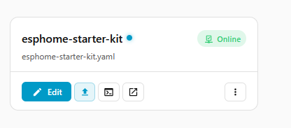
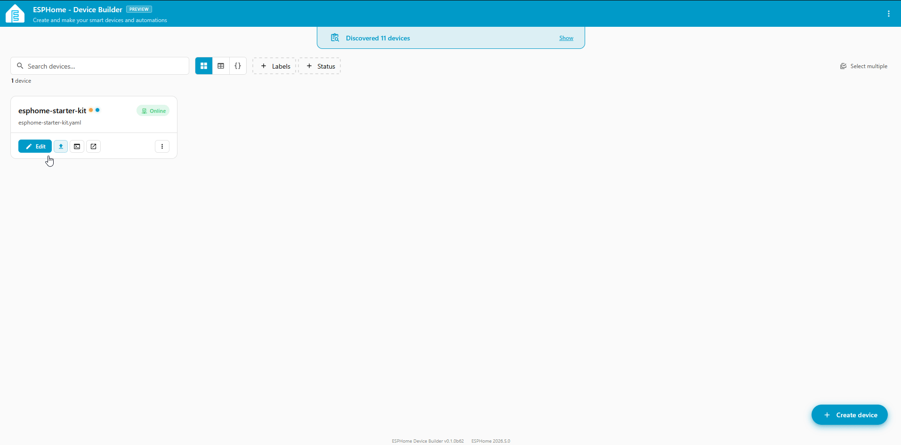
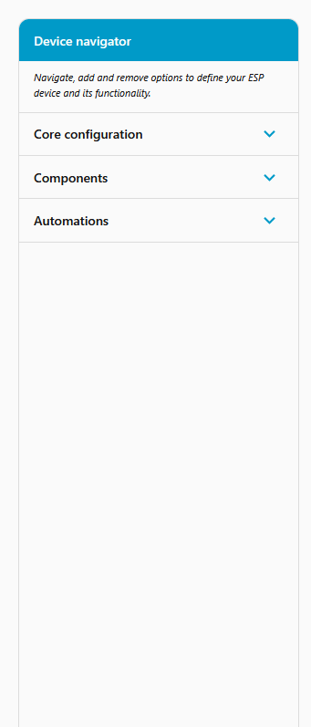
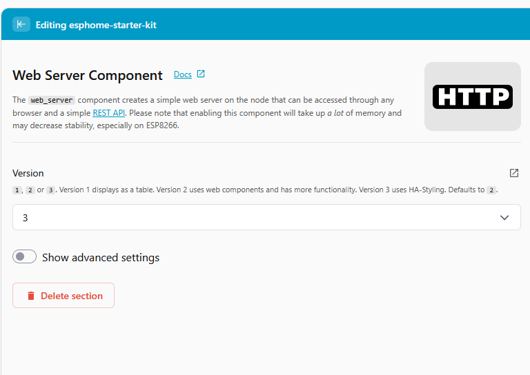
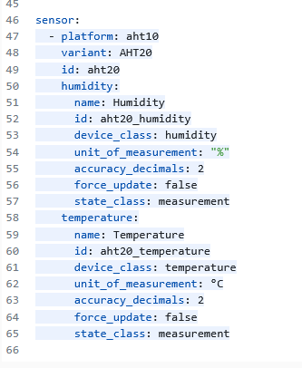
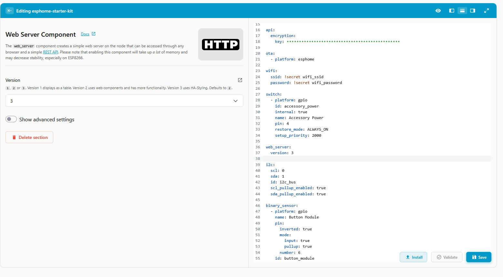
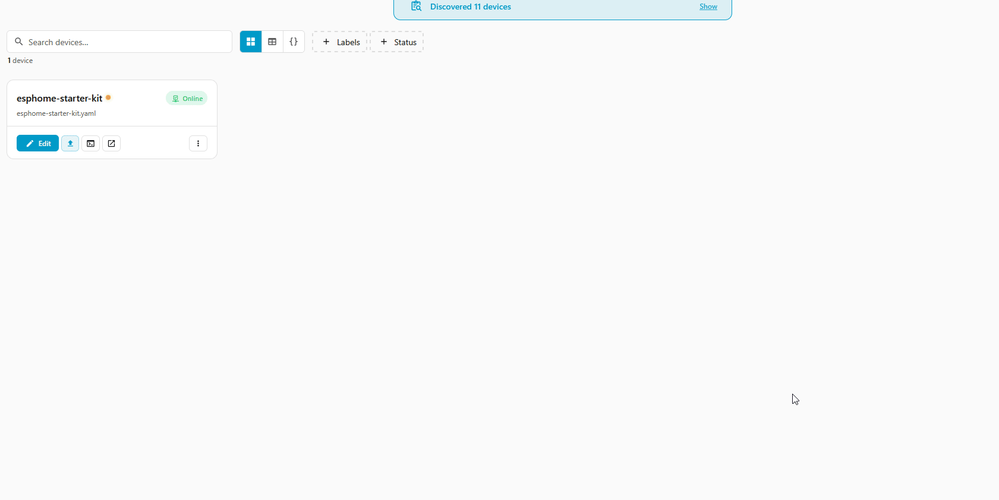

# Device Builder Tour

The **ESPHome Device Builder** is the app you used in [First Steps](../setup/first-steps.md) to install firmware on your Starter Kit, and it's where you go every time you change something on the device. This page walks through each screen so you know what you're looking at.

---

## Dashboard

When you open **ESPHome Device Builder**, you see a list of your ESPHome devices.

* The blue **Edit** button on your device card opens the [configuration editor](#editor). You'll use this most.

??? note "Other dashboard features"

    * The **Visit Web UI** icon on the card opens the device's built-in web page.
    * The three-dot menu on the card holds per-device actions like **Install**, **Validate**, **Logs**, and **Delete**.
    * Clicking the card body itself (not the buttons) opens a read-only info panel with details like the device's IP, MAC, and ESPHome version.
    * New devices on your network appear in the **Discovered devices** banner for adoption.
    * The floating **Create device** button in the bottom-right corner adds a new device.

## Editor

Click **Edit** on your device card and the screen flips into the configuration editor. It has three panes: the **Device navigator** on the left, the **Form pane** in the middle, and the **YAML editor** on the right.

#### Device navigator (left)

The left pane is your config's table of contents. It groups everything into three buckets:

* **Core configuration.** Foundational settings like the device name, Wi-Fi, the connection to Home Assistant, OTA updates, and the web server. For the Starter Kit these are all pre-configured. See [Core Components](core-components.md) for details on each.
* **Components.** The things your device does: switches, sensors, lights. The default Starter Kit has the accessory power switch, the I²C bus, and the AHT10 temperature and humidity sensor. Use **\+ Add component** to add more.
* **Automations.** Reactions that run on the device, like "when this button is pressed, turn that switch on". The Starter Kit ships with none by default.

#### Form pane (middle)

Click anything in the navigator to see its settings here as a form. Every field has inline help text, and a **Docs** link in the top right takes you to the official ESPHome reference for that component.

#### YAML editor (right)

The right pane is the raw YAML for your device, colour-coded with line numbers. You can read it, scroll it, and edit it directly.

The form pane and the YAML editor are always in sync. Edit either side and the other updates instantly. You can learn [YAML](what-is-yaml.md) by reading what the forms produce.

## Publishing Changes

When you have finished making changes:

1. Click **Save**. This writes the YAML file. Nothing is sent to the device yet.
2. Click **Validate** at the bottom right. ESPHome checks your config and reports any errors with the exact line and reason.
3. After saving, an **Install** button appears at the bottom right of the editor. If there's also a new ESPHome release available, the button reads **Update** instead. Click it, then pick **On the Network** for OTA, or **Plug into this computer** for USB.

#### Logs

Click **Logs** from the info panel or the device card's three-dot menu to open a live stream of what the device is reporting. Click **Stop** when done.

Pop them open when something looks off, or just to watch sensor readings come in.

#### Next Steps

* Pick a module from the [Modules](../modules/button-module.md) section to add to your Starter Kit and watch the components list update.
* Read [What is secrets.yaml?](what-is-secrets-yaml.md) to understand how Wi-Fi and encryption keys are stored.
* Bookmark the [official ESPHome documentation](https://esphome.io) for component reference whenever you click a **Docs** link.

<a href="../explaining-esphome/" class="md-button md-button--primary"> Back - Explaining ESPHome</a> <a href="../what-is-yaml/" class="md-button md-button--primary"> Next - What is YAML?</a>

--8<-- "_snippets/community-help.md"
