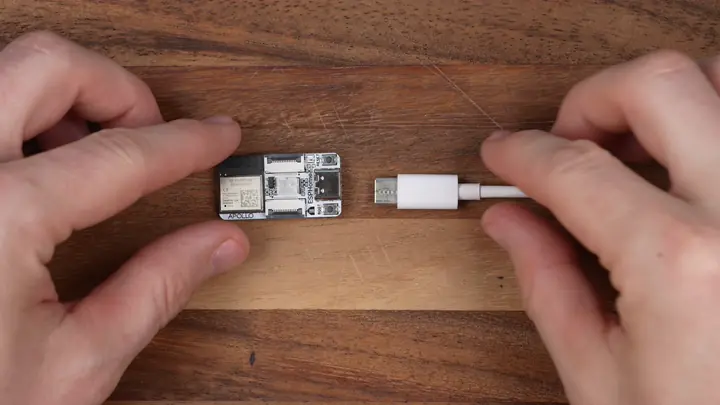
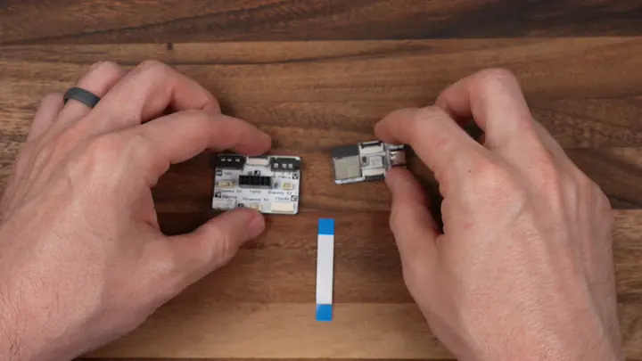
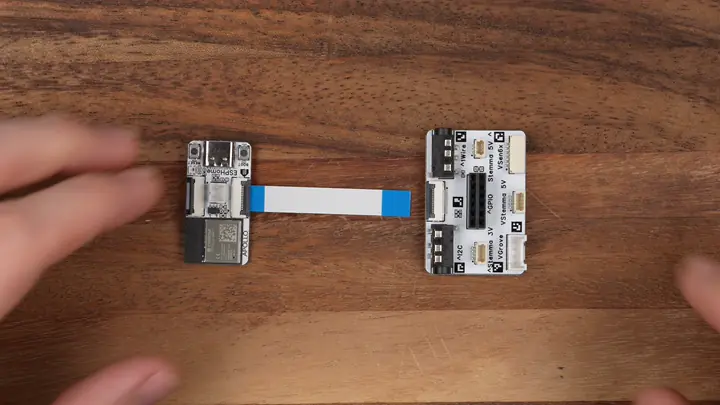

# Adding the Apollo Breakout Module

The Breakout Module gives your starter kit room to grow. It breaks the ESP32-C6's pins out so you can wire up your own parts, the components the kit doesn't include. By the end of this tutorial you'll have it attached to your ESP32-C6 and be ready to build something of your own.

!!! note "Before you start"

    Work through the two prerequisites first:

    * [Start Here](/products/ESPHome-Starter-Kit/start-here.md) to snap the module off the panel.
    * [First Steps](/products/ESPHome-Starter-Kit/setup/first-steps.md) to install ESPHome Device Builder and create your starter kit device.

## Attach Breakout module

Connect the Breakout Module to the ESP32-C6 using one of the FPC ribbon cables that came with the kit. Either FPC connector on the ESP32-C6 works, top or bottom.

1\. Unplug the USB-C cable from the ESP32-C6 so it is powered off.

!!! warning "Handle the FPC connectors gently"

    The latches are small and the ribbon cable is fragile. Lift the latch with a fingernail, slide the cable in, and press the latch down. Never pull on the cable itself.

2\. Flip up the latch on the FPC connector then gently slide the ribbon cable in to the connector. Gently press the latch down to lock it in place.

3\. Slide the ribbon cable into the Breakout Module with the blue side facing upwards then press the latch down to lock it in place.

4\. Plug the ESP32-C6 back into your computer.

## Pinout

The Breakout Module is covered in connectors, each labeled on the board. Most of them carry the same I2C bus at different voltages, plus a 1Wire port and a GPIO header for everything else.

=== "I2C"

    Five connectors share the I2C bus, so most sensor breakouts plug straight in no matter which ecosystem they come from:

    * **3.5mm jack**, top left, for an optional SHT20 temperature and humidity probe
    * **STEMMA QT (3.3V)**, middle left of the board
    * **STEMMA (5V, 4-pin)**, bottom center
    * **Grove**, bottom left
    * **SEN6x**, bottom right, a dedicated port for Sensirion SEN6x air quality sensors

    | Signal | ESP32-C6 pin |
    | --- | --- |
    | SCL | GPIO0 |
    | SDA | GPIO1 |

    Each connector also carries power and ground at its labeled voltage, so a single cable powers the sensor and wires up the bus.

=== "1Wire"

    The connector labeled **1Wire** (top right of the board) is for 1-Wire sensors like the <a href="https://cdn-shop.adafruit.com/datasheets/DS18B20.pdf" target="_blank" rel="noreferrer nofollow noopener">DS18B20 temperature probe</a> (1), the same probe our [TEMP-1](/products/temp1/introduction.md) and [TEMP-1B](/products/temp1b/introduction.md) use.
    { .annotate }

    1.  Probe options:

        <a href="https://apolloautomation.com/products/long-temperature-probe" target="_blank" rel="noreferrer nofollow noopener">**1.5m (~5ft) Waterproof Flat Cable (DS18B20)**</a>: -55°C to 85°C (-67°F to 185°F), ±0.5°C accuracy. Ideal for fridges, freezers, fish tanks etc.

        <a href="https://apolloautomation.com/products/short-temperature-probe" target="_blank" rel="noreferrer nofollow noopener">**20cm (~8in) Waterproof Flat Cable (DS18B20)**</a>: -55°C to 85°C (-67°F to 185°F), ±0.5°C accuracy.

    Data is on **GPIO6**. In your config, the <a href="https://esphome.io/components/one_wire/" target="_blank" rel="noreferrer nofollow noopener">One Wire</a> component sets up the bus on that pin, and the <a href="https://esphome.io/components/sensor/dallas_temp/" target="_blank" rel="noreferrer nofollow noopener">Dallas temperature sensor</a> reads each probe on it.

    Plug the probe's connector into the 1Wire port with the latch side facing up.

    

=== "STEMMA (5V, 3-pin)"

    The 3-pin STEMMA connector on the middle right of the board is a general-purpose 5V port.

    | Pin (left to right) | Signal |
    | --- | --- |
    | 1 | GPIO6 (shared with 1Wire) |
    | 2 | 5V |
    | 3 | GND |

=== "GPIO header"

    The 2x6 header in the middle of the board breaks out power, the UART, and spare GPIOs for anything else you want to wire up.

    

    A few of these pins pull double duty:

    * SCL and SDA are the same I2C bus as the connectors (GPIO0 and GPIO1).
    * IO6 is shared with the 1Wire port and the 3-pin STEMMA.
    * TX and RX are the ESP32-C6's UART.

??? note "Advanced: keeping 3.3V power on during sleep"

    Out of the box, the module's 3.3V pin runs on the ESP32-C6's controlled power rail (**3vCTRL**). That's the battery-friendly setting: when the ESP sleeps, power to your connected components shuts off too.

    If your project needs 3.3V that stays on through sleep, there's a solder jumper on the back of the board, top right, labeled **J5**. The existing bridge between the center pad and the **3vCTRL** pad looks like an H. Cut that bridge, then solder a new bridge from the center pad to the **3V** pad for always-on power.

    

    This involves cutting a trace and soldering on the board itself, so skip it unless you know you need it. Most projects are fine with the default.

## Add to ESPHome Device Builder

The Breakout Module is different from the other starter kit modules. There's no single **Add Component** entry to select, because the module doesn't have a fixed sensor on it. Instead it breaks the ESP32-C6's pins out so you can wire up your own parts. Pick the component that matches what you connected:

* For I2C devices (most sensor breakouts), add the component for your sensor, set SCL to pin 0 and SDA to pin 1, and turn on the pullup toggle for both pins.
* For a DS18B20 probe on the 1Wire connector, add the <a href="https://esphome.io/components/one_wire/" target="_blank" rel="noreferrer nofollow noopener">One Wire</a> component on GPIO6, then a <a href="https://esphome.io/components/sensor/dallas_temp/" target="_blank" rel="noreferrer nofollow noopener">Dallas temperature sensor</a>.
* For anything on the GPIO header, add the matching component and point it at the GPIO you wired.

The <a href="https://esphome.io/components/" target="_blank" rel="noreferrer nofollow noopener">ESPHome component index</a> lists every supported sensor, switch, light, and more, along with the config each one needs.

## Install the firmware

Once you've added the component for whatever you wired up, flash the device so your changes go live.

1. Click **Install** on your device card in ESPHome Device Builder.
2. Choose **Plug into the computer running ESPHome Device Builder** for the first flash, or **On The Network** if the device is already on your Wi-Fi.
3. Wait for the compile and flash to finish. First builds can take a few minutes.
4. The device reboots and reconnects to your Wi-Fi on its own.

## Test your wiring

With the device back online, whatever you wired up shows up on the web server alongside your other entities. <a href="http://esphome-starter-kit.local/" target="_blank" rel="noreferrer nofollow noopener">Open it in a browser</a> on the same network and watch it react in real time.

1. In a browser, open `http://<your-device-name>.local/`. If you used `esphome-starter-kit` as the device name in Getting Started, that's `http://esphome-starter-kit.local/`.
2. Find the entity for the component you added in the list.
3. Trigger it (press your button, cover your sensor, and so on) and watch the value update.

From here, the Breakout Module is your sandbox. Mix in any ESPHome component and build something that's all your own.

--8<-- "_snippets/community-help.md"
