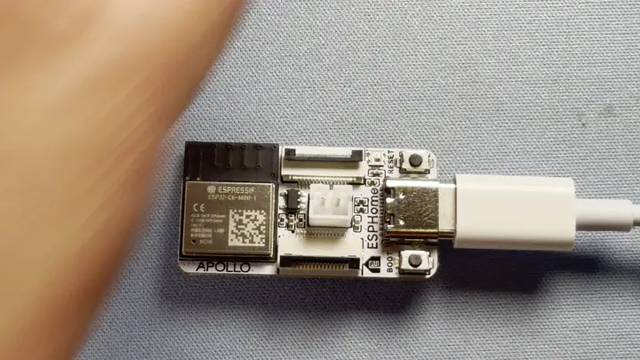
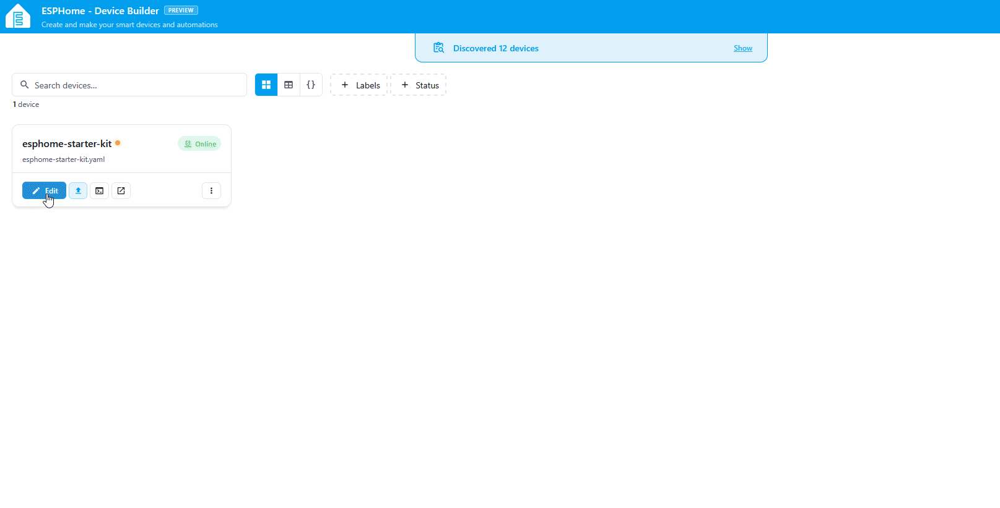
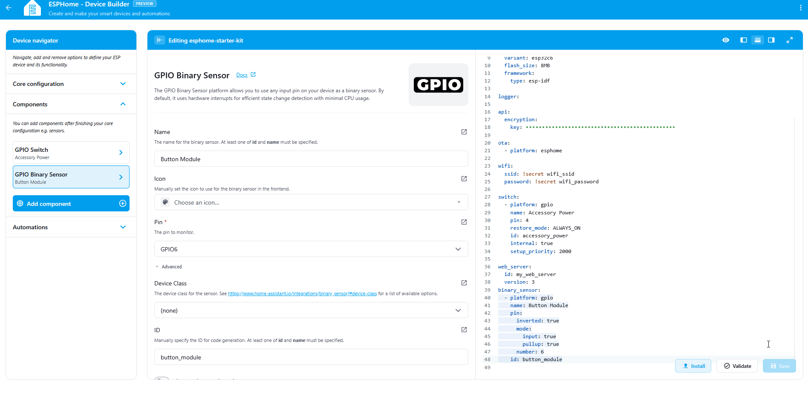
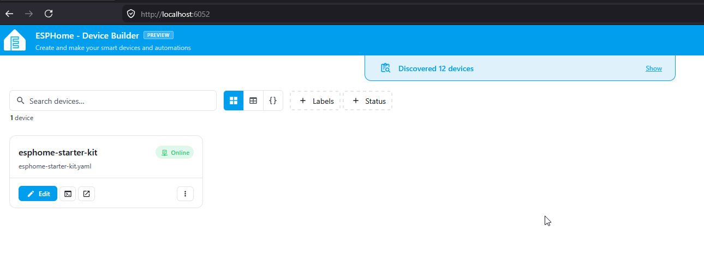
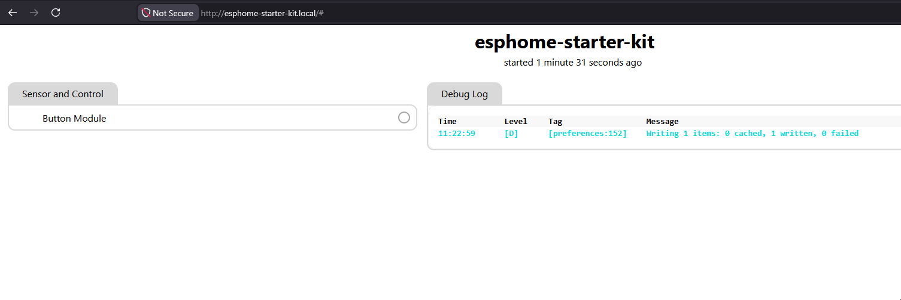

# Adding the Button Module

The button module is the first input your starter kit gets, and the fastest way to feel ESPHome respond to a physical action. By the end of this tutorial you'll have the button wired to your ESP32-C6, surfaced as a binary sensor in your YAML, and toggling live in the web server when you press it.

!!! note "Before you start"

    Work through the two prerequisites first:

    * [Start Here](/products/ESPHome-Starter-Kit/start-here/) to snap the button module off the panel.
    * [First Steps](/products/ESPHome-Starter-Kit/setup/first-steps/) to install ESPHome Device Builder and create your starter kit device.

#### Prerequisite

The <a href="https://esphome.io/components/web_server/" target="_blank" rel="noreferrer nofollow noopener">Web Server</a> is used to broadcast a local website using your device. This allows you to navigate to the IP address of your device or hostname such as <a href="http://esphome-starter-kit.local/" target="_blank" rel="noreferrer nofollow noopener">esphome-starter-kit.local</a> to easily control your new device!

1. In the ESPHome Device Builder, navigate to the **Core configuration** section.
2. Click **Add component**.
3. Scroll to **Web Server** and click **Add**.
4. Click **Add** once more to confirm.
5. Toggle **Show advanced settings**.
6. Scroll down to **Version** and select **3** from the dropdown.


## Attach Button module

Connect the button module to the ESP32-C6 using one of the FPC ribbon cables that came with the kit. Either FPC connector on the C6 works, top or bottom.

1\. Unplug the USB-C cable from the ESP32-C6 so the board is powered off.



2\. Flip up the latch on the FPC connector then gently slide the ribbon cable in to the connector. Gently press the latch down to lock it in place.


3\. Slide the ribbon cable into the button module with the blue side facing upwards then press the latch down to lock it in place.


4\. Plug the C6 back into your computer.

!!! warning "Handle the FPC connectors gently"

    The latches are small and the ribbon cable is fragile. Lift the latch with a fingernail, slide the cable in, and press the latch down. Never pull on the cable itself.

## Add to ESPHome Device Builder

ESPHome Device Builder ships an **Add Component** flow that knows the pin layout for every Apollo Starter Kit module. Use it instead of writing the binary sensor by hand, and you'll get the right GPIO and inversion settings on the first try.

1. Open your starter kit device in Device Builder and click **Edit**.
2. In the ESPHome Device Builder, navigate to the **Components** section.
3. Click **Add Component** in the editor toolbar.
4. Search for **Button** and select the **Button Module**.
5. Click **Add**. Device Builder inserts the button's binary sensor block into your YAML.



??? note "What the button YAML does"

    The block Add Component drops into your config looks like this:

    ```yaml
    binary_sensor:
      - platform: gpio
        pin:
          number: GPIO6
          inverted: true
          mode:
            input: true
            pullup: true
        id: my_button
        name: "Button"
    ```

    Each option does something specific:

    | Option | What it does |
    | --- | --- |
    | `platform: gpio` | Reads a digital input on a GPIO pin. |
    | `number: GPIO6` | The pin the button module's FPC connector wires to on the ESP32-C6. |
    | `inverted: true` | The pin reads LOW when the button is pressed, so this flips it to an intuitive on/off state. |
    | `mode.input: true` | Configures the pin as an input. |
    | `mode.pullup: true` | Enables the C6's internal pull-up so the pin doesn't float when the button isn't pressed. |
    | `id: my_button` | Internal handle you can reference from automations and lambdas elsewhere in the config. |
    | `name: "Button"` | The friendly name shown in Home Assistant and the web server. |

## Install the firmware

Flash the device so the new web server and button entity go live.

1. Click **Install** on your device card in ESPHome Device Builder.
2. Choose **Plug into the computer running ESPHome Device Builder** for the first flash, or **On The Network** if the device is already on your Wi-Fi.
3. Wait for the compile and flash to finish. First builds can take a few minutes.
4. The device reboots and reconnects to your Wi-Fi on its own.



## Test the Button

With the device back online, the button entity is live on the web server. <a href="http://esphome-starter-kit.local/" target="_blank" rel="noreferrer nofollow noopener">Open it in a browser</a> on the same network and watch it react in real time.



1. In a browser, open `http://<your-device-name>.local/`. If you used `esphome-starter-kit` as the device name in Getting Started, that's `http://esphome-starter-kit.local/`.
2. Find the **Button** entity in the binary sensor list.
3. Press the button on the module. The entity flips from **OFF** to **ON** while the button is held, then back to **OFF** when you release it.



> Web server page showing the Button binary sensor toggling between ON and OFF as the button is pressed.

!!! success "Your button module is now ready for you to use in automations!"

    Your Button Module is now ready for some fun tasks.. like toggling lights on and off in your room, watering your plants, and more!