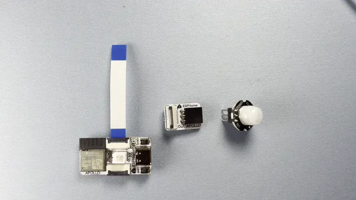
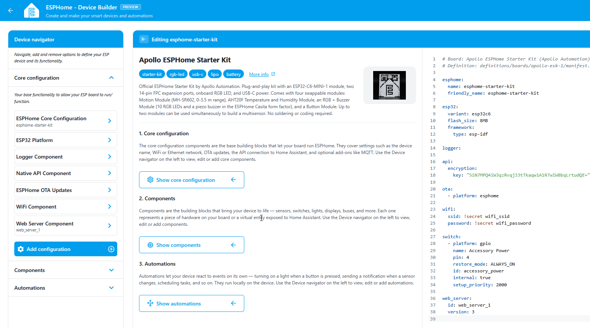
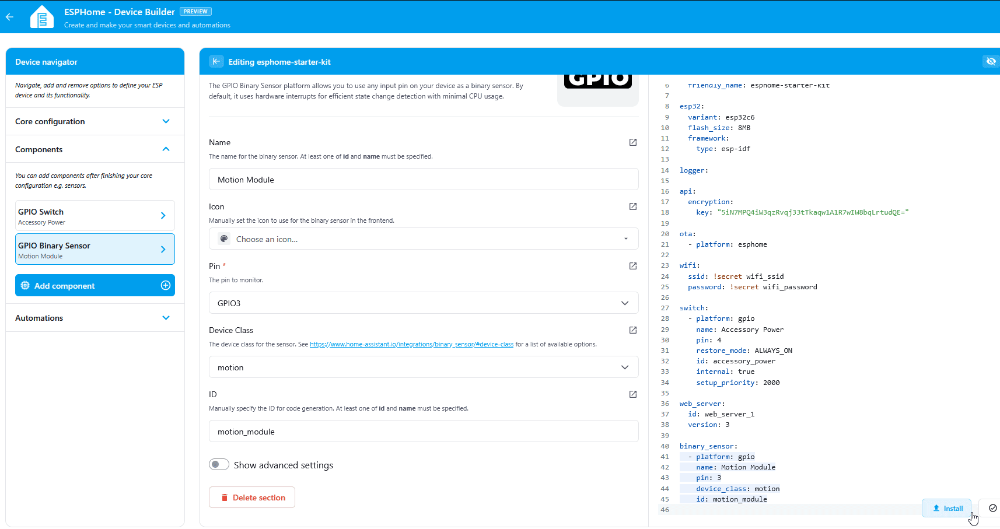
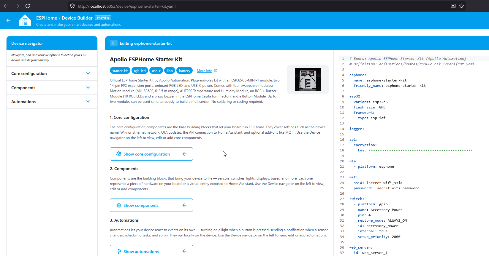

# Adding the Motion Module

The Motion Module turns your starter kit into a motion sensor. By the end of this tutorial you'll have an MH-SR602 wired to your ESP32-C6, surfaced as a binary sensor in your YAML, and flipping live in the web server whenever something moves in front of it.

!!! note "Before you start"

    Work through the two prerequisites first:

    * [Start Here](/products/ESPHome-Starter-Kit/start-here/) to snap the button module off the panel.
    * [First Steps](/products/ESPHome-Starter-Kit/setup/first-steps/) to install ESPHome Device Builder and create your starter kit device.

#### Prerequisite

The <a href="https://esphome.io/components/web_server/" target="_blank" rel="noreferrer nofollow noopener">Web Server</a> is used to broadcast a local website using your device. This allows you to navigate to the IP address of your device or hostname such as <a href="http://esphome-starter-kit.local/" target="_blank" rel="noreferrer nofollow noopener">esphome-starter-kit.local</a> to easily control your new device!

1. In the ESPHome Device Builder, navigate to the **Core configuration** section.
2. Click **Add component**.
3. Scroll to **Web Server** and click **Add**.
4. Click **Add** once more to confirm.
5. Toggle **Show advanced settings**.
6. Scroll down to **Version** and select **3** from the dropdown.


## Attach PIR

The PIR sensor (the small white dome on a tiny PCB) ships separately from the motion module so it can be packed safely. Install it onto the module before plugging anything into the C6.

1. Take the PIR sensor out of the box.
2. Line up the **Out** name on each side as shown in the gif below.
3. Press it down firmly until the pins are fully seated.



## Attach Motion module

Connect the motion module to the ESP32-C6 using one of the FPC ribbon cables that came with the kit. Either FPC connector on the C6 works, top or bottom.

1\. Unplug the USB-C cable from the ESP32-C6 so the board is powered off.


2\. Flip up the latch on the FPC connector then gently slide the ribbon cable in to the connector. Gently press the latch down to lock it in place


3\. Slide the ribbon cable into the button module with the blue side facing upwards then press the latch down to lock it in place.


4\. Plug the C6 back into your computer.

!!! warning "Handle the FPC connectors gently"

    The latches are small and the ribbon cable is fragile. Lift the latch with a fingernail, slide the cable in, and press the latch down. Never pull on the cable itself.

## Add to ESPHome Device Builder

ESPHome Device Builder ships an **Add Component** flow that knows the pin layout for every Apollo Starter Kit module. Use it instead of writing the binary sensor by hand, and you'll get the right GPIO and pin mode on the first try.

1. Open your starter kit device in Device Builder and click **Edit**.
2. Click **Add Component** in the editor toolbar.
3. Search for **Motion** and select the Apollo Starter Kit PIR motion component.
4. Click **Add**. Device Builder inserts the PIR's binary sensor block into your YAML.



??? note "What the Motion YAML does"

    The block Add Component drops into your config looks like this:

    ```yaml
    binary_sensor:
      - platform: gpio
        name: Motion Module
        pin: 3
        device_class: motion
        id: motion_module
    ```

    Each option does something specific:

    \| Option \| What it does \| \| --- \| --- \| \| `platform: gpio` \| Reads a digital input on a GPIO pin. \| \| `number: GPIO3` \| The pin the Motion module's FPC connector wires to on the ESP32-C6. \| \| `mode.input: true` \| Configures the pin as an input. \| \| `mode.pulldown: false` \| The MH-SR602 drives its output both high and low on its own, so no internal pulldown is needed. \| \| `id: motion_module` \| Internal handle you can reference from automations and lambdas elsewhere in the config. \| \| `name: "Motion Module"` \| The friendly name shown in Home Assistant and the web server. \| \| `device_class: motion` \| Tells Home Assistant this is a motion sensor, so it shows the right icon and works in motion-related templates and blueprints. \|

## Install the firmware

Flash the device so the new web server and motion entity go live.

1. Click **Install** on your device card in ESPHome Device Builder.
2. Choose **Plug into the computer running ESPHome Device Builder** for the first flash, or **On The Network** if the device is already on your Wi-Fi.
3. Wait for the compile and flash to finish. First builds can take a few minutes.
4. The device reboots and reconnects to your Wi-Fi on its own.



## Test Motion

With the device back online, the Motion entity is live on the web server. <a href="http://esphome-starter-kit.local/" target="_blank" rel="noreferrer nofollow noopener">Open it in a browser</a> on the same network and watch it react in real time.

1. In a browser, open `http://<your-device-name>.local/`. If you used `esphome-starter-kit` as the device name in Getting Started, that's `http://esphome-starter-kit.local/`.
2. Find the **Motion** entity in the binary sensor list.
3. Wave your hand in front of the sensor. The entity flips from OFF to ON while motion is detected, then back to OFF a few seconds after motion stops.

!!! tip "Give the Motion sensor a moment to settle"

    PIR sensors need a brief warm-up after powering on, usually 5 to 10 seconds, before their readings stabilize. If the sensor reports motion right after boot even when nothing is moving, give it a moment.



> Web server page showing the Motion binary sensor toggling between ON and OFF as motion is detected.

!!! success "Your Motion module is now ready to use in automations!"

    You're now ready to make automations around occupancy in your home!

## Try it in an automation

Your motion sensor is live. Put it to work:

<a href="/products/ESPHome-Starter-Kit/automations/motion-activated-light/" class="md-button md-button--primary">  Motion-Activated Light </a>

[Join our Discord :simple-discord:](https://link.apolloautomation.com/discord){ .md-button .md-button--discord }
[Community Forum :material-forum:](https://forum.apolloautomation.com/){ .md-button .md-button--primary }