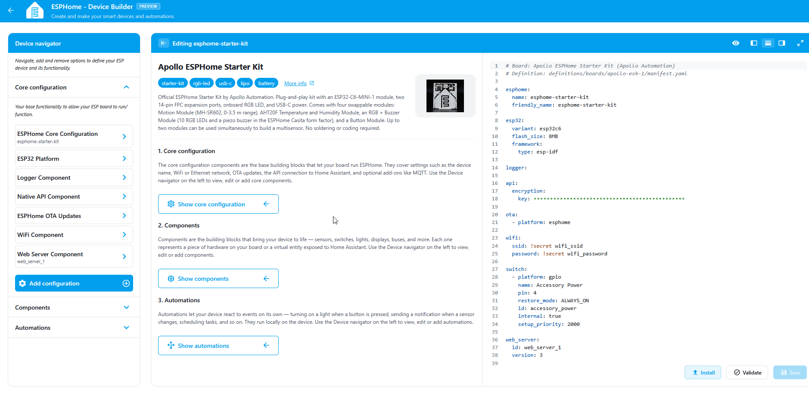
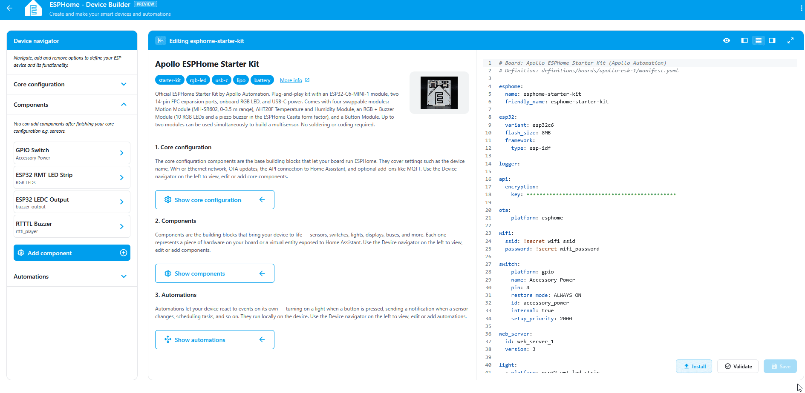
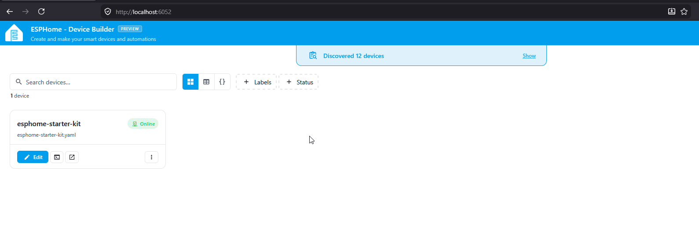

The LED & Buzzer is the starter kit's notification module, a strip of ten addressable RGB LEDs and a small piezo buzzer behind the ESPHome logo silkscreen. By the end of this tutorial you'll have the lights and buzzer wired to your ESP32-C6, surfaced in your YAML, and ready to flash, animate, or sing in response to anything else you build.

!!! note "Before you start"

    Work through the two prerequisites first.

    - [Start here](../start-here.md) to snap the LED & Buzzer module off the panel.
    - [First steps](../setup/first-steps.md) to install ESPHome Device Builder and create your starter kit device.

## Prerequisite, enable the Web Server

The <a href="https://esphome.io/components/web_server/" target="_blank" rel="noreferrer nofollow noopener">Web Server</a> broadcasts a local website from your device. That lets you navigate to the device's IP address or hostname (for example <a href="http://esphome-starter-kit.local/" target="_blank" rel="noreferrer nofollow noopener">esphome-starter-kit.local</a>) to control it from any browser on your network.

1. In the ESPHome Device Builder, navigate to the **Core configuration** section.
2. Click **Add component**.
3. Scroll to **Web Server** and click **Add**.
4. Click **Add** once more to confirm.
5. Toggle **Show advanced settings**.
6. Scroll down to **Version** and select **3** from the dropdown.


## Attach the LED & Buzzer module

Connect the LED & Buzzer module to the ESP32-C6 using one of the FPC ribbon cables that came with the kit. Either FPC connector on the C6 works, top or bottom.

1. Unplug the USB-C cable from the ESP32-C6 so the board is powered off.

    

2. Flip up the latch on the FPC connector, then gently slide the ribbon cable into the connector. Gently press the latch down to lock it in place.

    

3. Slide the ribbon cable into the LED & Buzzer module with the blue side facing upwards, then press the latch down to lock it in place.

    

4. Plug the C6 back into your computer.

!!! warning "Handle the FPC connectors gently"

    The latches are small and the ribbon cable is fragile. Lift the latch with a fingernail, slide the cable in, and press the latch down. Never pull on the cable itself.

## Add the bundle in ESPHome Device Builder

ESPHome Device Builder ships an **Add Component** flow that knows the pin layout for every Apollo Starter Kit module. Use it instead of writing the LED strip and buzzer config by hand, and you'll get the right GPIOs, chipset, and PWM setup on the first try.

1. Open your starter kit device in Device Builder and click **Edit**.
2. In the ESPHome Device Builder, navigate to the **Components** section.
3. Click **Add Component** in the editor toolbar.
4. Select the **RGB LED + Buzzer Module Bundle** at the top.
5. Click **Add** → click **Add** → click **Add** → click **Add**. Each section lets you make changes, but you can leave them at defaults for now. Device Builder inserts the light, output, and rtttl blocks into your YAML.



??? note "What the LED & Buzzer module YAML does"

    The blocks Add Component drops into your config look like this.

    ```yaml
    light:
      - platform: esp32_rmt_led_strip
        id: rgb_module
        name: "RGB Module Light"
        pin: GPIO14
        chipset: WS2812
        num_leds: 10
        rmt_symbols: 48
        rgb_order: grb
        default_transition_length: 0s
        effects:
          - addressable_rainbow:
              name: "Rainbow"
          - addressable_twinkle:
              name: "Twinkle"

    output:
      - platform: ledc
        pin: GPIO18
        id: buzzer

    rtttl:
      id: rtttl_buzzer
      output: buzzer
    ```

    **LED strip**

    | Option | What it does |
    | --- | --- |
    | `light.platform: esp32_rmt_led_strip` | Uses the ESP32's RMT peripheral to drive addressable LEDs with precise timing. |
    | `light.pin: GPIO14` | The data line going to the first LED on the PCB. |
    | `light.chipset: WS2812` | Which addressable LED protocol to use. WS2812 is the most common, sometimes also called NeoPixel. |
    | `light.num_leds: 10` | The number of LEDs on the LED & Buzzer module. |
    | `light.rgb_order: grb` | Color channel order. WS2812 LEDs receive color data in green-red-blue order, so this makes sure red looks red and not green. |
    | `light.rmt_symbols: 48` | Low-level RMT setting needed on the ESP32-C6. Leave it at 48. |
    | `light.effects` | Pre-loaded animations you can select from the web server or trigger from Home Assistant. |

    **Piezo buzzer**

    | Option | What it does |
    | --- | --- |
    | `output.platform: ledc` | PWM output for driving the buzzer. PWM is how digital pins create audio tones on a piezo. |
    | `output.pin: GPIO18` | The pin the buzzer is wired to. |
    | `output.id: buzzer` | Internal handle the rtttl component uses to send tones to this output. |
    | `rtttl.id: rtttl_buzzer` | Internal handle for triggering tunes from automations and lambdas. |
    | `rtttl.output: buzzer` | Tells rtttl to use the buzzer output for playback. |

## Flash the firmware

Flash the device so the new web server and the LED and buzzer entities go live.

1. Click **Install** on your device card in ESPHome Device Builder.
2. Choose **Plug into the computer running ESPHome Device Builder** for the first flash, or **On The Network** if the device is already on your Wi-Fi.
3. Wait for the compile and flash to finish. First builds can take a few minutes.
4. The device reboots and reconnects to your Wi-Fi on its own.



## Test the LEDs

With the device back online, the RGB LED light entity is live on the web server. <a href="http://esphome-starter-kit.local/" target="_blank" rel="noreferrer nofollow noopener">Open it in a browser</a> on the same network and play with it.

1. In a browser, open `http://<your-device-name>.local/`. If you used `esphome-starter-kit` as the device name in [First steps](../setup/first-steps.md), that's `http://esphome-starter-kit.local/`.
2. Toggle the **RGB LEDs** entity and play around with the colors and brightness.



!!! tip "Go further with light effects"

    There are a lot of advanced things you can do with a light entity. See the [advanced LED & Buzzer effects wiki](#TODO-link-to-advanced-light-component-wiki) for more.

The buzzer doesn't have its own web server control, since it's an output rather than a switch. Once you've added the device to Home Assistant, you can trigger tunes with the `rtttl.play` action or by exposing your own service.

!!! success "Your LED & Buzzer notification module is ready"

    Your LED & Buzzer module is now wired up. From here, toggle the lights, animate the strip, or play tunes through the buzzer in response to anything else you build.
