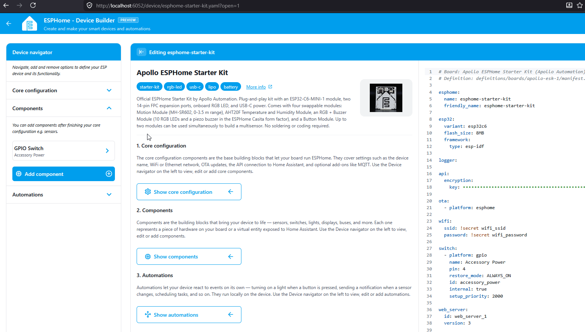
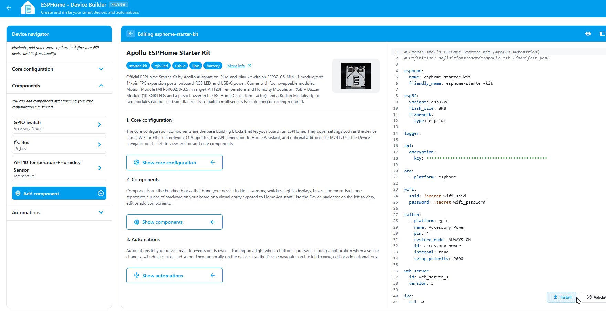
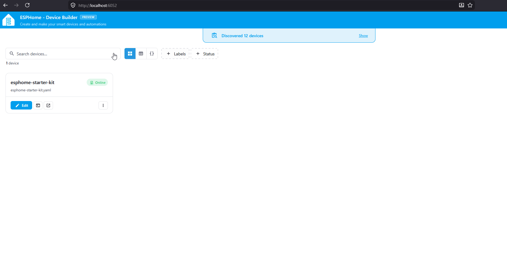

The temperature and humidity module is your starter kit's first environmental sensor, reading the air around it on whatever interval you choose. By the end of this tutorial you'll have an AHT20F wired to your ESP32-C6, surfaced as two sensors in your YAML, and updating live in the web server.

!!! note "Before you start"

    Work through the two prerequisites first.

    - [Start here](../start-here.md) to snap the temperature and humidity module off the panel.
    - [First steps](../setup/first-steps.md) to install ESPHome Device Builder and create your starter kit device.

## Prerequisite, enable the Web Server

The <a href="https://esphome.io/components/web_server/" target="_blank" rel="noreferrer nofollow noopener">Web Server</a> broadcasts a local website from your device. That lets you navigate to the device's IP address or hostname (for example <a href="http://esphome-starter-kit.local/" target="_blank" rel="noreferrer nofollow noopener">esphome-starter-kit.local</a>) to control it from any browser on your network.

1. In the ESPHome Device Builder, navigate to the **Core configuration** section.
2. Click **Add component**.
3. Scroll to **Web Server** and click **Add**.
4. Click **Add** once more to confirm.
5. Toggle **Show advanced settings**.
6. Scroll down to **Version** and select **3** from the dropdown.


## Attach the temperature and humidity module

Connect the Temperature and Humidity module to the ESP32-C6 using one of the FPC ribbon cables that came with the kit. Either FPC connector on the C6 works, top or bottom.

1. Unplug the USB-C cable from the ESP32-C6 so the board is powered off.

    

2. Flip up the latch on the FPC connector, then gently slide the ribbon cable into the connector. Gently press the latch down to lock it in place.

    

3. Slide the ribbon cable into the temperature and humidity module with the blue side facing upwards, then press the latch down to lock it in place.

    

4. Plug the C6 back into your computer.

!!! warning "Handle the FPC connectors gently"

    The latches are small and the ribbon cable is fragile. Lift the latch with a fingernail, slide the cable in, and press the latch down. Never pull on the cable itself.

## Add the sensor in ESPHome Device Builder

ESPHome Device Builder ships an **Add Component** flow that knows the pin layout for every Apollo Starter Kit module. Use it instead of writing the I2C bus and sensor block by hand, and you'll get the right pins, address, and variant on the first try.

1. Open your starter kit device in Device Builder and click **Edit**.
2. In the ESPHome Device Builder, navigate to the **Components** section.
3. Click **Add Component** in the editor toolbar.
4. Search for **Temperature and Humidity** and select the Apollo Starter Kit temperature and humidity component.
5. Click **Add**. Device Builder inserts the I2C bus into your YAML.
6. Search for **Temperature and Humidity** again and select the Apollo Starter Kit temperature and humidity component.
7. Click **Add**. Device Builder inserts the AHT20F sensor block into your YAML.



??? note "What the temperature and humidity YAML does"

    The blocks Add Component drops into your config look like this.

    ```yaml
    i2c:
      sda: GPIO1
      scl: GPIO0
      scan: true

    sensor:
      - platform: aht10
        variant: AHT20
        id: aht_20
        temperature:
          name: "Temperature"
          id: aht_temperature
        humidity:
          name: "Humidity"
          id: aht_humidity
        update_interval: 60s
    ```

    Each option does something specific.

    | Option | What it does |
    | --- | --- |
    | `i2c.sda` / `i2c.scl` | The data and clock pins for the I2C bus the AHT20F speaks on. The starter kit wires them to `GPIO1` and `GPIO0`. |
    | `i2c.scan: true` | Lists every I2C device the board finds at boot, useful for confirming the sensor is connected. |
    | `platform: aht10` | The ESPHome platform that drives AHT10, AHT20, and AHT30 sensors. |
    | `variant: AHT20` | Tells the platform which variant of the chip is connected. |
    | `id: aht_20` | Internal handle you can reference from automations and lambdas elsewhere in the config. |
    | `temperature` / `humidity` | Two sub-sensors. Each has a `name` shown in Home Assistant and the web server, and an `id` you can reference from automations and lambdas. |
    | `update_interval: 60s` | How often the sensor reports. 60 seconds is a reasonable default. Lower it for more responsive readings, raise it to cut down on network traffic. |

## Flash the firmware

Flash the device so the new web server and the temperature and humidity entities go live.

1. Click **Install** on your device card in ESPHome Device Builder.
2. Choose **Plug into the computer running ESPHome Device Builder** for the first flash, or **On The Network** if the device is already on your Wi-Fi.
3. Wait for the compile and flash to finish. First builds can take a few minutes.
4. The device reboots and reconnects to your Wi-Fi on its own.



## Test temperature and humidity

With the device back online, the temperature and humidity entities are live on the web server. <a href="http://esphome-starter-kit.local/" target="_blank" rel="noreferrer nofollow noopener">Open it in a browser</a> on the same network and watch them update in real time.

1. In a browser, open `http://<your-device-name>.local/`. If you used `esphome-starter-kit` as the device name in [First steps](../setup/first-steps.md), that's `http://esphome-starter-kit.local/`.
2. Find the **Temperature** and **Humidity** entities in the sensor list.
3. Watch the values update on the interval you set. Cup your hand over the sensor or breathe on it, and the humidity reading will respond within a few cycles.



!!! success "Your temperature and humidity module is ready"

    You now have a trustworthy temperature and humidity sensor you can place anywhere in your home.
