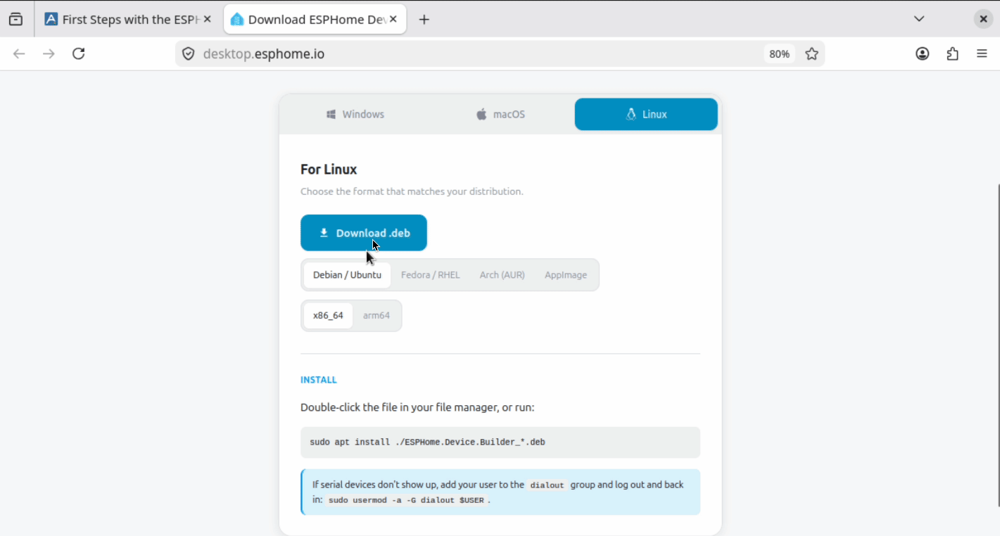

# ESPHome Starter Kit - First Steps

This guide walks you through installing the ESPHome Device Builder app, and making your first ESPHome YAML configuration from scratch.

By the end you'll have your ESPHome Starter Kit flashed with a working configuration, showing up in Home Assistant, and reachable in a browser at its IP address or http://esphome-starter-kit.local via its built-in web server.

[:material-cart: Buy the ESPHome Starter Kit](https://apolloautomation.com/products/esk-1-esphome-starter-kit){ .md-button .md-button--primary }

!!! tip "Click the (+) for extra context"

    

    When you see a small **(+)** icon next to a step or word, give it a click (1). It opens a side note with tips, gotchas, or examples you don't need on first read.

    

    1.  Like this, you just opened your first annotation. Click outside the box to close it.

---

### ESPHome Device Builder

ESPHome Device Builder is the software that gives you a user interface for writing, compiling, and flashing ESPHome YAML configurations. You'll use it to build the firmware for your kit.

Think of it like telling the starter kit about what devices it has connected and how to use them!

<a href="../../learning-the-basics/explaining-esphome/" class="md-button md-button--primary"> Learn more about ESPHome</a>

Pick the platform you'll be running ESPHome Device Builder on:

=== "Windows"

    1. Open <a href="https://desktop.esphome.io" target="_blank" rel="noreferrer nofollow noopener">desktop.esphome.io</a> and click **Download installer** under the **Windows** tab.
    2. Open the installer and click **Next** then click **Next** again to start the installation process. Once it shows completed, click **Next** again then **Finish** to complete the installation.

    !!! warning "You may see Windows prompts during install"

        - If Windows shows a blue **Windows protected your PC** warning, click **More info → Run anyway** to continue.
        - If **Windows Security** asks whether to allow public and private networks to access Python, click **Allow**.
        - If the installer fails or the Device Builder can't compile firmware, install **Git for Windows** from <a href="https://gitforwindows.org/" target="_blank" rel="noreferrer nofollow noopener">gitforwindows.org</a> and try again. Future installer builds will bundle this for you.

    

    Once installed, a web browser should launch and navigate to <a href="http://localhost:6052/" target="_blank" rel="noreferrer nofollow noopener">http://localhost:6052/</a>. Once you see this page, your ESPHome Device Builder installation is complete.

    !!! info "Browser support"

        WebSerial is required for the first USB flash. Chrome, Edge, and the latest version of Firefox all support it. Older Firefox builds do not.

    

=== "Mac"

    1. Open <a href="https://desktop.esphome.io" target="_blank" rel="noreferrer nofollow noopener">desktop.esphome.io</a>. The page detects your OS and shows the macOS downloads. Pick the build that matches your chip:

        - **Apple Silicon** (M1, M2, M3, M4, M5)
        - **Intel Mac**

    2. Open the `.dmg` and drag **ESPHome Builder** into your Applications folder. Launch it from Applications or Spotlight.

        - On first launch, macOS may block the app with a Gatekeeper warning. If that happens, right-click the app in Applications and choose **Open**, then click **Open** in the confirmation dialog. After the first launch, double-click will work normally.

    <!-- TODO: add a Mac installer gif/screenshot if available. -->

    Once installed, a web browser should launch and navigate to <a href="http://localhost:6052/" target="_blank" rel="noreferrer nofollow noopener">http://localhost:6052/</a>. Once you see this page, your ESPHome Device Builder installation is complete.

    !!! info "Browser support"

        WebSerial is required for the first USB flash. Chrome, Edge, and the latest version of Firefox all support it. Older Firefox builds do not. Safari does not support WebSerial.

    

=== "Home Assistant App"

    The ESPHome Device Builder runs as a Home Assistant app served right inside your existing HA dashboard. This is the easiest option if you already run Home Assistant OS or a supervised install.

    **<u>Method 1</u>**

    To add the **ESPHome Device Builder** to your Home Assistant instance, use this My button:

    

    **<u>Method 2</u>**

    1. In Home Assistant, open **Settings → Apps → App Store**.
    2. Search for **ESPHome Device Builder** and click **Install**.
    3. Once installed, click **Start**, then **Open Web UI**. The Device Builder will open inside your Home Assistant dashboard.

    

=== "Linux"

    1.  Open <a href="https://desktop.esphome.io" target="_blank" rel="noreferrer nofollow noopener">desktop.esphome.io</a>. The page opens on the **Linux** tab and shows **Download .deb** as the default. Click **Download .deb** to grab the Debian / Ubuntu package.

        If your distro fits a different format, switch to the matching tab on the download page first:

        - **Fedora / RHEL** → downloads a `.rpm`
        - **Arch (AUR)** → opens the AUR package page
        - **AppImage** → downloads a portable AppImage that runs on any distro

    2.  Install the package. Pick the workflow you're more comfortable with:

        === "GUI"

            Works for the `.deb` download. Skip to the CLI tab if you grabbed a `.rpm`, AUR package, or AppImage.

            1.  Open your **Downloads** folder in your file manager.
            2.  Right-click the `ESPHome.Builder_*.deb` file and choose **Open with → Archive Manager** (or whichever archive viewer your distro ships).
            3.  In the archive viewer, click **Extract** and pick a folder you can find again, like `~/esphome-desktop`.
            4.  Open the extracted folder, then navigate into **`usr`** → **`bin`**.
            5.  Double-click **`esphome-desktop`** to launch the app.

            

        === "CLI"

            From a terminal, run the installer that matches the file you downloaded:

            - **.deb (Debian / Ubuntu):** `sudo apt install ./ESPHome.Builder_*.deb`
            - **.rpm (Fedora / RHEL):** `sudo dnf install ./ESPHome.Builder*.rpm`
            - **AppImage (any distro):** `chmod +x ESPHome.Builder_*.AppImage` then double-click the file, or run it from a terminal.

    Once installed, a web browser should launch and navigate to <a href="http://localhost:6052/" target="_blank" rel="noreferrer nofollow noopener">http://localhost:6052/</a>. Once you see this page, your ESPHome Device Builder installation is complete.

    !!! info "Browser support"

        WebSerial is required for the first USB flash. Chrome, Edge, and the latest version of Firefox all support it. Older Firefox builds do not.

    

#### Set up Wi-Fi Credentials

Fill in your Wi-Fi network name (SSID) and Wi-Fi password then click Save credentials. *The password is case sensitive so be careful when entering your password.*

!!! tip "Secrets Folder"

    One popular option is to store your encryption keys here. That way, you can share your full YAML with other users without needing to edit and hide your encryption key. See our <a href="https://wiki.apolloautomation.com/products/ESPHome-Starter-Kit/tutorials/using-secrets/" target="_blank" rel="noreferrer nofollow noopener">using secrets wiki for step by step directions</a>!

If you make a mistake or want to change this later, click the 3 dots menu in the top right then select Secrets. Click the Eye icon to unhide the Wi-Fi SSID and password and change them then click Save in the bottom right.

!!! tip "Get busy!"

    You are done with the install guide and can now use the kit!

#### Add a new device

1\. Navigate back to the ESPHome Device Builder and click **Add new device** then click Create new project.

2\. Select the Apollo ESPHome Starter Kit and give it a name such as esphome-starter-kit then click **Finish Setup**. (1)

1. Remember the name you choose. You'll use it later to reach your device's web server at `http://your-name.local` (for example, <a href="http://esphome-starter-kit.local/" target="_blank" rel="noreferrer nofollow noopener">http://esphome-starter-kit.local/</a>).

### Configure Components

!!! tip "We're now ready to add your first component and turn your project into a smart device!"

    Below you will be learning how to add the Onboard RGB LED which will help you learn how to add a Component. You will be using this in the future for the other modules such as the Button and Motion modules!

When you create a new ESPHome Starter Kit project in ESPHome Device Builder, the **Web Server** and **Accessory Power Rail** components are already configured for you, so there's nothing extra to do for those. In this tutorial we'll add one more component: the **Onboard RGB LED**.

#### Onboard RGB LED

The Onboard RGB LED is a small LED above the Reset button of your ESP32-C6. Useful for testing automations and doubles as a status light.

1. In the ESPHome Device Builder, navigate to the **Components** section.
2. Click **Add component**.
3. Scroll to **Onboard RGB LED** and click **Add**.
4. Click **Add** once more to confirm.

### Boot Mode

The device is required to be flashed via USB using the bootloader mode the very first time it is used. Once you flash it once, you do not have to do these steps again

!!! tip "Use a quality USB-C cable and power source"

    ESP32 boards are sensitive to power. If your device keeps restarting, won't be detected, or won't broadcast its hotspot, try a different USB-C cable or a different USB port. A 5V 1A supply is plenty.

1\. Hold the sides of the ESP32-C6 and gently push the USB-C cable firmly into the USB-C port. Plug in the other side of the USB-C cable into your computer. Please be careful not to snap or damage the FPC ribbon cable connectors located on the sides of the device.

2\. Hold down the boot button. While still holding the boot button, press and release the reset button, then release the boot button.

3\. Your device is now in boot mode - The ESP32-C6 will now stay in bootloader mode until you flash it.

### Installing Firmware

Before we continue, confirm that you installed the ESPHome Device Builder, configured your components, and put your device in boot mode.

1. Click **Save** in the bottom right which will then show an **Install** button.
2. Click **Install** in the bottom right.
3. Click **Plug into this computer**.
4. Select the COM port, then click **Connect** to connect to the ESP32-C6.
5. Wait for the firmware to compile and install. This usually takes two to five minutes.
6. Once it completes, click **Stop**, then press the **Reset** button on your device. Your device will reboot and it's now ready to test out!

!!! tip "Click Show details during the install to watch the compile and flash process"

    It's a great way to see what's happening under the hood.

<a href="../../learning-the-basics/core-components/" class="md-button md-button--primary"> Learn about Core Components</a>

### Test your LED

Your kit's default project includes the [**Web Server**](../../learning-the-basics/core-components/#web-server) component, which lets you navigate to the IP address of your device or the hostname.local such as <a href="http://esphome-starter-kit.local/" target="_blank" rel="noreferrer nofollow noopener">http://esphome-starter-kit.local/</a>

!!! warning "Use http:// not https://"

    Your kit only speaks `http://`. Some browsers quietly try `https://` first, and the page just won't load. If that happens, click the address bar and add `http://` before the name (so it looks like `http://esphome-starter-kit.local/`).

It should load your new device and show you the Onboard RGB LED. We can click the toggle button to make sure the RGB LED turns on and off on our device!

Example of the light changing colors below!

<a href="../../start-here/" class="md-button md-button--primary"> Back - Start Here</a> <a href="../../modules/button-module/" class="md-button md-button--primary"> Add More Modules</a> <a href="../../tutorials/connect-to-home-assistant/" class="md-button md-button--primary"> Connect to Home Assistant</a>

--8<-- "_snippets/community-help.md"