# ESPHome Starter Kit - First Steps

This guide walks you through installing the ESPHome Device Builder app, and making your first ESPHome YAML configuration from scratch.

By the end you'll have your ESPHome Starter Kit flashed with a working configuration and showing up in Home Assistant and with a working web server accessible at its IP address or esphome-starter-kit.local in a browser.

---

### ESPHome Device Builder

ESPHome Device Builder is the software that gives you a user interface for writing, compiling, and flashing ESPHome YAML configurations. You'll use it to build the firmware for your kit.

Think of it like telling the starter kit about what devices it has connected and how to use them!

Pick the platform you'll be running ESPHome Device Builder on:

=== "Windows"

    1. <a href="https://github.com/esphome/esphome-desktop/releases/download/v0.7.0/ESPHome.Builder_0.7.0_x64-setup.exe" title="Download the ESPHome Device Builder for Windows" target="_blank" rel="noreferrer nofollow noopener">Download the ESPHome Device Builder for Windows</a>.
    2. Open the installer and click **Next** then click **Next** again to start the installation process. Once it shows completed, click **Next** again then **Finish** to complete the installation.
       * If Windows shows a blue **Windows protected your PC** warning, click **More info → Run anyway** to continue.

    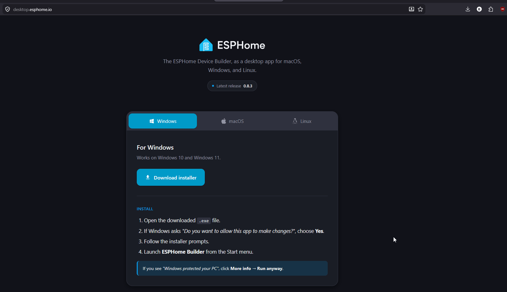

    3. Once installed, a web browser should launch and navigate to <a href="http://localhost:6052/" target="_blank" rel="noreferrer nofollow noopener">http://localhost:6052/</a>. Once you see this page, your ESPHome Device Builder installation is complete.
       * Use a Chromium-based browser such as Chrome or Edge. Firefox does not yet support WebSerial, which is required for the initial flashing of the device over USB. If Firefox is your default, copy the URL into Chrome or Edge instead.
    4. Navigate to the **system tray** (bottom right of your Windows taskbar). Hover over **Backend** and switch from Classic to the ESPHome Builder Beta with the new layout and features.

    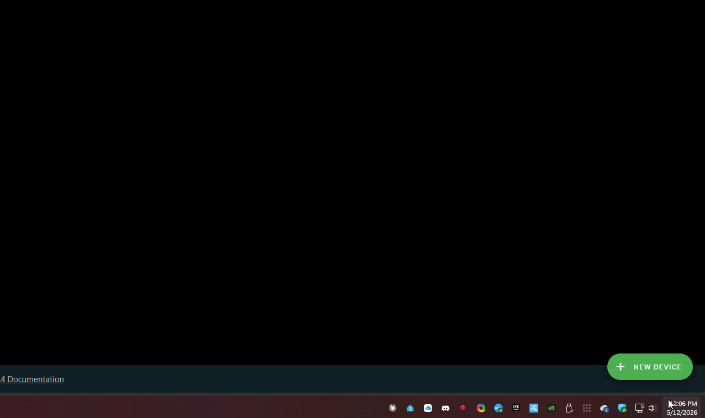

    5. Wait 30+ seconds, then refresh your browser (F5). You should now see the new ESPHome Device Builder Preview.

    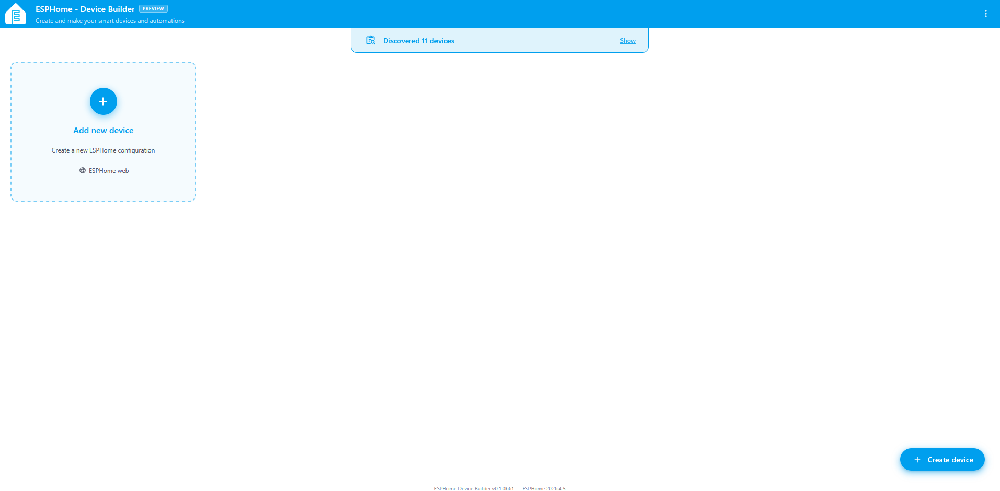

=== "Mac"

    1. Download the ESPHome Device Builder for Mac. Pick the build that matches your chip:

        - <a href="https://github.com/esphome/esphome-desktop/releases/download/v0.7.0/ESPHome.Builder_0.7.0_aarch64.dmg" target="_blank" rel="noreferrer nofollow noopener">Apple Silicon (M1, M2, M3, M4)</a>
        - <a href="https://github.com/esphome/esphome-desktop/releases/download/v0.7.0/ESPHome.Builder_0.7.0_x64.dmg" target="_blank" rel="noreferrer nofollow noopener">Intel Mac</a>

    2. Open the `.dmg` and drag **ESPHome Builder** into your Applications folder. Launch it from Applications or Spotlight.

        - On first launch, macOS may block the app with a Gatekeeper warning. If that happens, right-click the app in Applications and choose **Open**, then click **Open** in the confirmation dialog. After the first launch, double-click will work normally.

    <!-- TODO: add a Mac installer gif/screenshot if available. -->

    3. Once installed, a web browser should launch and navigate to <a href="http://localhost:6052/" target="_blank" rel="noreferrer nofollow noopener">http://localhost:6052/</a>. Once you see this page, your ESPHome Device Builder installation is complete.

        - Use a Chromium-based browser such as Chrome or Edge. Safari and Firefox do not currently support WebSerial, which is required for the initial USB flash.

    4. Find the **ESPHome Builder** icon in the menu bar (top right of your Mac's screen). Click it, hover over **Backend**, and switch from Classic to the ESPHome Builder Beta.

    <!-- TODO: confirm the exact menu bar wording on Mac and add a screenshot. -->

    5. Wait 30+ seconds, then refresh your browser. You should now see the new ESPHome Device Builder Preview.

=== "Home Assistant App"

    The ESPHome Device Builder runs as a Home Assistant app served right inside your existing HA dashboard. This is the easiest option if you already run Home Assistant OS or a supervised install.

    **<u>Method 1</u>**

    To add the **ESPHome Device Builder** to your Home Assistant instance, use this My button:

    

    **<u>Method 2</u>**

    1. In Home Assistant, open **Settings → Apps → App Store**.
    2. Search for **ESPHome Device Builder** and click **Install**.
    3. Once installed, click **Start**, then **Open Web UI**. The Device Builder will open inside your Home Assistant dashboard.

    !!! info "Already on the new layout"

        The HA app version of Device Builder is already the new beta backend, so you can skip the backend toggle and browser refresh shown in the desktop tabs.

=== "Linux"

    1. Download the ESPHome Device Builder for Linux. Pick the package that fits your distro:

        - <a href="https://github.com/esphome/esphome-desktop/releases/download/v0.7.0/ESPHome.Builder_0.7.0_amd64.AppImage" target="_blank" rel="noreferrer nofollow noopener">AppImage (works on any distro)</a>
        - <a href="https://github.com/esphome/esphome-desktop/releases/download/v0.7.0/ESPHome.Builder_0.7.0_amd64.deb" target="_blank" rel="noreferrer nofollow noopener">.deb (Debian / Ubuntu)</a>
        - <a href="https://github.com/esphome/esphome-desktop/releases/download/v0.7.0/ESPHome.Builder-0.7.0-1.x86_64.rpm" target="_blank" rel="noreferrer nofollow noopener">.rpm (Fedora / RHEL)</a>

    2. Install or run the file you downloaded:

        - **AppImage:** `chmod +x ESPHome.Builder_0.7.0_amd64.AppImage` then double-click the file, or run it from a terminal.
        - **.deb:** `sudo apt install ./ESPHome.Builder_0.7.0_amd64.deb`
        - **.rpm:** `sudo dnf install ./ESPHome.Builder-0.7.0-1.x86_64.rpm`

    <!-- TODO: add a Linux installer screenshot if available. -->

    3. Once installed, a web browser should launch and navigate to <a href="http://localhost:6052/" target="_blank" rel="noreferrer nofollow noopener">http://localhost:6052/</a>. Once you see this page, your ESPHome Device Builder installation is complete.

        - Use a Chromium-based browser such as Chrome or Edge. Firefox does not currently support WebSerial, which is required for the initial USB flash.

    4. Look for the **ESPHome Builder** icon in your system tray or notification area. Its exact location depends on your desktop environment (top bar on GNOME, system tray on KDE, XFCE, or Cinnamon). Click it, hover over **Backend**, and switch from Classic to the ESPHome Builder Beta.

    <!-- TODO: confirm the system tray wording on Linux. -->

    5. Wait 30+ seconds, then refresh your browser. You should now see the new ESPHome Device Builder Preview.

#### Set up Wi-Fi Credentials

Fill in your Wi-Fi network name (SSID) and Wi-Fi password then click Save credentials. *The password is case sensitive so be careful when entering your password.*

!!! tip "Protip: You can put all kinds of credentials here that you want kept secret!"

    One popular option is to store your encryption keys here. That way, you can share your full YAML with other users without needing to edit and hide your encryption key. See our <a href="https://wiki.apolloautomation.com/products/ESPHome-Starter-Kit/tutorials/using-secrets.md" target="_blank" rel="noreferrer nofollow noopener">using secrets wiki for step by step directions</a>!

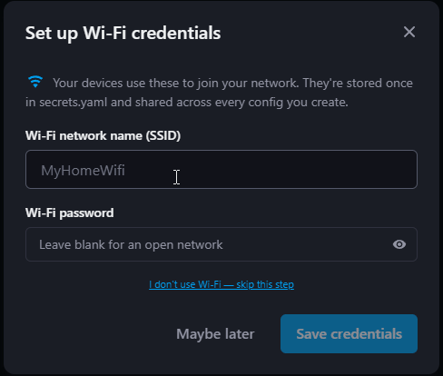

If you make a mistake or want to change this later, click the 3 dots menu in the top right then select Secrets. Click the Eye icon to unhide the Wi-Fi SSID and password and change them then click Save in the bottom right.

!!! tip "Get busy!"

    You are done with the install guide and can now use the kit!

#### Add a new device

1\. Navigate back to the ESPHome Device Builder and click **Add new device** then click Create new project.

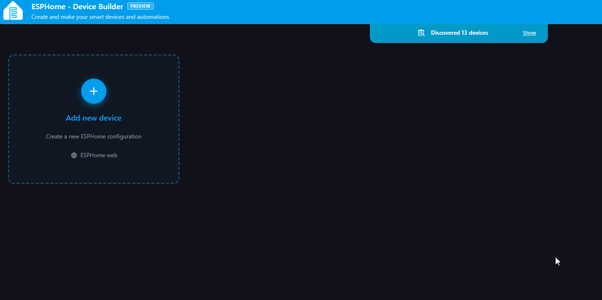

2\. Select the Apollo ESPHome Starter Kit and give it a name such as esphome-starter-kit then click **Finish Setup**.

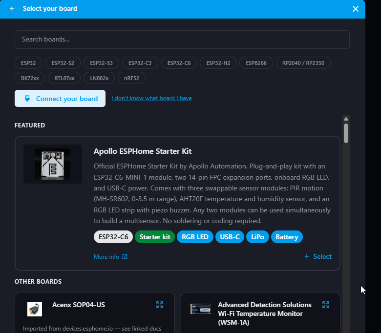

### Configure Components

When you install ESPHome Device builder, you will see a list of components under **Core Configuration**. We will add three more components for our tutorial below.

#### Accessory Power Rail

The <a href="https://esphome.io/components/switch/gpio/" target="_blank" rel="noreferrer nofollow noopener">Accessory Power Rail</a> is used behind the scenes to give power to your optional modules including the Onboard RGB LED.

1. In the ESPHome Device Builder, navigate to the **Components** section.
2. Click **Add component**.
3. Scroll to **Accessory Power Rail** and click **Add**.
4. Click **Add** once more to confirm.

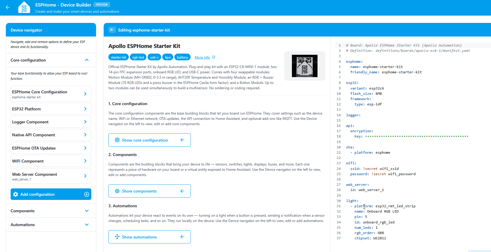

#### Web Server Component

The <a href="https://esphome.io/components/web_server/" target="_blank" rel="noreferrer nofollow noopener">Web Server</a> is used to broadcast a local website using your device. This allows you to navigate to the IP address of your device or hostname such as <a href="http://esphome-starter-kit.local/" target="_blank" rel="noreferrer nofollow noopener">esphome-starter-kit.local</a> to easily control your new device!

1. In the ESPHome Device Builder, navigate to the **Core configuration** section.
2. Click **Add component**.
3. Scroll to **Web Server** and click **Add**.
4. Click **Add** once more to confirm.
5. Toggle **Show advanced settings**.
6. Scroll down to **Version** and select **3** from the dropdown.

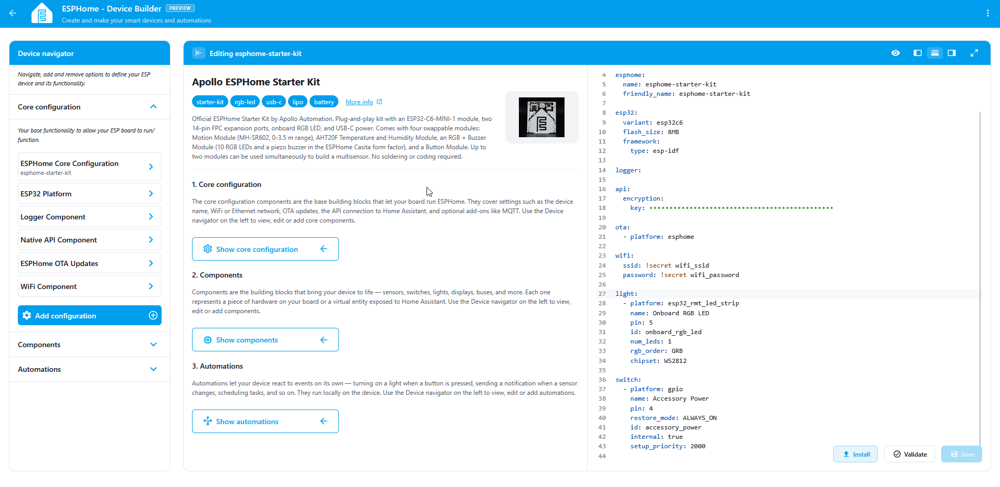

#### Onboard RGB LED

The Onboard RGB LED is a small LED above the Reset button of your ESP32-C6 Module. Useful for testing automations and doubles as a status light.

1. In the ESPHome Device Builder, navigate to the **Components** section.
2. Click **Add component**.
3. Scroll to **Onboard RGB LED** and click **Add**.
4. Click **Add** once more to confirm.

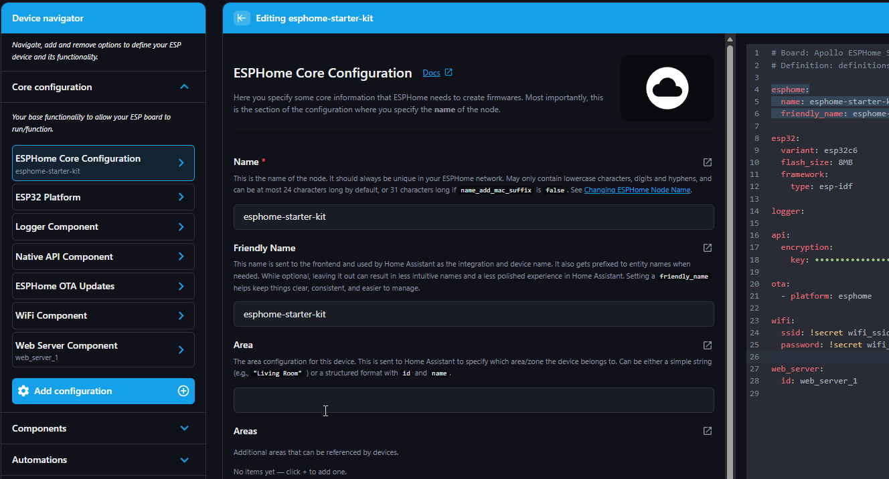

### Boot Mode

The device is required to be flashed via USB using the bootloader mode the very first time it is used. Once you flash it once, you do not have to do these steps again

!!! tip "Use a quality USB-C cable and power source"

    ESP32 boards are sensitive to power. If your device keeps restarting, won't be detected, or won't broadcast its hotspot, try a different USB-C cable or a different USB port. A 5V 1A supply is plenty.

1\. Hold the sides of the ESP32-C6 and gently push the USB-C cable firmly into the USB-C port. Plug in the other side of the USB-C cable into your computer. Please be careful not to snap or damage the FPC ribbon cable connectors located on the sides of the device.

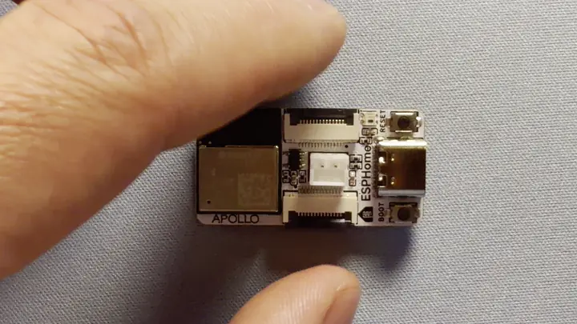

2\. Hold down the boot button. While still holding the boot button, press and release the reset button, then release the boot button.

3\. Your device is now in boot mode - The board will now stay in bootloader mode until you flash it.

### Installing Firmware

Before we continue, confirm that you installed the ESPHome Device Builder, configured your components, and put your device in boot mode.

1. Click **Save** in the bottom right which will then show an **Install** button.
2. Click **Install** in the bottom right.
3. Click **Plug into this computer**.
4. Select the COM port, then click **Connect** to connect to the ESP32-C6 module.
5. Wait for the firmware to compile and install. This usually takes two to five minutes.
6. Once it completes, click **Stop**, then press the **Reset** button on your device. Your device will reboot and it's now ready to test out!

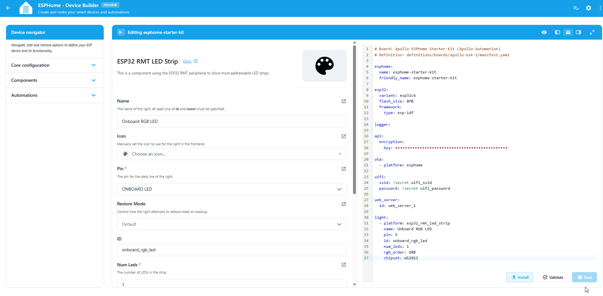

!!! tip "Click Show details during the install to watch the compile and flash process"

    It's a great way to see what's happening under the hood.

### Test your LED

Above we installed the web\_server component which allows us to navigate to the ip address of our device or the hostname.local such as <a href="http://esphome-starter-kit.local/" target="_blank" rel="noreferrer nofollow noopener">esphome-starter-kit.local</a>

It should load your new device and show you the Onboard RGB LED. We can click the toggle button to make sure the RGB LED turns on and off on our device!

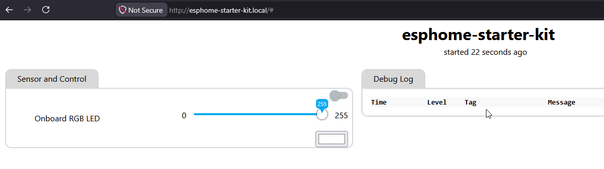

Example of the light changing colors below!

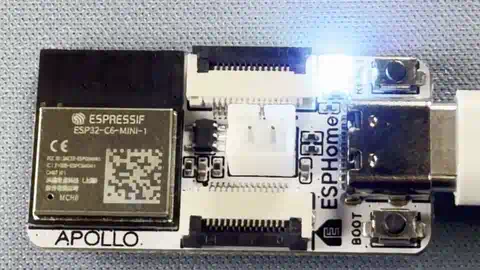

<a href="../setup/start-here/" class="md-button md-button--primary"> Back - Start Here</a> <a href="../setup/button-module/" class="md-button md-button--primary"> Next - Add Button Module</a>