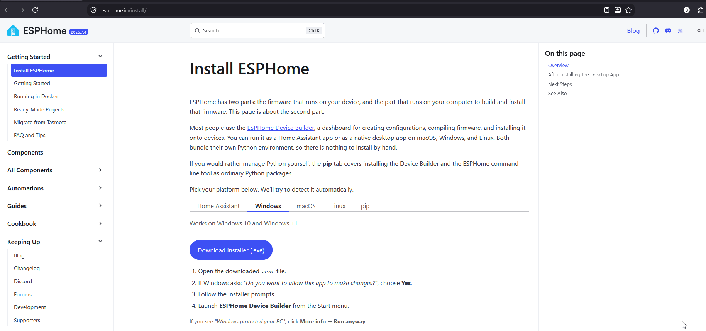
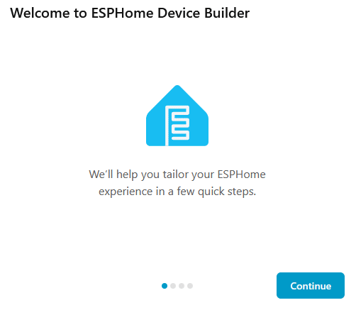
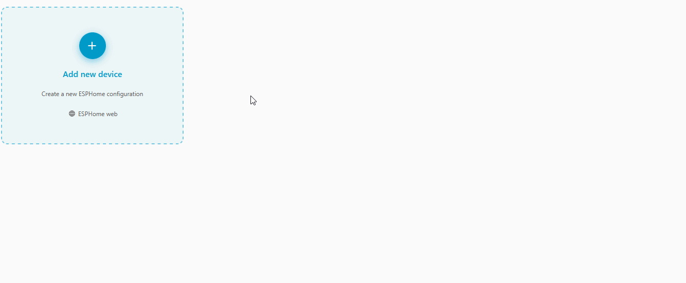
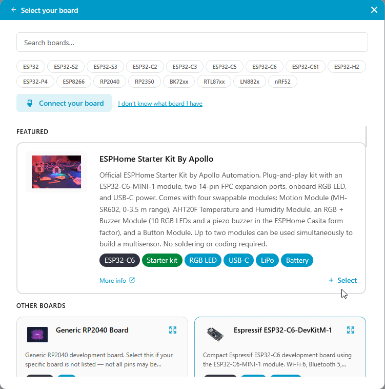
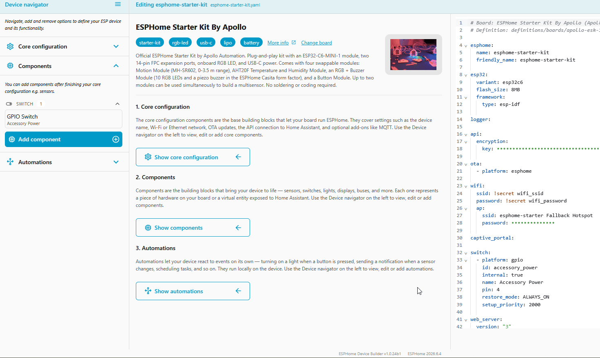
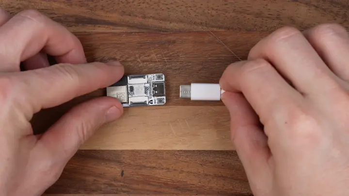
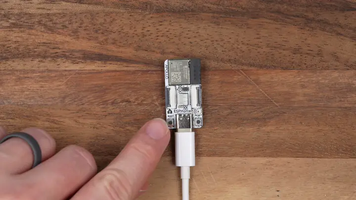
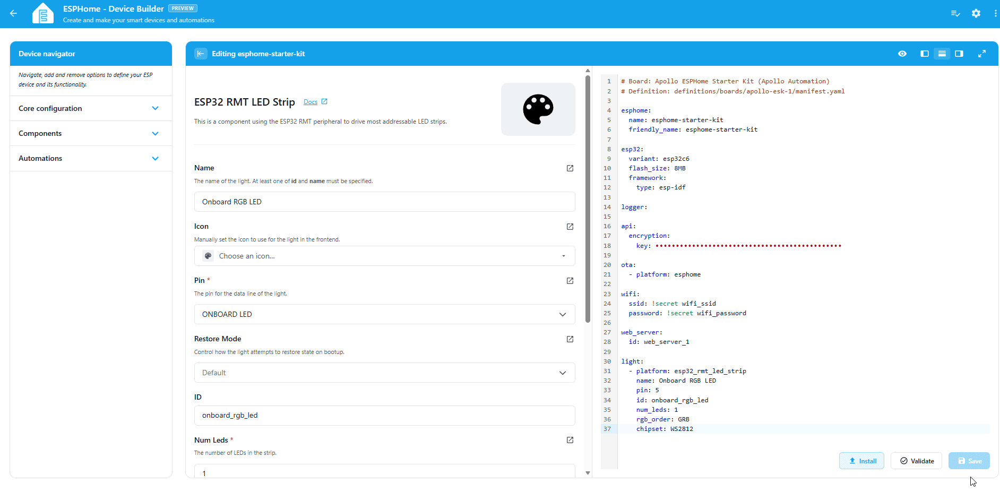
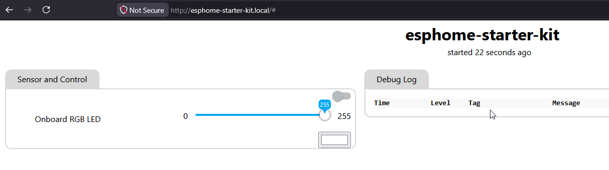
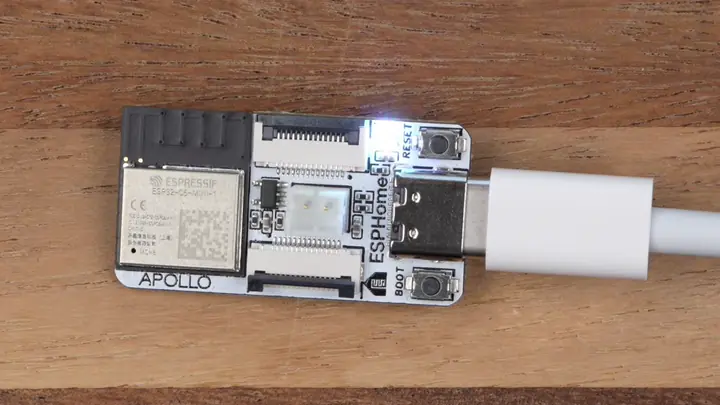

# ESPHome Starter Kit - First Steps

This guide walks you through installing the ESPHome Device Builder app, and making your first ESPHome YAML configuration from scratch.

By the end you'll have your ESPHome Starter Kit flashed with a working configuration, showing up in Home Assistant, and reachable in a browser at its IP address or http://esphome-starter-kit.local via its built-in web server.

[:material-cart: Buy the ESPHome Starter Kit](https://apolloautomation.com/products/esk-1-esphome-starter-kit){ .md-button .md-button--primary }

!!! tip "Click the Apollo dog for extra context"

    

    When you see a small Apollo dog peeking over a step or word, give it a click (1). It opens a side note with tips, gotchas, or examples you don't need on first read.

    

    1.  Like this, you just opened your first annotation. Click outside the box to close it. Good dog.

    Fun fact: the dog is Apollo Automation's original logo. Both the company name and the logo come from cofounder Trevor's real dog, Apollo.

---

### ESPHome Device Builder

ESPHome Device Builder is the app that gives you a user interface for writing, compiling, and flashing ESPHome YAML configurations. You'll use it to build the software for your kit. (1)
{ .annotate }

1.  We say software because it's the friendlier word. The technically correct term is firmware: code that runs directly on the chip instead of on a computer. That's the word ESPHome's own docs use.

Think of it like telling the starter kit about what devices it has connected and how to use them!

<a href="../../learning-the-basics/explaining-esphome/" class="md-button md-button--primary"> Learn more about ESPHome</a>

Pick the platform you'll be running ESPHome Device Builder on:

=== "Windows"

    1. Open <a href="https://esphome.io/install/" target="_blank" rel="noreferrer nofollow noopener">esphome.io/install</a> and click **Download installer (.exe)** on the **Windows** tab.
    2. Open the downloaded `.exe` file. If Windows asks whether to allow the app to make changes, choose **Yes**, then follow the installer prompts.
    3. On the last screen, leave **Run ESPHome Device Builder** checked and click **Finish**.
    4. When **Allow network pairing** appears, click **Allow access**. Windows then asks for administrator approval and shows its own firewall prompt for the Python backend. Allow that one too, or other ESPHome dashboards on your network won't be able to reach this computer.

    !!! warning "If Windows blocks the installer"

        If a blue **Windows protected your PC** warning appears when you open the `.exe`, click **More info → Run anyway** to continue.

    

    The first launch takes a moment while it sets itself up, then the dashboard opens in your browser at <a href="http://localhost:6052/" target="_blank" rel="noreferrer nofollow noopener">http://localhost:6052/</a>. An ESPHome icon lands in your notification area for getting back to it later.

    A short wizard runs the first time:

    1. Click **Continue** on the welcome screen.
    2. Choose **Installation of the ESPHome Device Builder**, since you're building on this computer.
    3. Choose **New to ESPHome** for the simpler, guided interface.

    Then take **Start guided tour** for a [five minute walkthrough](../learning-the-basics/device-builder-tour.md), or **Maybe later**.

    

=== "Mac"

    1.  Open <a href="https://esphome.io/install/" target="_blank" rel="noreferrer nofollow noopener">esphome.io/install</a>. The page detects your OS and opens the **macOS** tab. Pick the build that matches your chip:

        - **Apple Silicon** (M1, M2, M3, M4, M5)
        - **Intel**

        Not sure which you have? Click the Apple menu → **About This Mac**.

    2.  Open the `.dmg` and drag **ESPHome Device Builder** into your Applications folder.

    3.  Open your Applications folder and double-click **ESPHome Device Builder**. The first time you run it, macOS may ask you to confirm. Click **Open**.

        - If macOS blocks it outright with a Gatekeeper warning instead, right-click the app in Applications and choose **Open**, then click **Open** in the confirmation dialog. After that, double-click works normally.

    <!-- TODO: add a Mac installer gif/screenshot if available. -->

    The first launch takes a moment while it sets itself up, then the dashboard opens in your browser at <a href="http://localhost:6052/" target="_blank" rel="noreferrer nofollow noopener">http://localhost:6052/</a>. An ESPHome icon lands in your menu bar for getting back to it later.

    A short wizard runs the first time:

    1. Click **Continue** on the welcome screen.
    2. Choose **Installation of the ESPHome Device Builder**, since you're building on this computer.
    3. Choose **New to ESPHome** for the simpler, guided interface.

    Then take **Start guided tour** for a [five minute walkthrough](../learning-the-basics/device-builder-tour.md), or **Maybe later**.

    

=== "Home Assistant App"

    The ESPHome Device Builder runs as a Home Assistant app served right inside your existing HA dashboard. This is the easiest option if you already run Home Assistant OS or a supervised install.

    **<u>Method 1</u>**

    To add the **ESPHome Device Builder** to your Home Assistant instance, use this My button:

    

    **<u>Method 2</u>**

    1. In Home Assistant, open **Settings → Apps → App Store**.
    2. Search for **ESPHome Device Builder** and click **Install**.
    3. Once installed, click **Start**, then **Open Web UI**. The Device Builder will open inside your Home Assistant dashboard.

=== "Linux"

    1.  Open <a href="https://esphome.io/install/" target="_blank" rel="noreferrer nofollow noopener">esphome.io/install</a>. The page opens on the **Linux** tab with **Debian / Ubuntu** selected. Choose the package format your distro uses, then the CPU architecture (**x86_64** for a normal desktop or laptop, **arm64** for a Raspberry Pi or similar board):

        - **Debian / Ubuntu** → downloads a `.deb`
        - **Fedora / openSUSE** → downloads a `.rpm`
        - **Arch (AUR)** → installs the `esphome-desktop-bin` package
        - **AppImage** → a portable build that runs on any distro

    2.  Install it. Double-click the downloaded `.deb` or `.rpm` in your file manager, or run the matching command in a terminal:

        - **Debian / Ubuntu:** `sudo apt install ./ESPHome.Device.Builder_*.deb`
        - **Fedora / openSUSE:** `sudo dnf install ./ESPHome.Device.Builder-*.rpm`
        - **Arch:** `yay -S esphome-desktop-bin`
        - **AppImage:** `chmod +x ESPHome.Device.Builder_*.AppImage` then run `./ESPHome.Device.Builder_*.AppImage`

    3.  Launch **ESPHome Device Builder** from your applications menu.

        If your kit doesn't appear as a serial port later when you flash it, add your user to the `dialout` group with `sudo usermod -a -G dialout $USER`, then log out and back in.

    The first launch takes a moment while it sets itself up, then the dashboard opens in your browser at <a href="http://localhost:6052/" target="_blank" rel="noreferrer nofollow noopener">http://localhost:6052/</a>. An ESPHome icon lands in your system tray for getting back to it later. Some Linux desktops, notably GNOME without a tray extension, don't show tray icons at all. The app still runs, so just use the dashboard in your browser.

    A short wizard runs the first time:

    1. Click **Continue** on the welcome screen.
    2. Choose **Installation of the ESPHome Device Builder**, since you're building on this computer.
    3. Choose **New to ESPHome** for the simpler, guided interface.

    Then take **Start guided tour** for a [five minute walkthrough](../learning-the-basics/device-builder-tour.md), or **Maybe later**.

    

#### Add a new device

With the app installed, it's time to tell it about your kit. If you took the guided tour, these next steps will look familiar.

1\. Navigate back to the ESPHome Device Builder and click **Add new device** then click Create new project.

2\. Select the Apollo ESPHome Starter Kit and give it a name such as esphome-starter-kit, then click **Next**. Type in your Wi-Fi network name (SSID) and Wi-Fi password, then click **Finish Setup**. (1)

1. Remember the name you choose. You'll use it later to reach your device's web server at `http://your-name.local` (for example, <a href="http://esphome-starter-kit.local/" target="_blank" rel="noreferrer nofollow noopener">http://esphome-starter-kit.local/</a>).

### Configure Components

!!! tip "We're now ready to add your first component and turn your project into a smart device!"

    Below you will be learning how to add the Onboard RGB LED which will help you learn how to add a Component. You will be using this in the future for the other modules such as the Button and Motion modules!

When you create a new ESPHome Starter Kit project in ESPHome Device Builder, the **Web Server** and **Accessory Power Rail** components are already configured for you, so there's nothing extra to do for those. In this tutorial we'll add one more component: the **Onboard RGB LED**.

#### Onboard RGB LED

The Onboard RGB LED is a small LED above the Reset button of your ESP32-C6. Useful for testing automations and doubles as a status light.

1. In the ESPHome Device Builder, navigate to the **Components** section.
2. Click **Add component**.
3. Scroll to **Onboard RGB LED** and click **Add**.

### Boot Mode

The device is required to be flashed via USB using the bootloader mode the very first time it is used. Once you flash it once, you do not have to do these steps again

!!! tip "Use a quality USB-C cable and power source"

    ESP32 boards are sensitive to power. If your device keeps restarting, won't be detected, or won't broadcast its hotspot, try a different USB-C cable or a different USB port. A 5V 1A supply is plenty.

1\. Hold the sides of the ESP32-C6 and gently push the USB-C cable firmly into the USB-C port. Plug in the other side of the USB-C cable into your computer. Please be careful not to snap or damage the FPC ribbon cable connectors located on the sides of the device.

2\. Hold down the boot button. While still holding the boot button, press and release the reset button, then release the boot button.

3\. Your device is now in boot mode - The ESP32-C6 will now stay in bootloader mode until you flash it.

### Installing Software

Before we continue, confirm that you installed the ESPHome Device Builder, configured your components, and put your device in boot mode.

1. Click **Save** in the bottom right which will then show an **Install** button.
2. Click **Install** in the bottom right.
3. Click **Plug into this computer**.
4. Select the COM port, then click **Connect** to connect to the ESP32-C6.
5. Wait for the software to compile and install. This usually takes two to five minutes.
6. Once it completes, click **Stop**, then press the **Reset** button on your device. Your device will reboot and it's now ready to test out!

!!! tip "Click Show details during the install to watch the compile and flash process"

    It's a great way to see what's happening under the hood.

<a href="../../learning-the-basics/core-components/" class="md-button md-button--primary"> Learn about Core Components</a>

### Test your LED

Your kit's default project includes the [**Web Server**](../learning-the-basics/core-components.md#web-server) component, which lets you navigate to the IP address of your device or the hostname.local such as <a href="http://esphome-starter-kit.local/" target="_blank" rel="noreferrer nofollow noopener">http://esphome-starter-kit.local/</a>

!!! warning "Use http:// not https://"

    Your kit only speaks `http://`. Some browsers quietly try `https://` first, and the page just won't load. If that happens, click the address bar and add `http://` before the name (so it looks like `http://esphome-starter-kit.local/`).

It should load your new device with the Onboard RGB LED listed. Click its toggle and the LED on your kit turns on and off.

The LED on the board, switching on and off.

<a href="../../start-here/" class="md-button md-button--primary"> Back - Start Here</a> <a href="../../modules/button-module/" class="md-button md-button--primary"> Add More Modules</a> <a href="../../tutorials/connect-to-home-assistant/" class="md-button md-button--primary"> Connect to Home Assistant</a>

--8<-- "_snippets/community-help.md"