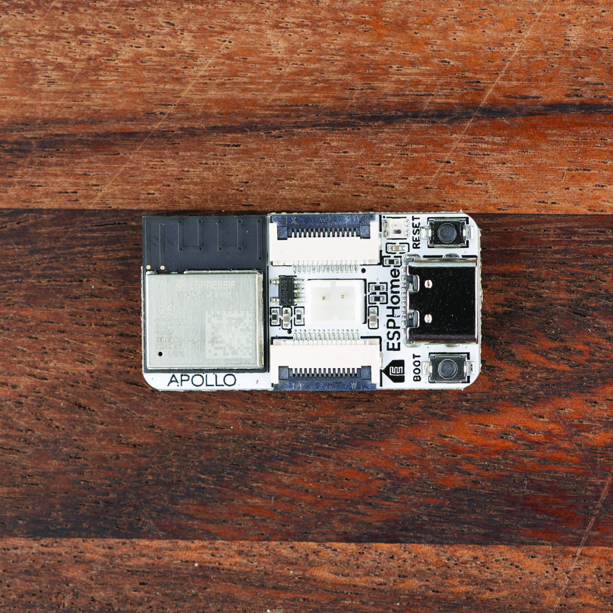
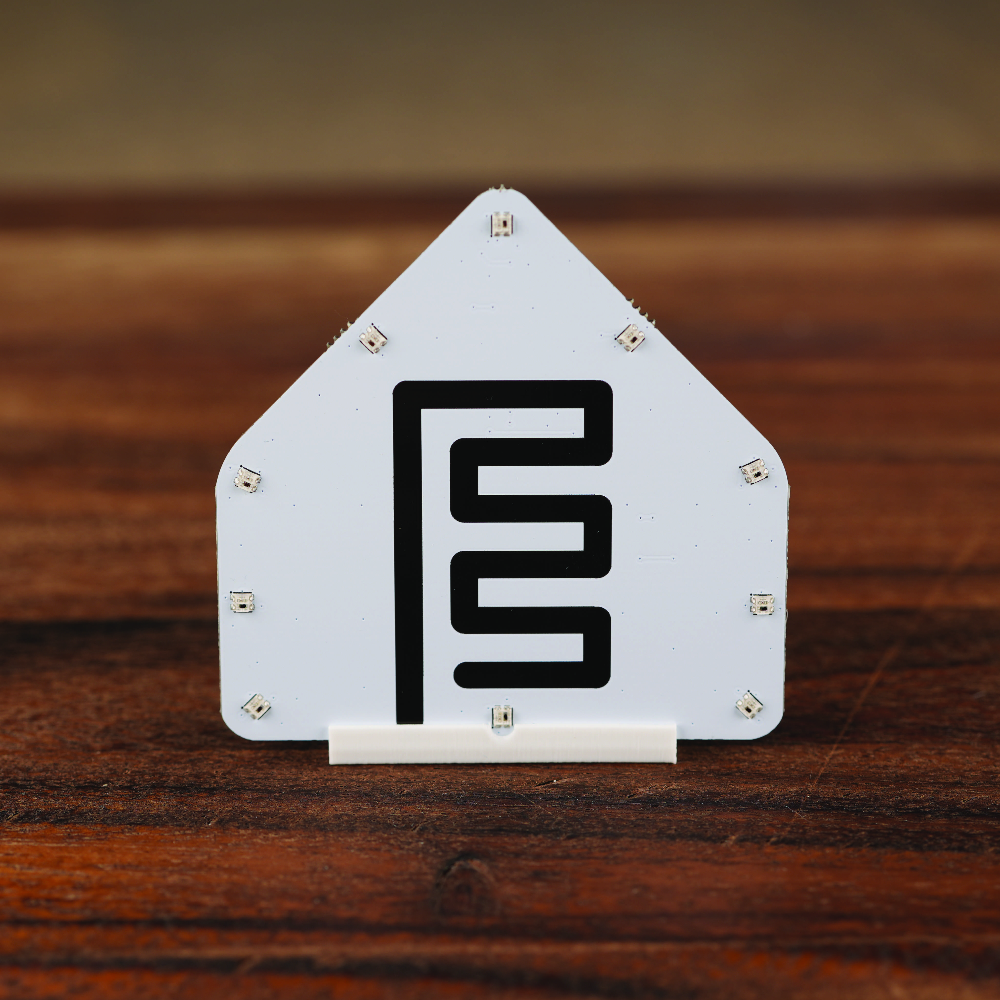
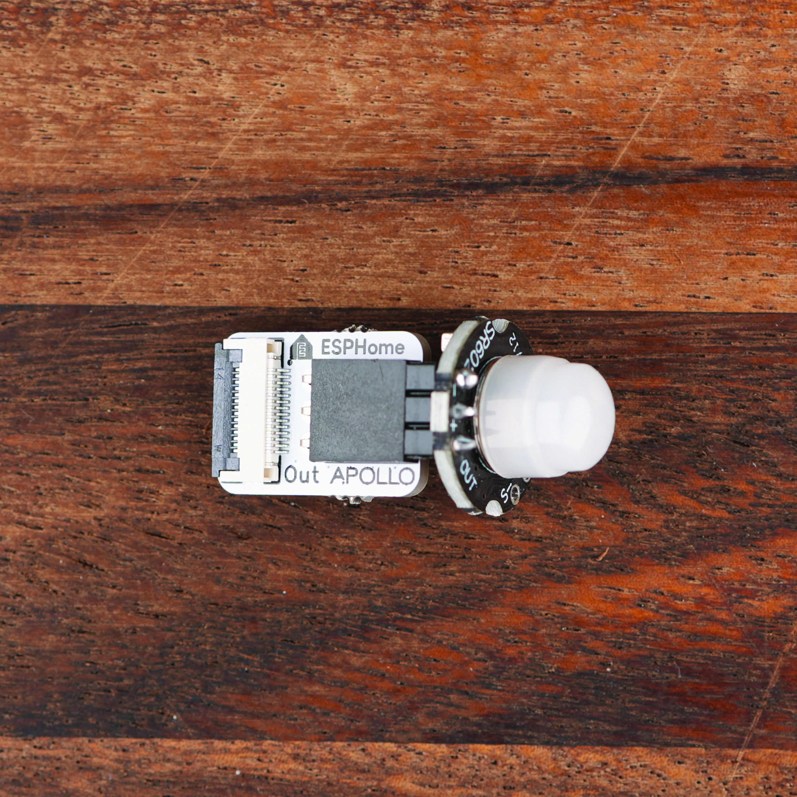
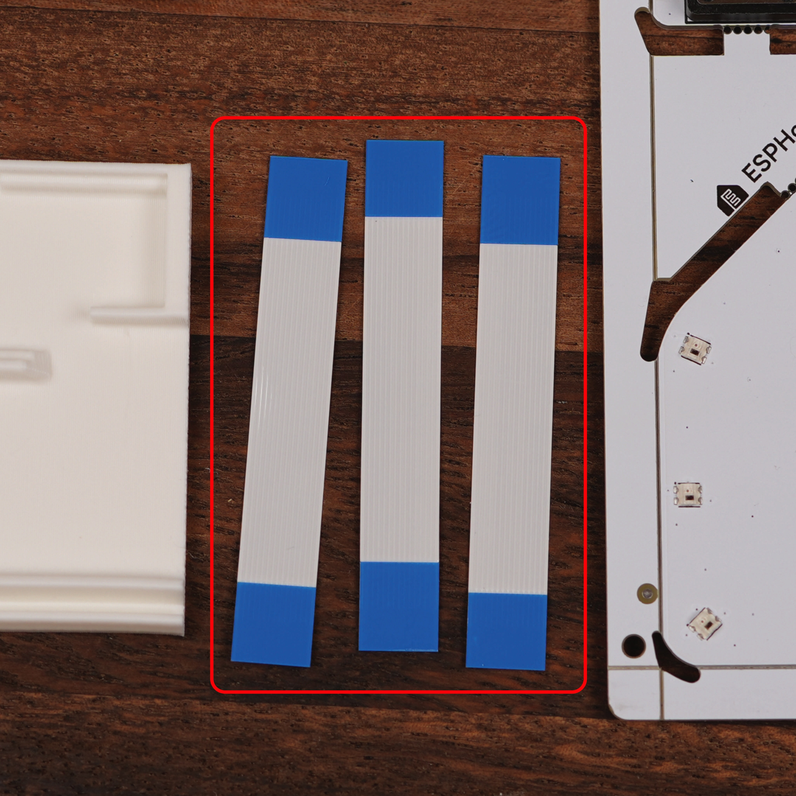

Welcome to the start of your ESPHome ecosystem journey with the **Apollo ESPHome Starter Kit**.

By the end of this page you will know how to safely separate the modules from the panel, and recognise each part of the kit so the rest of the guides make sense.

## What's in the kit

Your kit arrives as a single snap-apart panel that includes the ESP32-C6 main board along with a selection of interchangeable modules. The kit also includes three ribbon cables used to connect the modules together, and a stand for the LED & Buzzer module.

## Snapping the panel apart

Each module is connected to the panel by small breakaway tabs. Follow the steps below to separate them, step by step.

!!! success "Take it slow"

    Bend the panel gradually, not all at once. The PCB is sturdy, but the components on the modules prefer a gentle snap.

1. Hold the panel flat on a table with one hand on the module you want to remove.
2. Gently flex the panel along the tab line until the tab snaps cleanly.

<video autoplay="" loop="" muted="" playsinline="" width="100%">
  <source src="/assets/ESPHome_Starter_Kit_Break_Apart_Modules.mp4" type="video/mp4" />

  Your browser does not support embedded video.
</video>

Once every module is off the panel, lay them out so you can see what you have before plugging anything in.

## Meet the modules

### ESP32-C6 main board

The brain of every project you'll build with the kit. It handles Wi-Fi and Bluetooth, runs your ESPHome config, and exposes the GPIO pins the modules plug into.

### LED & Buzzer module

The starter kit's notification module, a strip of ten addressable RGB LEDs and a small piezo buzzer behind the ESPHome logo silkscreen. Use the included stand to show it off on a shelf or desk.

### Motion module

Detects movement in a room, and a great way to get started automating your home. It ships in two parts so the PIR dome can be packed safely, then plugs into the PIR module board.

### Button module

Premium feel button perfect for triggering automations for lights, scenes, and more.

### Temperature and humidity module

Accurate temperature and humidity sensor, trustworthy enough to track room comfort levels with ease.

### FPC cables

Each module connects to the main board through an FPC connector using one of the three provided cables. Tear the brown paper bag open from one of the ends. Do not use scissors, you could accidentally cut the cables.

## Next, bring it online

Once you have identified your modules and snapped them off the panel, the next step is to connect the main board to your computer and walk through your first ESPHome configuration.

<a href="../setup/first-steps/" class="md-button md-button--primary">      Next - First Steps </a>
