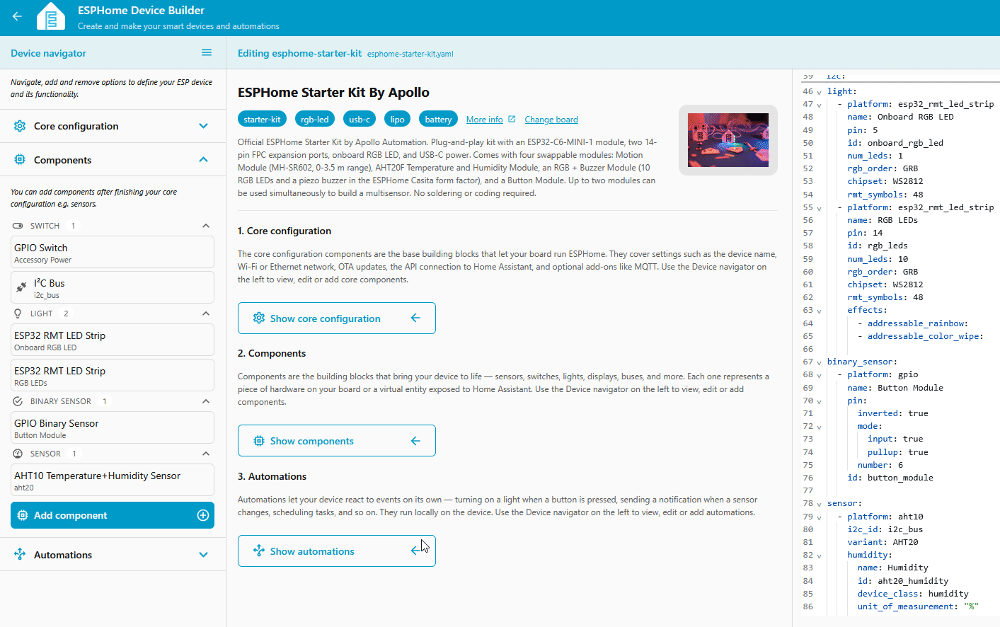
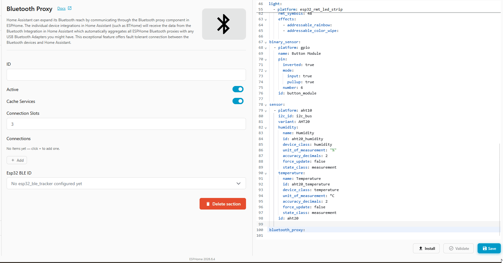

# Turn Your Starter Kit into a Bluetooth Proxy

Home Assistant can talk to Bluetooth devices directly, but only ones close to the machine it runs on. A <a href="https://esphome.io/components/bluetooth_proxy/" target="_blank" rel="noreferrer nofollow noopener">Bluetooth proxy</a> fixes that. Your starter kit's ESP32-C6 listens for nearby BLE devices and relays them back to Home Assistant over Wi-Fi, so a sensor two rooms away shows up as if it were sitting next to your server. Drop a few of these around the house and Home Assistant gets Bluetooth coverage everywhere.

Adding one used to mean a block of YAML. Now it's a single line, and Device Builder can add it for you.

!!! note "Before you start"

    Work through this first:

    * [First Steps](/products/ESPHome-Starter-Kit/setup/first-steps.md) to install ESPHome Device Builder and create your starter kit device.

    Your device also needs to be on Wi-Fi and adopted in [Home Assistant](/products/ESPHome-Starter-Kit/tutorials/connect-to-home-assistant.md) so the proxy has somewhere to send what it hears.

## Add the Bluetooth proxy

Device Builder has an **Add Component** flow that drops the proxy into your config for you, no typing required.

1. Open your starter kit device in ESPHome Device Builder and click **Edit**.
2. Click **Add Component** in the editor toolbar.
3. Search for **Bluetooth Proxy** and select it.
4. Click **Add**. Device Builder inserts the proxy into your YAML.



??? note "Prefer to add it by hand? Here's the YAML"

    If you'd rather edit the config directly, open the editor and add this one line anywhere at the top level:

    ```yaml
    bluetooth_proxy:
    ```

    That's it. Active connections are on by default, and `bluetooth_proxy` automatically pulls in the <a href="https://esphome.io/components/esp32_ble_tracker/" target="_blank" rel="noreferrer nofollow noopener">ESP32 BLE Tracker</a> it needs, so you don't have to add anything else.

    You only need to add a second `esp32_ble_tracker:` line if you want to explicitly set passive scanning:

    ```yaml
    esp32_ble_tracker:
      scan_parameters:
        active: false
    ```

## Install the firmware

The proxy is saved in Device Builder, but the device is still running its old firmware. Compile and install to push the change.

1. Click **Save** in the bottom right of the editor.
2. Click **Install**, then pick **On the Network** to push the new firmware over Wi-Fi.
3. Wait for the compile and flash to finish. The device reboots once the install is done.



## Verify it works

Once the device reboots, Home Assistant picks up the proxy on its own.

1. Open your ESPHome device in Home Assistant. If you haven't adopted it yet, follow [Connect to Home Assistant](/products/ESPHome-Starter-Kit/tutorials/connect-to-home-assistant.md) first.
2. Home Assistant detects the new Bluetooth proxy and offers to set it up. Accept the prompt.
3. Open the <a href="https://my.home-assistant.io/redirect/bluetooth_advertisement_monitor/" target="_blank" rel="noreferrer nofollow noopener">Bluetooth advertisement monitor</a> to watch the BLE devices your starter kit is picking up in real time. Anything in range shows up here, ready to add under **Settings → Devices & Services → Bluetooth** like any other device.

--8<-- "_snippets/community-help.md"
