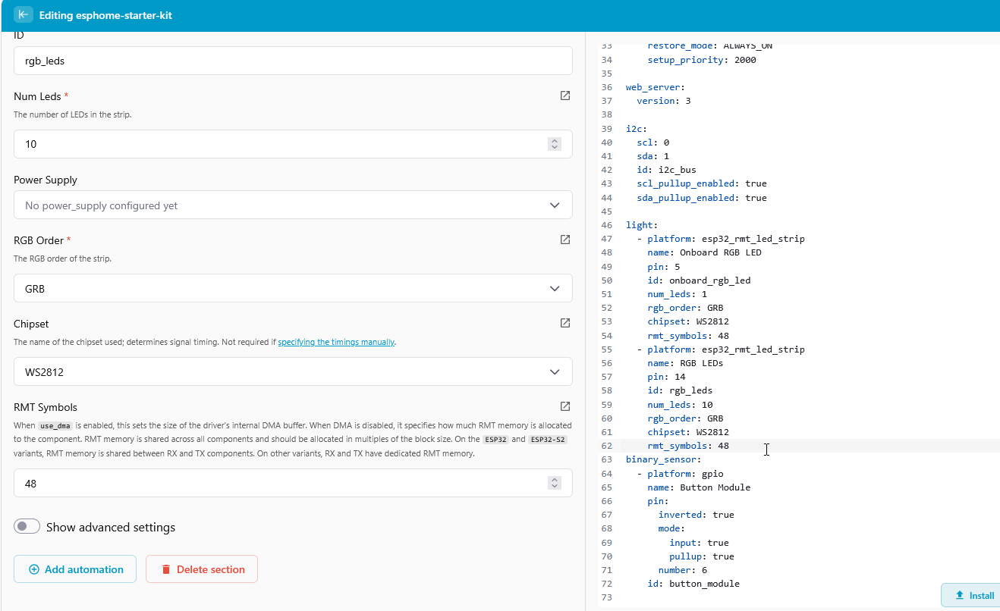
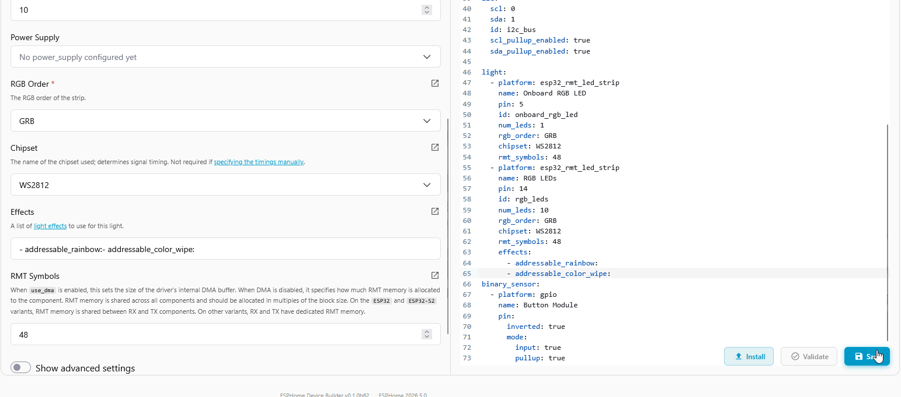
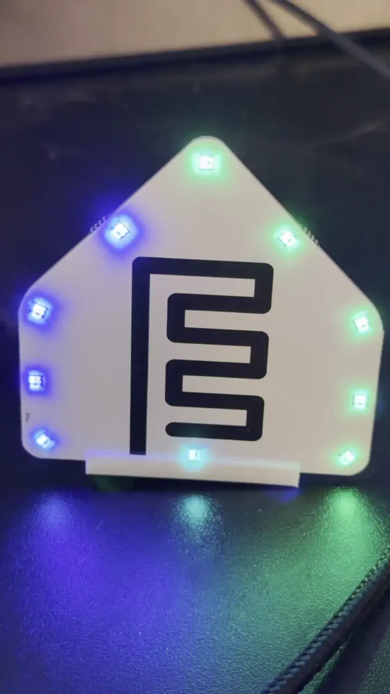
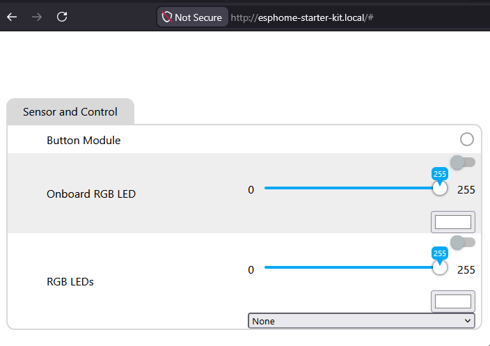

# Add Light Effects to Your RGB Module

Out of the box, your RGB module turns on, turns off, and changes color. ESPHome ships a library of built-in <a href="https://esphome.io/components/light/#light-effects" target="_blank" rel="noreferrer nofollow noopener">light effects</a> (rainbow cycles, color wipes, flickers, and more) that you can drop in with a couple of lines of YAML. This tutorial adds two effects to get you started.

!!! note "Before you start"

    Work through these pages first. This tutorial assumes your device is flashed and has an addressable RGB light component already configured (either the **Onboard RGB LED** or the **RGB LEDs** from the LED & Buzzer module):

    * [First Steps](/products/ESPHome-Starter-Kit/setup/first-steps.md) to create your starter kit device in ESPHome Device Builder.
    * [Adding the LED & Buzzer Module](/products/ESPHome-Starter-Kit/modules/rgb-buzzer-module.md) if you're using the LED & Buzzer module.

## Add the effects

1. Open your starter kit device in ESPHome Device Builder and click **Edit**.
2. In the editor's left pane, scroll to **Components** and click the RGB light you want to add effects to (either **Onboard RGB LED** or **RGB LEDs**).
3. Click to the right of `rmt_symbols: 48` and hit enter. Hit backspace twice to delete the two leading spaces.
4. Paste the following YAML on the new line with no spaces in front of it:

   ```yaml
       effects:
         - addressable_rainbow:
         - addressable_color_wipe:
   ```



This adds two effects to the light: a continuously cycling rainbow and a sweeping color wipe.

??? info "Browse more effects"

    ESPHome's full effect library lives at <a href="https://esphome.io/components/light/#light-effects" target="_blank" rel="noreferrer nofollow noopener">esphome.io/components/light</a>. Open it in a new tab and pick anything you want to try.

    The starter kit RGB modules are **addressable** lights (each LED can be controlled individually), so look for effect names that start with `addressable_`. Non-addressable effects like `pulse` or `strobe` will not apply.

## Install the firmware

The effects are saved in Device Builder, but the device is still running its old firmware. Compile and install the new code to push the change.

1. Click **Save** in the bottom right of the editor.
2. Click **Install**, then pick **On the Network** to push the new firmware over Wi-Fi.



3\. Wait for the compile and flash to finish. The device reboots once the install is done.

## Try the effects

With the device back online, open the local web page at `http://esphome-starter-kit.local/` (or whatever you named your device) in a browser on the same Wi-Fi network. Find the RGB light entity and pick **Rainbow** or **Color Wipe** from the **Effect** dropdown. The LEDs start animating right away.





If you've already followed [Connect to Home Assistant](/products/ESPHome-Starter-Kit/tutorials/connect-to-home-assistant.md), the same **Effect** dropdown shows up on the light entity card in Home Assistant.

!!! success "You just edited YAML!"

    Every component you add to your device has a set of advanced fields like this one. Pasting a few lines into the right field is all it takes to unlock more behavior, and the YAML pane on the right of the editor will show you exactly what changed.

--8<-- "_snippets/community-help.md"
