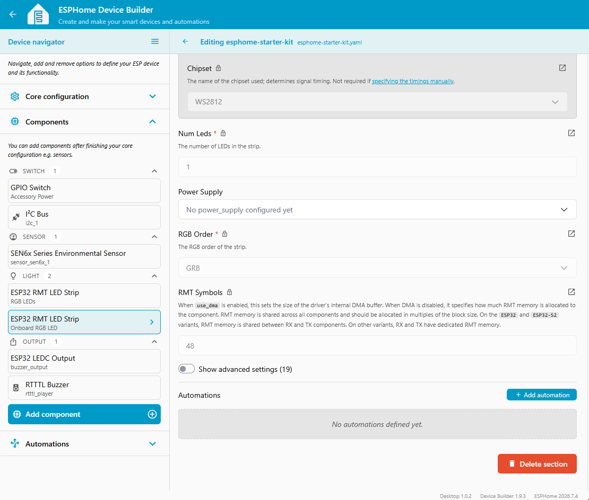
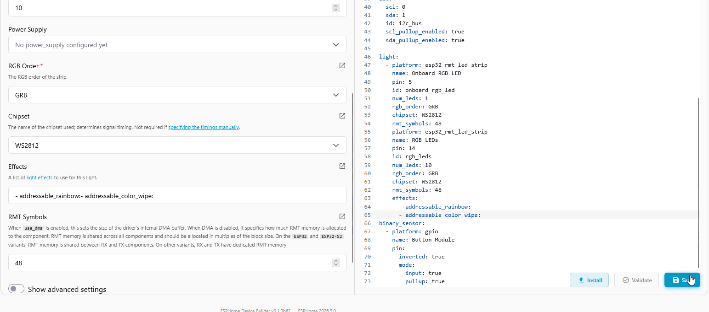
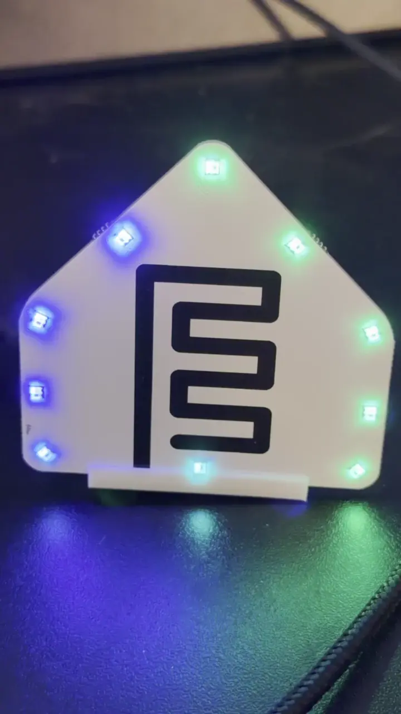
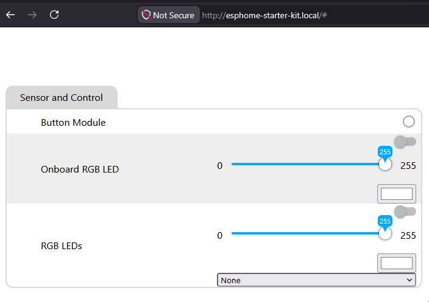

# Add Light Effects to Your RGB Module

Out of the box, your RGB module turns on, turns off, and changes color. ESPHome ships a library of built-in <a href="https://esphome.io/components/light/#light-effects" target="_blank" rel="noreferrer nofollow noopener">light effects</a> (rainbow cycles, color wipes, flickers, and more), and Device Builder can add them from a dropdown. No typing required. This tutorial adds two effects to get you started.

!!! note "Before you start"

    Work through these pages first. This tutorial assumes your device is flashed and has an addressable RGB light component already configured (either the **Onboard RGB LED** or the **RGB LEDs** from the LED & Buzzer module):

    * [First Steps](/products/ESPHome-Starter-Kit/setup/first-steps.md) to create your starter kit device in ESPHome Device Builder.
    * [Adding the LED & Buzzer Module](/products/ESPHome-Starter-Kit/modules/rgb-buzzer-module.md) if you're using the LED & Buzzer module.

## Add the effects

1.  Open your starter kit device in ESPHome Device Builder and click **Edit**.
2.  In the editor's left pane, scroll to **Components** and click the RGB light you want to add effects to. (1)
    { .annotate }

    1.  Both RGB lights are listed under **LIGHT** as **ESP32 RMT LED Strip**, with the light's name in smaller text underneath. **Onboard RGB LED** is the LED on the board itself, and **RGB LEDs** is the strip on the LED & Buzzer module. Pick whichever one you want the effects on.

3.  Turn on **Show advanced settings** near the bottom of the form. Effects are an advanced option, so the field stays hidden until you do.
4.  Scroll to **Effects** and click **\+ Add**.
5.  Pick **Addressable Rainbow** from the dropdown. Its own settings unfold underneath: **Name**, **Speed**, and **Width**. Leave them alone for now, the greyed-out values are the defaults ESPHome uses. (1)
    { .annotate }

    1.  Want something other than rainbow? Everything in the dropdown works on your RGB module, and the full library is documented at <a href="https://esphome.io/components/light/#light-effects" target="_blank" rel="noreferrer nofollow noopener">esphome.io/components/light</a>. The entries starting with "Addressable" animate each LED separately, which is what makes a rainbow or a wipe travel along the strip. The rest, like **Pulse**, **Strobe**, and **Flicker**, drive the whole strip as one color at a time.

6.  Click **\+ Add** a second time and pick **Addressable Color Wipe**.



That gives the light two effects: a continuously cycling rainbow and a sweeping color wipe. Add as many as you like the same way, and click the **X** to the right of an effect's dropdown to drop one.

??? note "What the effects YAML does"

    Watch the YAML pane on the right while you add each effect. Device Builder writes this into the light component:

    ```yaml
    effects:
      - addressable_rainbow:
      - addressable_color_wipe:
    ```

    Two lines, because a field you left at its default never gets written. ESPHome already knows a rainbow runs at speed 10 and answers to the name "Rainbow". Change any of these and the matching line appears:

    | Field | YAML | What it does |
    | --- | --- | --- |
    | **Name** | `name` | What the effect is called in the **Effect** dropdown, on the device's web page and in Home Assistant. |
    | **Speed** (rainbow) | `speed` | How fast the colors cycle. Higher is faster. |
    | **Width** (rainbow) | `width` | How many LEDs one full rainbow spans. Lower packs more color into the strip. |
    | **Add LED Interval** (color wipe) | `add_led_interval` | How long before the wipe advances one LED. Lower is faster. |
    | **Colors** (color wipe) | `colors` | The colors the wipe cycles through. Leave it empty for random colors. |
    | **Reverse** (color wipe) | `reverse` | Runs the wipe from the far end of the strip back toward the first LED. |

## Install the software

The effects are saved in Device Builder, but the device is still running its old software. Compile and install the new code to push the change.

1.  Click **Save** in the bottom right of the editor.
2.  Click **Install**, then pick **On the Network** to push the new software over Wi-Fi. (1)
    { .annotate }

    1.  We say software because it's the friendlier word. The technically correct term is firmware: code that runs directly on the chip instead of on a computer. That's the word ESPHome's own docs use.



3\. Wait for the compile and flash to finish. The device reboots once the install is done.

## Try the effects

With the device back online, open the local web page at `http://esphome-starter-kit.local/` (or whatever you named your device) in a browser on the same Wi-Fi network. Find the RGB light entity and pick **Rainbow** or **Color Wipe** from the **Effect** dropdown. The LEDs start animating right away.





If you've already followed [Connect to Home Assistant](/products/ESPHome-Starter-Kit/tutorials/connect-to-home-assistant.md), the same **Effect** dropdown shows up on the light entity card in Home Assistant.

--8<-- "_snippets/community-help.md"
