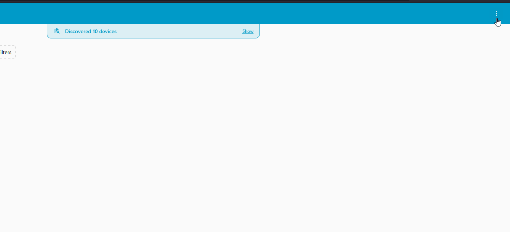
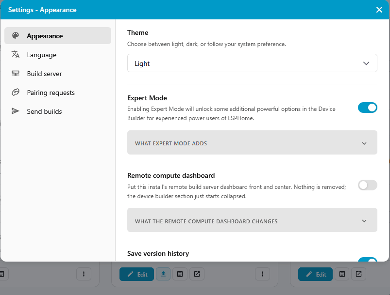
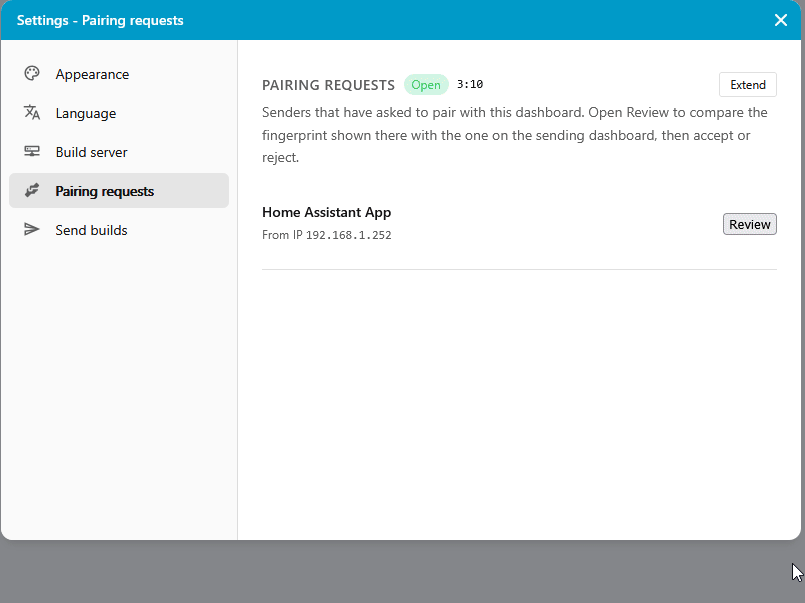
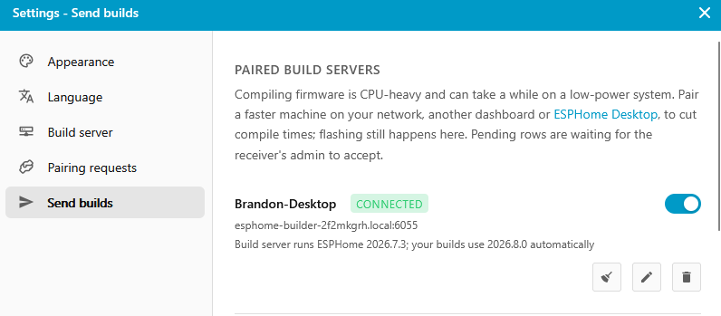

# Use Your PC as a Build Server

Compiling is the slow part of ESPHome. Every time you click **Install**, the machine running Device Builder turns your YAML into firmware, and on a Raspberry Pi that can take several minutes. A desktop PC gets through the same build far quicker.

Device Builder can hand the work to another computer on your network. You pair the two once, then keep clicking **Install** where you always do while your PC does the compiling. (1)
{ .annotate }

1.  This is called remote build. Both sides need ESPHome Device Builder, and the two talk directly over your local network.

!!! note "Before you start"

    * ESPHome Device Builder installed on your Windows PC. [First Steps](/products/ESPHome-Starter-Kit/setup/first-steps.md) walks through the installer, including the **Allow network pairing** prompt you have to allow for this to work.
    * A second Device Builder to send builds from. This page uses the app in Home Assistant, but any other install works the same way, on a laptop, a Mac, or another server.
    * Both machines on the same network, and the PC awake whenever you want to build.

## Turn On the Build Server

Start on your Windows PC. This is the machine that will do the compiling.

1.  Open ESPHome Device Builder from the icon in your notification area.

2.  Click the three-dot menu in the top-right corner and choose **Settings**.

3.  Pick **Build server** in the sidebar, then toggle on **Enable remote build**. (1)
    { .annotate }

    1.  **Paired senders**, just below the toggle, lists every dashboard allowed to send builds here. It stays empty until you pair one.

## Pair the Two Dashboards

Pairing goes in one direction: the sending dashboard asks, your PC accepts. Both machines show the same row of emoji partway through, and comparing them by eye is what proves you're pairing with your own PC.

#### Open the Pairing Window on Your PC

On your Windows PC, open **Settings → Pairing requests**. It shows **Open** with a countdown beside it. (1)
{ .annotate }

1.  Requests only arrive while that countdown is running. Click **Extend** if it runs out before you've finished.

#### Send the Request From the Other Dashboard

1.  Go to **Settings → Send builds**. Your PC appears under **Known dashboards** with its address and ESPHome version. Click **Pair**.

2.  **Confirm receiver** opens, showing your PC's fingerprint and two name fields. Click **Send pair request**. (1)
    { .annotate }

    1.  **Name for this receiver** is a label for your own list. **How this dashboard introduces itself** is the name your PC sees in its inbox, which is Home Assistant App by default. Both are safe to leave alone.

3.  **Pair request sent** appears with a row of emoji under **Your fingerprint**. Leave it on screen, you're about to compare it.

#### Accept It on Your PC

1.  The request shows up under **Pairing requests** with the sender's name and **From IP**. Click **Review**.

2.  Compare the emoji under **OOB fingerprint** against the ones still showing on the sending dashboard. Every one has to match.

3.  Click **Accept**. (1)
    { .annotate }

    1.  Accepting gives that dashboard code execution on your PC. Only accept a request you just sent yourself.

Back on the sending dashboard, your PC now sits under **Paired build servers** marked **Connected**. That's how you know it worked. The row reads **Pending** while it's waiting on you and flips over once you accept.

The line underneath tells you which ESPHome version the build server runs, and which one your builds will use. The two don't have to match. Device Builder installs whatever your sending dashboard is on and builds with that.

#### If Your PC Isn't Listed

Device Builder finds other dashboards over mDNS, which doesn't cross subnets or VLANs and which some networks block outright. Enter the address yourself instead.

1.  On the sending dashboard, scroll down the **Send builds** page to **Pair with another dashboard**.

2.  Enter your PC's hostname or IP address, and port `6055`. (1)
    { .annotate }

    1.  That's the pairing port, and it's a different number from the `6052` you use to open the dashboard in a browser.

3.  Carry on with **Confirm receiver** and **Review** exactly as above.

The <a href="https://github.com/esphome/device-builder/blob/main/README.md#manual-entry-no-mdns" target="_blank" rel="noreferrer nofollow noopener">ESPHome Device Builder documentation</a> goes further on setups where the two machines sit on different networks.

## Send Your First Build

Nothing changes about how you install. Open your starter kit in the Device Builder you paired from and click **Install**. Your PC does the compiling from here on.

Plugging a device in over USB still works. Your PC compiles and sends the firmware back, and the flashing happens on the machine the device is plugged into. (1)
{ .annotate }

1.  Device Builder says the same thing on the **Send builds** screen: pairing a faster machine cuts compile times, and flashing still happens here.

To stop using the build server, turn off the toggle on its row under **Paired build servers**. Builds go back to compiling locally, and the pairing stays in place for when you want it again.

#### Keeping It Working

* Your PC has to be awake and running Device Builder. If it's asleep, builds queue until it comes back.
* The two machines don't need the same ESPHome version. If you'd rather they matched, **Settings → Send builds** has a version-match setting to enforce it.

--8<-- "_snippets/community-help.md"
