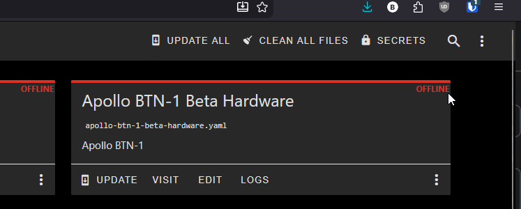
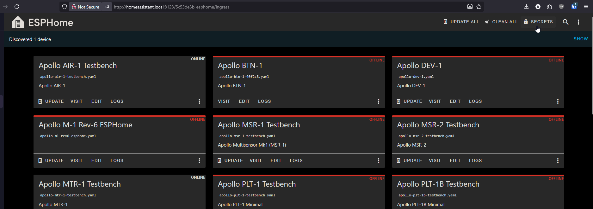

# Using Secrets

In [Getting Started](../setup/getting-started.md) you saved your Wi-Fi name and password in secrets.yaml. That same file can hold every other sensitive value your device needs, from your Home Assistant API key to your MQTT password. This tutorial walks through what to put in there and how to reference it from your device YAML.

---

### What secrets.yaml is

secrets.yaml is a single file in ESPHome Device Builder that stores values you don't want pasted into every device config. Two reasons to use it:

* **Safety.** You can copy a device YAML to a friend, paste it in a forum, or commit it to a public repo without leaking your Wi-Fi password or API key.
* **One place to change things.** Rotate a password once in secrets.yaml and every device that references it picks up the new value on the next flash.

secrets.yaml lives inside ESPHome Device Builder, so the same secrets are available to every device you build there.

---

### 1\. Navigating to Secrets

In the ESPHome Device Builder dashboard, click the 3 dots menu in the top right then **Secrets.**



You'll see a YAML file with one key per line. If you followed Getting Started you should already see `wifi_ssid` and `wifi_password` here.



---

### 2\. The syntax

Each entry is a `key: "value"` pair:

```yaml
my_secret_name: "the value goes here"
```

In your device YAML, reference it with `!secret` followed by the key name:

```yaml
some_option: !secret my_secret_name
```

When the device compiles, ESPHome substitutes the value from secrets.yaml in place of the `!secret` tag.

!!! warning "The key has to exist"

    If you reference `!secret some_name` in a device config but `some_name` isn't defined in `secrets.yaml`, the build will fail. Spelling counts.

---

### 3\. What to put in Secrets

Each section below shows the line you add to secrets.yaml and the line in your device YAML that references it.

#### Wi-Fi credentials

You set these up in [Getting Started](../setup/getting-started.md). They're the baseline every device needs.

In secrets.yaml:

```yaml
wifi_ssid: "your-wifi-ssid-here"
wifi_password: "your-wifi-password-here"
```

In your device YAML:

```yaml
wifi:
  ssid: !secret wifi_ssid
  password: !secret wifi_password
```

#### Fallback hotspot password

If you want the device's fallback hotspot to require a password instead of being open, store that here too.

In secrets.yaml:

```yaml
ap_password: "fallback-hotspot-password"
```

In your device YAML:

```yaml
wifi:
  ssid: !secret wifi_ssid
  password: !secret wifi_password
  ap:
    ssid: "Apollo ESK-1 Hotspot"
    password: !secret ap_password
```

#### Home Assistant API encryption key

ESPHome encrypts the connection between your device and Home Assistant. The key is a 32-byte base64 string. The easiest way to get one is to let ESPHome Device Builder generate it for you when you first add the `api:` block, then copy that value into secrets.yaml.

In secrets.yaml:

```yaml
api_encryption_key: "your-32-byte-base64-key-here"
```

In your device YAML:

```yaml
api:
  encryption:
    key: !secret api_encryption_key
```

!!! tip "Reuse the same key across devices"

    Using the same `api_encryption_key` for every Apollo device on your network is fine and keeps your secrets file short. Home Assistant prompts for the key the first time it discovers a device, then remembers it.

#### OTA password

OTA (over-the-air) updates let you re-flash a device wirelessly after the first USB flash. The password protects that endpoint so a stranger on your network can't push firmware to your device.

In secrets.yaml:

```yaml
ota_password: "a-long-random-string"
```

In your device YAML:

```yaml
ota:
  - platform: esphome
    password: !secret ota_password
```

#### Web server username and password

If you enable the optional `web_server:` component to access your device at `http://device-name.local/`, you can require a login.

In secrets.yaml:

```yaml
web_server_username: "admin"
web_server_password: "a-strong-password"
```

In your device YAML:

```yaml
web_server:
  port: 80
  auth:
    username: !secret web_server_username
    password: !secret web_server_password
```

#### MQTT broker, username, and password

If you publish to an MQTT broker instead of (or in addition to) the Home Assistant API, all three of these belong in secrets.yaml.

In secrets.yaml:

```yaml
mqtt_broker: "192.168.1.50"
mqtt_username: "esphome"
mqtt_password: "broker-password"
```

In your device YAML:

```yaml
mqtt:
  broker: !secret mqtt_broker
  username: !secret mqtt_username
  password: !secret mqtt_password
```

---

### 4\. A complete Secrets example

Putting it all together, a fully loaded secrets.yaml looks like this:

```yaml
# Wi-Fi
wifi_ssid: "your-wifi-ssid-here"
wifi_password: "your-wifi-password-here"
ap_password: "fallback-hotspot-password"

# Home Assistant API
api_encryption_key: "your-32-byte-base64-key-here"

# OTA updates
ota_password: "a-long-random-string"

# Web server auth
web_server_username: "admin"
web_server_password: "a-strong-password"

# MQTT
mqtt_broker: "192.168.1.50"
mqtt_username: "esphome"
mqtt_password: "broker-password"
```

You don't have to include every entry. If a device doesn't use MQTT, leave those lines out (or leave them in for the next device, the unused ones are harmless).

---

### Good practice

!!! info "Treat secrets.yaml like a password manager"

    * Don't share or post the file. Share device YAMLs instead, the `!secret` references are safe.
    * Keep a backup somewhere safe (a password manager works well). If you reinstall ESPHome Device Builder you'll need to recreate it.
    * Rotating a credential is a one-line edit here, then re-flash anything that uses it.