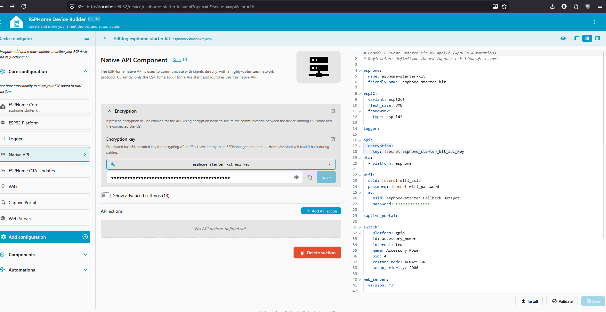
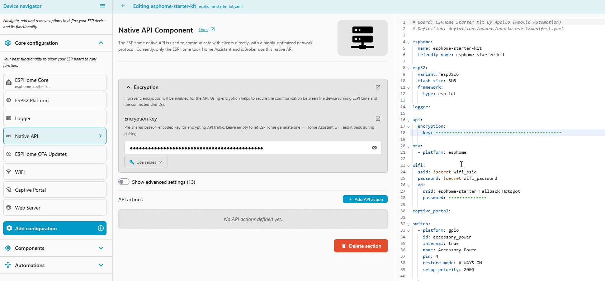

# Using Secrets

When you set up your kit in [First Steps](../setup/first-steps.md), the Device Builder saved the Wi-Fi name and password you typed in to secrets.yaml. That same file can hold every other sensitive value your device needs, from your Home Assistant API key to your MQTT password. This tutorial walks through what to put in there and how to reference it from your device YAML.

!!! info "New to secrets.yaml?"

    Read [What is secrets.yaml?](../learning-the-basics/what-is-secrets-yaml.md) first for a quick conceptual overview, then come back here when you're ready to set yours up.

---

### Open Secrets

<div markdown class="annotate">

In the ESPHome Device Builder dashboard, click the 3 dots menu in the top right then **Secrets.** (1)

</div>

1. You'll see a YAML file with one key per line. If you followed First Steps you should already see `wifi_ssid` and `wifi_password` here.



---

### Syntax

Each entry is a `key: "value"` pair:

```yaml
my_secret_name: "the value goes here"
```

In your device YAML, reference it with `!secret` followed by the key name:

```yaml
some_option: !secret my_secret_name
```

When the device compiles, ESPHome substitutes the value from secrets.yaml in place of the `!secret` tag.

!!! warning "The key has to exist"

    If you reference `!secret some_name` in a device config but `some_name` isn't defined in `secrets.yaml`, the build will fail. Spelling counts.

---

### Make a Secret in the GUI

<div markdown class="annotate">

The Device Builder can turn a value into a secret for you, no hand editing required. The API encryption key is the perfect first candidate:

1. Open your device in the ESPHome Device Builder and click the **Core configuration** tab.
2. Click **Native API**. Your device's API key is shown here. Click the eye icon to reveal it.
3. Click **Use secret**, then select **Make secret esphome_starter_kit__encryption_key**. (1)

</div>

1. The secret is named after your device, so if you named your kit something else, the entry will match that name instead.

The Device Builder moves the key into secrets.yaml and swaps the device YAML over to a `!secret` reference. You can now share your device YAML without exposing the key.



---

### What to store

Each section below shows the line you add to secrets.yaml and the line in your device YAML that references it.

#### Wi-Fi credentials

You set these up in [First Steps](../setup/first-steps.md). They're the baseline every device needs.

In secrets.yaml:

```yaml
wifi_ssid: "your-wifi-ssid-here"
wifi_password: "your-wifi-password-here"
```

In your device YAML:

```yaml
wifi:
  ssid: !secret wifi_ssid
  password: !secret wifi_password
```

#### Fallback hotspot password

If you want the device's fallback hotspot to require a password instead of being open, store that here too.

In secrets.yaml:

```yaml
ap_password: "fallback-hotspot-password"
```

In your device YAML:

```yaml
wifi:
  ssid: !secret wifi_ssid
  password: !secret wifi_password
  ap:
    ssid: "Apollo ESK-1 Hotspot"
    password: !secret ap_password
```

#### Home Assistant API encryption key

ESPHome encrypts the connection between your device and Home Assistant. The key is a 32-byte base64 string, and the Device Builder generates one for every new device. The easiest way to make it a secret is the **Use secret** button covered in [Make a Secret in the GUI](#make-a-secret-in-the-gui) above, which names the entry after your device. If you'd rather add it by hand, it looks like this:

In secrets.yaml:

```yaml
api_encryption_key: "your-32-byte-base64-key-here"
```

In your device YAML:

```yaml
api:
  encryption:
    key: !secret api_encryption_key
```

!!! tip "Reuse the same key across devices"

    Using the same `api_encryption_key` for every Apollo device on your network is fine and keeps your secrets file short. Home Assistant prompts for the key the first time it discovers a device, then remembers it.

#### OTA password

OTA (over-the-air) updates let you re-flash a device wirelessly after the first USB flash. The password protects that endpoint so a stranger on your network can't push software to your device. (1)
{ .annotate }

1.  We say software because it's the friendlier word. The technically correct term is firmware: code that runs directly on the chip instead of on a computer. That's the word ESPHome's own docs use.

In secrets.yaml:

```yaml
ota_password: "a-long-random-string"
```

In your device YAML:

```yaml
ota:
  - platform: esphome
    password: !secret ota_password
```

#### Web server username and password

If you enable the optional `web_server:` component to access your device at `http://device-name.local/`, you can require a login.

In secrets.yaml:

```yaml
web_server_username: "admin"
web_server_password: "a-strong-password"
```

In your device YAML:

```yaml
web_server:
  port: 80
  auth:
    username: !secret web_server_username
    password: !secret web_server_password
```

#### MQTT broker, username, and password

If you publish to an MQTT broker instead of (or in addition to) the Home Assistant API, all three of these belong in secrets.yaml.

In secrets.yaml:

```yaml
mqtt_broker: "192.168.1.50"
mqtt_username: "esphome"
mqtt_password: "broker-password"
```

In your device YAML:

```yaml
mqtt:
  broker: !secret mqtt_broker
  username: !secret mqtt_username
  password: !secret mqtt_password
```

---

### Complete Example

Putting it all together, a fully loaded secrets.yaml looks like this:

```yaml
# Wi-Fi
wifi_ssid: "your-wifi-ssid-here"
wifi_password: "your-wifi-password-here"
ap_password: "fallback-hotspot-password"

# Home Assistant API
api_encryption_key: "your-32-byte-base64-key-here"

# OTA updates
ota_password: "a-long-random-string"

# Web server auth
web_server_username: "admin"
web_server_password: "a-strong-password"

# MQTT
mqtt_broker: "192.168.1.50"
mqtt_username: "esphome"
mqtt_password: "broker-password"
```

You don't have to include every entry. If a device doesn't use MQTT, leave those lines out (or leave them in for the next device, the unused ones are harmless).

---

#### Good practice

!!! info "Treat secrets.yaml like a password manager"

    * Don't share or post the file. Share device YAMLs instead, the `!secret` references are safe.
    * Keep a backup somewhere safe (a password manager works well). If you reinstall ESPHome Device Builder you'll need to recreate it.
    * Rotating a credential is a one-line edit here, then re-flash anything that uses it.

--8<-- "_snippets/community-help.md"
