# Adding CO2 to AIR-1

!!! tip "Tip"

    [If you have the Original Design of the AIR-1 please click here](https://www.youtube.com/watch?v=ZKGwc2ZSMrw "Mesh Case Design for the AIR-1")

1\. Unplug your AIR-1 from power and lift the top of the case or "lid".

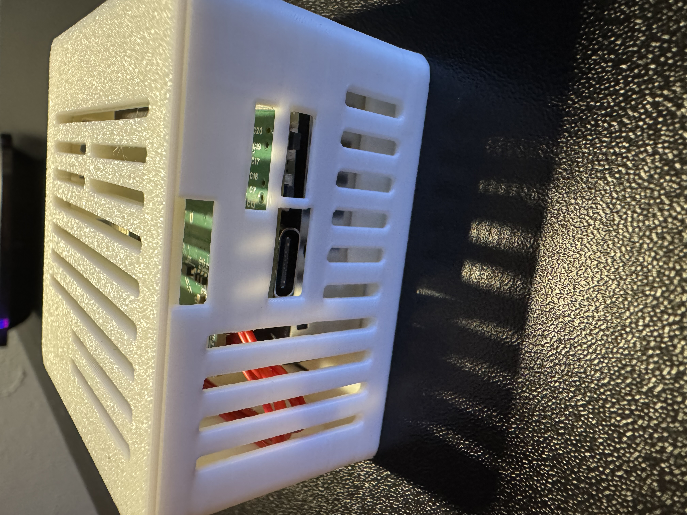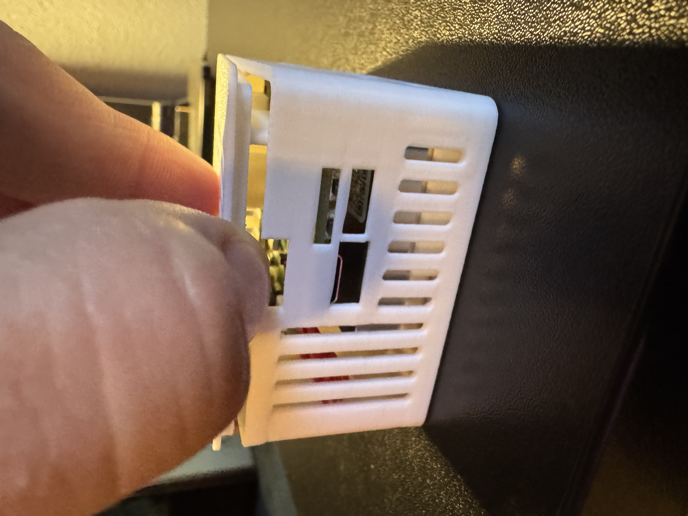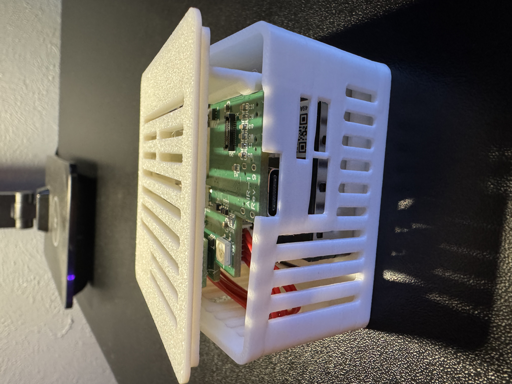

2\. Remove the lid completely by grabbing the lid from the other side and gently lifting upwards.

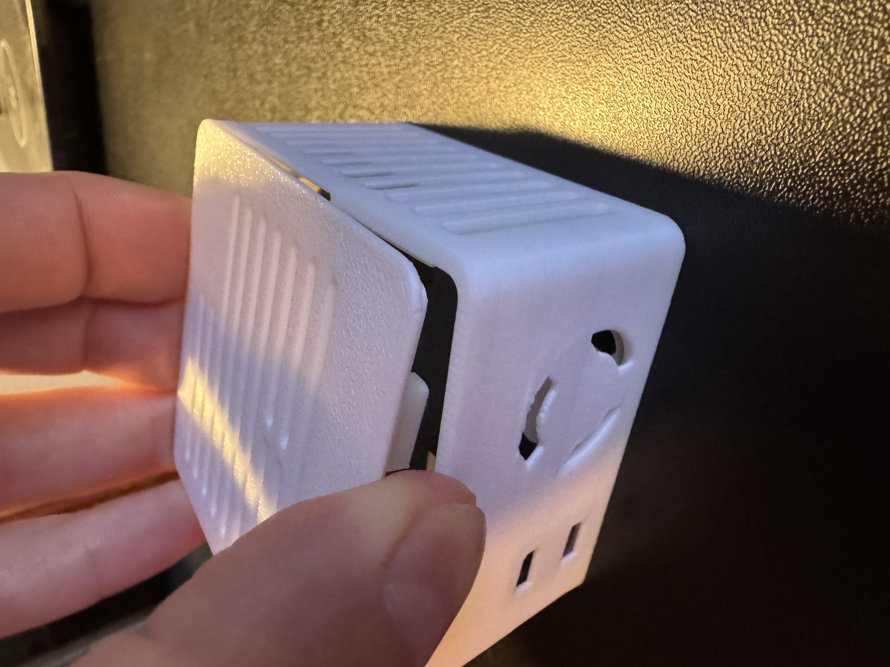

3\. Hold the PCB and orient it correctly where Apollo (the dog) is facing you in.

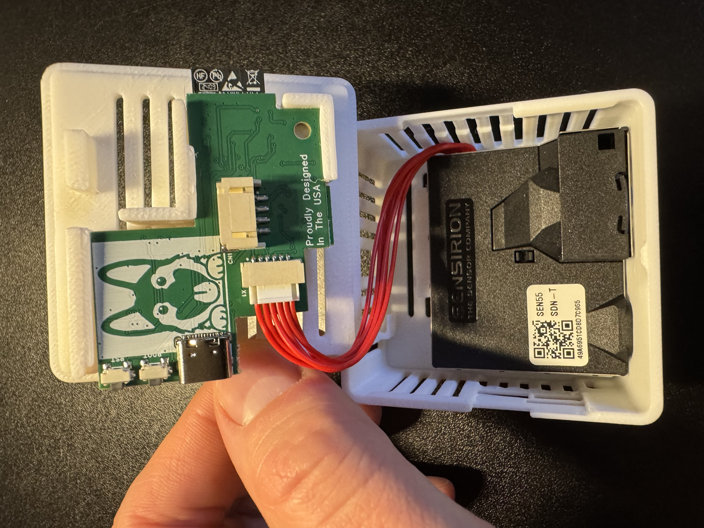

4\. Gently slide the pcb out by sliding it to the left as shown in the images below.

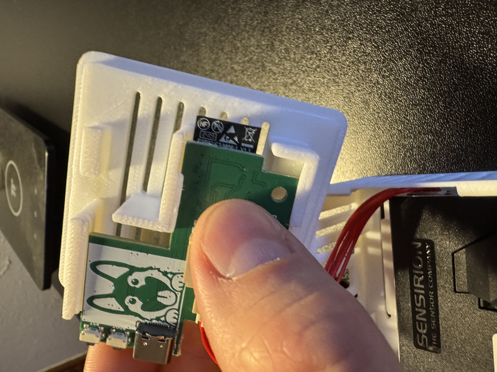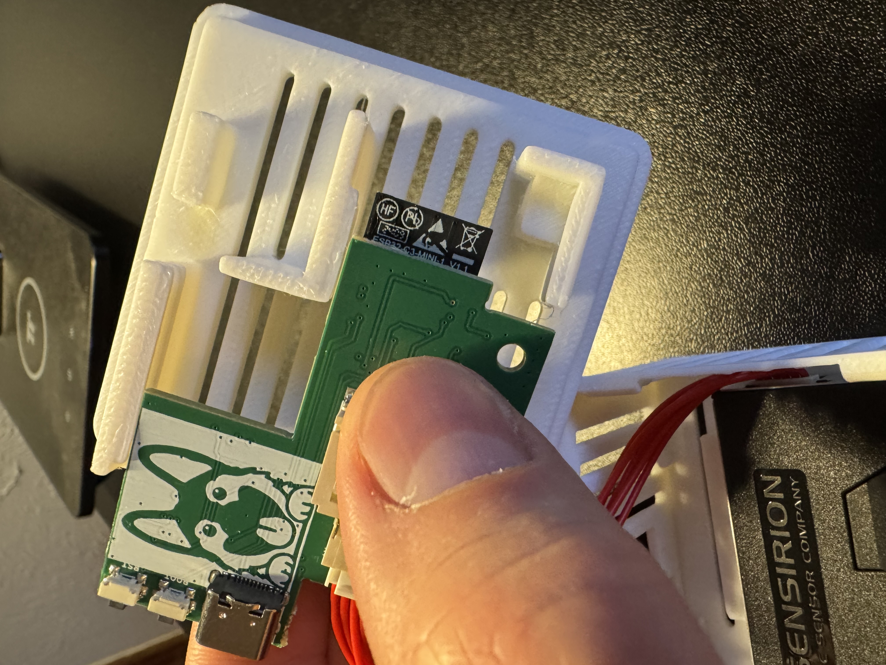

5\. Flip the PCB over and identify the bottom right corner where the small black mezzanine connector lives. You will see an "X" indicating which corner needs to be lined up with the SCD40 CO2 sensor. There is an X on the SCD40 sensor's PCB as well, you can see it in the image below but it is slightly cut off on the PCB itself. There is also a "gold dot" in the top left of the SCD40 when oriented properly.

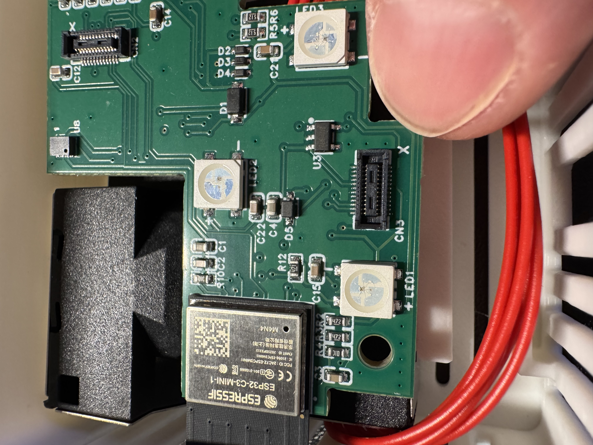

6\. Gently push the SCD40 CO2 module onto the black mezzanine connector.

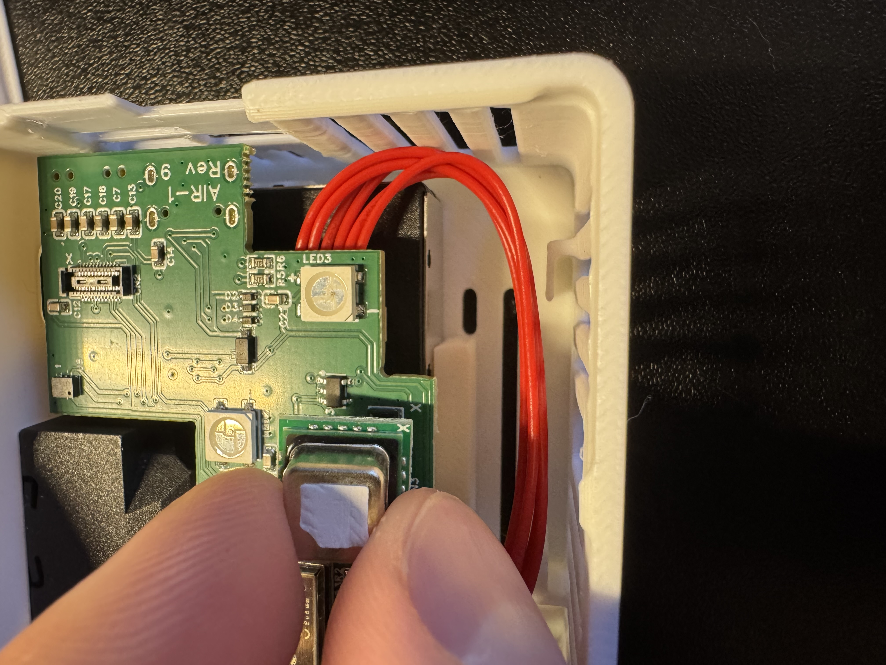

7\. Gently slide the PCB back into the 3d printed case as shown below.

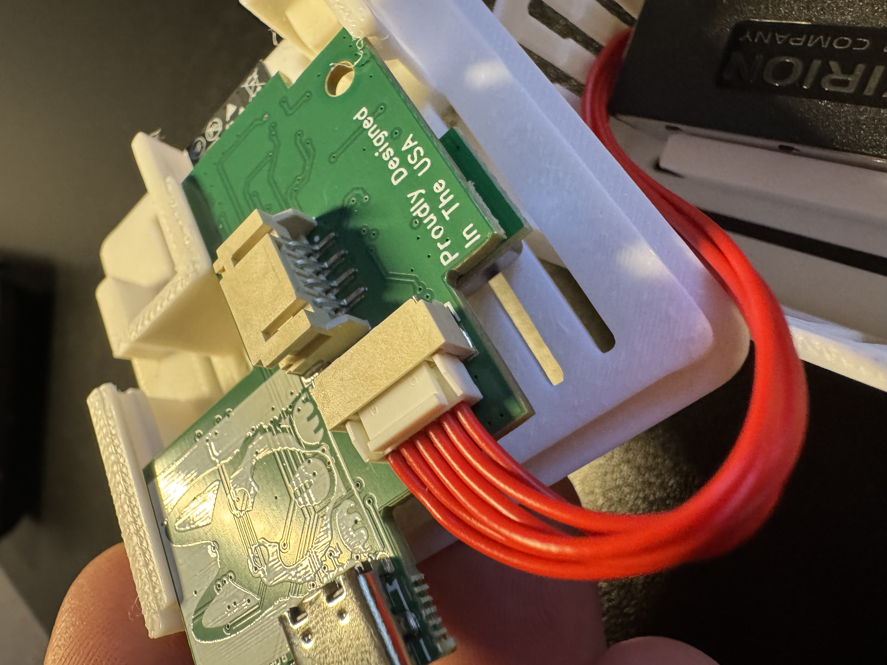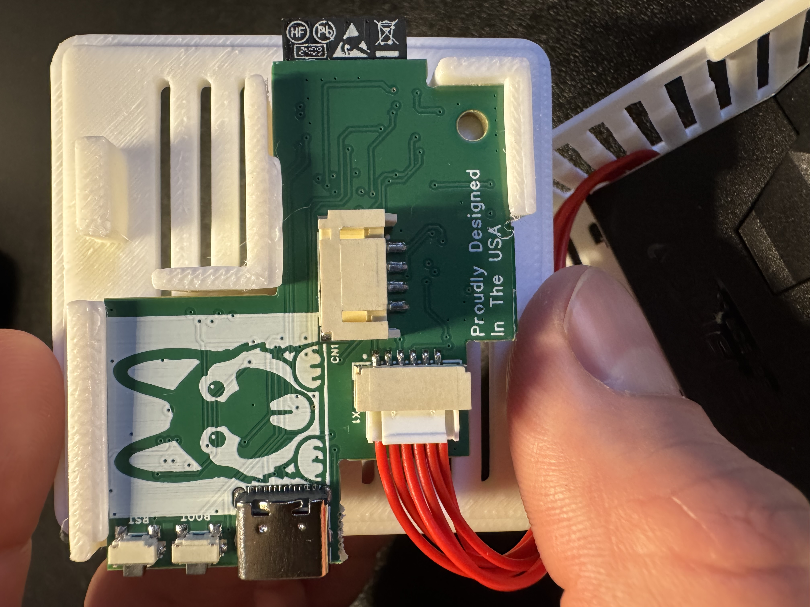

8\. Gently push the case back together as shown below.

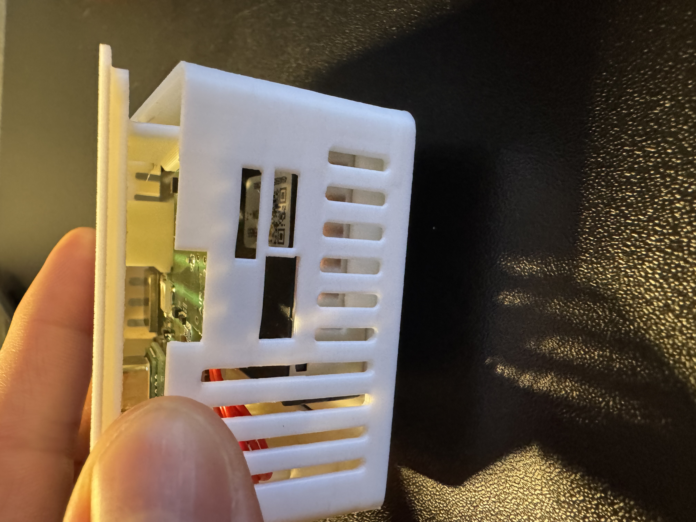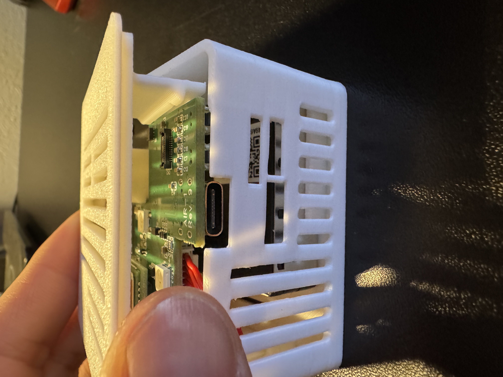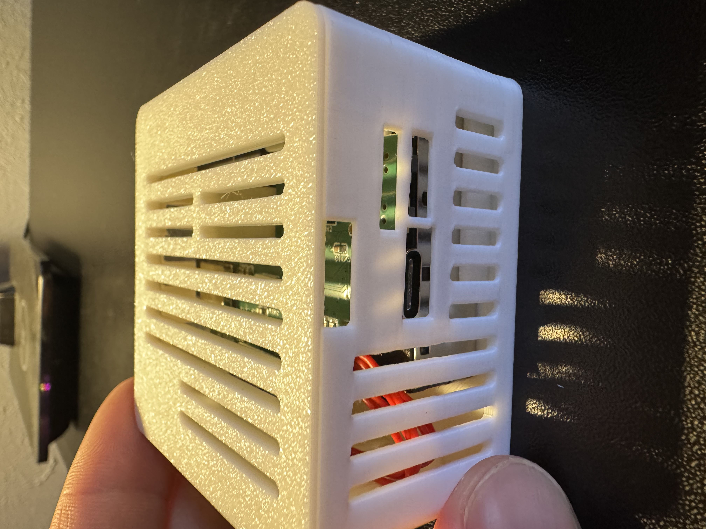

9\. Please refer to our [CO2 calibration guide](https://wiki.apolloautomation.com/products/general/calibrating-and-updating/co2-calibration/ "CO2 Calibration") to calibrate the CO2 module after installation. This is required for all CO2 addons purchased from us separately from a product (such as buying it to addon to an existing Apollo device).