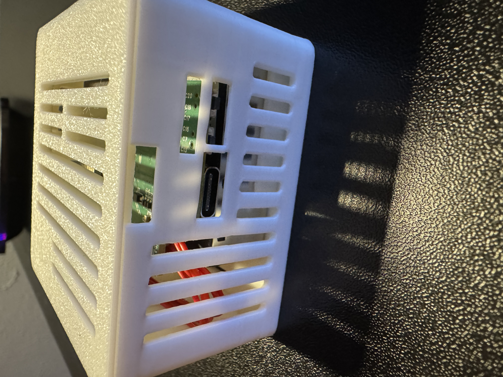
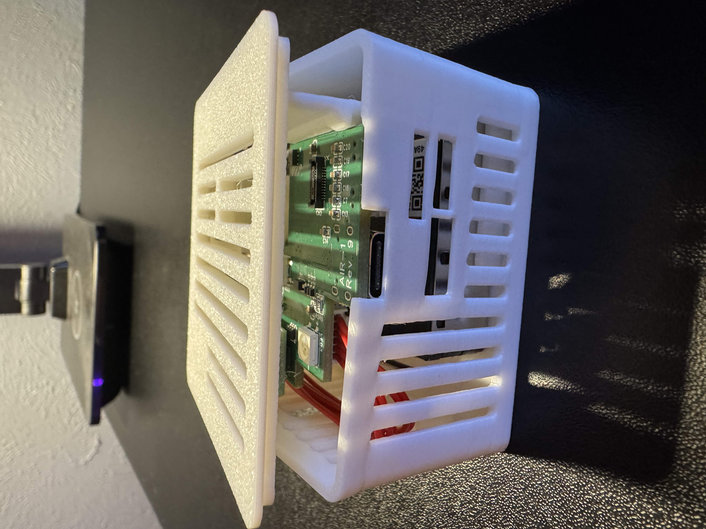
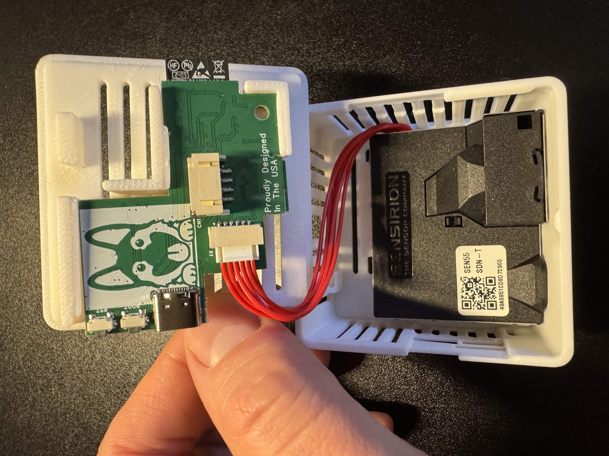

# Adding GPIO Header to AIR-1

1\. Unplug your AIR-1 from power and lift the top of the case or "lid".

2\. Remove the lid completely by grabbing the lid from the other side and gently lifting upwards.

3\. Hold the PCB and orient it correctly where Apollo (the dog) is facing you in.

4\. Gently slide the pcb out by sliding it to the left as shown in the images below.

5\. Flip the PCB over and identify the Top Right corner where the small black mezzanine connector lives. You will see an "X" indicating which corner needs to be lined up with the PCB of the GPIO Header. There is an X on the GPIO Header's PCB as well, you can see it in the images below

6\. Match up the X on the PCB of the GPIO Header and the X on the AIR-1 PCB and then gently push the GPIO Header onto the black mezzanine connector.

7\. Flip the AIR-1 PCB over and gently slide it back into the new AIR-1 Lid which came with your GPIO Header addon! Please do not use much force, the PCB should slide in relatively smoothly, with a tiny bit of force needed. There are three channels in the plastic where the PCB slides into!

8\. Gently push the case back together as shown below.

9\. You are now done and your AIR-1 is now able to be used with the GPIO Header addon! Here is the pinout image below and <a href="https://wiki.apolloautomation.com/products/air1/examples/how-to-use-the-apollo-gpio-header-to-control-an-led-strip/" target="_blank" rel="noopener">here's a great wiki article showing you how to add a small led strip!</a>

!!! warning "Warning"

    If you plan to use a lot of leds or your gpio project requires a lot of power then you need to use a dedicated power supply and not try to use too much power (under 350mA) from the GPIO of the device! You can power the AIR-1 via the vcc (5v) and GND pins but please do not power it via the pins AND the USB-C port, it should be one or the other.

